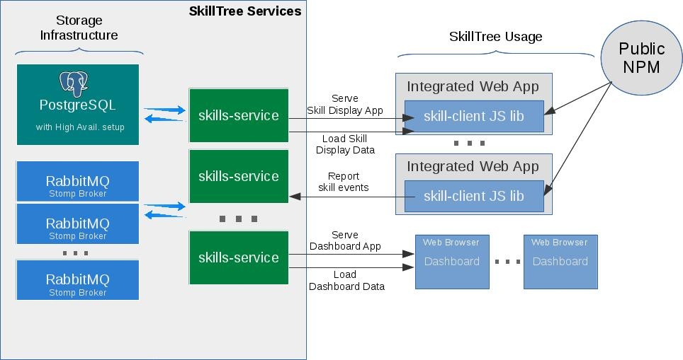

# Architecture

This section explains how the code is structured and how it relates to deployed daemons and artifacts.
Before reading further, please ensure you are familiar with the [Install Guide](/dashboard/install-guide/), the
[Dashboard User Guide](/dashboard/user-guide/), and the [Integration Guide](/skills-client/#client-display-integration).

SkillTree's `skills-service` is designed with minimal runtime requirements.
You can start the service with zero configuration other than the datasource properties required to connect to an available <external-url label="PostgreSQL" url="https://www.postgresql.org/" /> database.
Please visit the [Install Guide](/dashboard/install-guide/) to better understand your installation options.

A standard production installation of the `skills-service` requires the following infrastructure:
- [PostgreSQL](https://www.postgresql.org/) - Relational store for project definitions and skill events.
- [RabbitMQ STOMP Brokers](https://www.rabbitmq.com/stomp.html) - Used to support [WebSocket](https://en.wikipedia.org/wiki/WebSocket) functionality.

SkillTree's `skills-service` is configured to connect directly to these PostgreSQL and STOMP brokers.

Integrated applications utilize `skills-client` libraries published on public NPM repositories.
These libraries act as thin wrappers around an `iframe` tag, fetching the Skills Display views and their associated data directly from the `skills-service` application.
Consequently, the Skills Display is served as its own dedicated URL from the `skills-service` dashboard application and embedded into an `iframe` inside the client's browser.
These underlying details are completely transparent to users of the `skills-client` libraries.

The `skills-client` libraries also enable integrators to report skill events.
Skill reporting utilities call the [Report Skill Event Endpoint](/skills-client/endpoints.html#report-skill-event-endpoint) exposed by the `skills-service`.     
Alternatively, integrators can choose to call this endpoint directly.
When using the client libraries, users can register for global events to receive notifications whenever a skill event is reported.
The event response returns a [result object](/skills-client/endpoints.html#endpoint-result-object) containing event metadata and any achievements triggered by the event.

This is where WebSocket integration becomes critical.
External clients may report skill events directly via the REST endpoint, and WebSockets are utilized to propagate the outcome of those events instantly to all registered clients.

## SkillTree Repositories

1. [skills-service](https://github.com/NationalSecurityAgency/skills-service): Contains the core code for the skills service and dashboard. This is where the majority of code changes occur.
1. [skills-client](https://github.com/NationalSecurityAgency/skills-client): Client JavaScript libraries providing skill event reporting utilities and the thin `iframe`-based wrapper for the Skills Display.
1. [skills-docs](https://github.com/NationalSecurityAgency/skills-docs): The documentation repository—which you are reading right now!
1. [skills-stress-test](https://github.com/NationalSecurityAgency/skills-stress-test): A web-based application used to facilitate stress testing against the SkillTree service.
1. [call-stack-profiler](https://github.com/NationalSecurityAgency/call-stack-profiler): A Groovy annotation-driven, in-code profiling utility used by the services.
1. [skills-client-examples](https://github.com/NationalSecurityAgency/skills-client-examples): Simple integration examples demonstrating how to use the client libraries.
