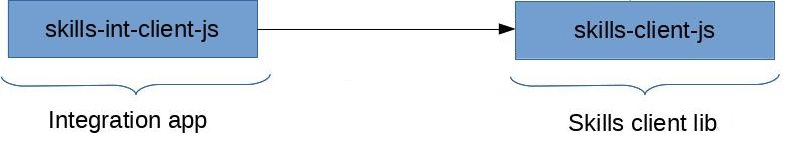

# Development Environment

We recommend developing SkillTree in a *nix environment.

## Prerequisites 

- modern *nix environment
- JDK 11+, we suggest [Open JDK](https://openjdk.java.net/)
- [Git](https://git-scm.com/) version 2.23+
- [Node.js](https://nodejs.org/en/) v12+ and [npm](https://www.npmjs.com/) 6+
- [Maven](https://maven.apache.org/) 3.6.2+
- [PostgreSQL](https://www.postgresql.org/) 10+

## Development Overview

The following sections will cover:
1. skills-service project development 
1. skills-client project development

::: tip
More than likely your development will be scoped to the skills-service project but, although rare, there are situations when you'll need to modify the skills-client as well. 
If you are making improvements to the SkillTree dashboard or its Skills Display views then your development will be scoped within the skills-service project. 
If you have not yet, please take few minutes to review the [architecture](/contribution/architecture.html) section.
::: 

The tech stack is large but to get started you will need to be familiar (but more likely experienced) with these core technologies:

- Java and Groovy
- Spring Framework (especially [Spring Boot](https://spring.io/projects/spring-boot))
- Web stack: Javascript, html, css
- [Vue.js](https://vuejs.org/)
- [cypress.io](https://www.cypress.io/)
- Build tools: maven, npm & webpack

Each sub-section follows the same flow: 
1. Get, build, and test 
1. [cypress.io](https://www.cypress.io/) end-to-end tests 
1. Day-to-day development
1. Test checklist

## Skills-service development

The skills-service project encapsulates code for the SkillTree dashboard, REST apis and Skills Display views. 

### Get, build, and test
First things first, **fork** and checkout the code (please see the [Contribution Steps](/contribution/#contribution-steps)), build it and run all of the unit and integration tests. 
Then we'll discuss development and testing steps.

```bash
git clone <github>:skills-service.git
```   
To build the project, run the unit tests and the backend integration tests:  
```bash
cd skills-service
mvn install
```
Since this process runs all of the service integration tests it will take a while (5 to 20 minutes depending on your hardware). 

SkillTree uses [maven](https://maven.apache.org/) and [npm](https://www.npmjs.com/) for its dependency management and to facilitate the build lifecycle.  Let's get familiar with the project's layout:
``` markdown
skills-service
└───service
│   │   pom.xml
|   └───target
|   |   skills-service-<version>.jar
|   |   ....
└───dashboard
|   │   pom.xml
|   │   package.json
|   |   ....
└───client-display
|   │   pom.xml
|   │   package.json
|   |   ....
└───e2e-tests
|   │   package.json
|   |   ....
└─── pom.xml
```

The runtime artifact is a [spring boot](https://spring.io/projects/spring-boot) application and will be created in ``service/skills-service-<version>.jar``; 
we ran ``mvn install`` to generate this artifact and the following sequence of steps were performed:
- Build dashboard web application: ``npm run build`` in dashboard project
- Build client display web application: ``npm run build`` in client-display project
- Compile Java and Groovy classes in the ``service`` project: ``mvn compile``
- Copy the built dashboard app to ``service/src/main/resources/public`` so the spring boot app can host the dashboard web-application
- Copy the built client-display app to ``service/src/main/resources/public/static/clientPortal`` so the spring boot app can host the client-display web-application
- Generate runtime artifact: ``mvn package`` in the service project

Of course this doesn't cover the entire build cycle so please familiarize yourself with all of the pom.xml and package.json files. 
Now that you have the runtime artifact, you can start the SkillTree dashboard and service using the following command:

```bash
java -jar service/target/skills-service-<version>.jar
```

The app will run on [http://localhost:8080](http://localhost:8080), visit it to create an account, new project, subjects, skills, etc. 
To learn more about the features of the SkillTree dashboard, please visit the [Dashboard Guide](/dashboard/user-guide/).
  
The SkillTree application will be started using default properties. Some things to note:
- By default an in-memory H2 database is used - data will be ephemeral and will not persist between application restarts.
- By default the app runs in [Password Auth Mode](/dashboard/install-guide/installModes.html#password-auth-mode) which is the common use-case. 

### Cypress.io end-to-end tests

SkillTree utilizes the [cypress.io](https://www.cypress.io/) framework to perform end-to-end tests and specifically verify features of the dashboard and client-display web applications. 
Cypress tests are located in the ``e2e-tests`` project: 

``` markdown
skills-service
|   ....
└───e2e-tests
|   │   package.json
|   └───cypress
|   |   └───integration
|   |   <dashboard test name>_spec.js
|   |   |   └───client-display
|   |   |   |   <client-display test name>_spec.js   
```

The end-to-end tests stand-up the skills-service, the dashboard, and the client display web applications and then execute numerous tests against these web-applications to mimic users' actions.  

To run cypress end-to-end tests (assumes that you have built the skills-service.jar via the previous step):

```bash
cd skills-service/e2e-tests
npm install

# start servers in the background: skills-service and client-display
npm run cyServices:start
# run cypress integration tests
npm run cy:run
# kill background servers
npm run cyServices:kill 
```

Buckle down as these tests will take a while to run, and depending on your system specs you should expect anywhere from 5 to 20 minutes. 

::: tip
Please note that ports 8080, 8083, 1026, and 1081 have to be available on your system
:::

``npm run cyServices:start`` command starts:
- The programmatic service and the dashboard by utilizing the already built jar; will run on port 8080
- the client-display using webpack dev server; will run on port 8083
- A mock smtp server; will run on ports 1026 and 1081

Now that you can build and run integration tests let's discuss day-to-day development setup for the skills-service project.

### Day-to-day development

Most IDEs (Intellij, Eclipse, etc...) provide first-class support for maven projects so the very first step would be to import the skills-service project into your favorite IDE. 

Please note that code additions will generally fall into these categories:
1. Enhancing the skills-service programmatic REST API
1. Making changes to the web-based dashboard application or the client-display web-based application

###### skills-service programmatic REST API

The code for the API can be found under ``skills-service/service`` which follows standard maven conventions. 

The programmatic API tests reside in ```service/src/test/java``` and you can run all of the tests via
```bash
cd skills-service/service
mvn test
``` 
You can also run any of the tests using your favorite IDE. 

::: tip
SkillTree's overall testing strategy is to implement black-box integration tests and supplement with unit tests whenever an integration test is not possible.
:::

Generally, programmatic API service development is facilitated via the integration tests .

Skills Service integration tests stand-up the skills-service application and then execute various endpoints, validating the result.
These integration tests reside in the ``skills.intTests`` package and extend the ``DefaultIntSpec.groovy`` class. 

``DefaultIntSpec.groovy`` is annotated with the [``@SpringBootTest``](https://docs.spring.io/spring-boot/docs/current/api/org/springframework/boot/test/context/SpringBootTest.html) annotation
which facilitates running the Spring Boot application, exposing endpoints on a random port. 

A few things to note: 
- You should interact with the skills-service using the test client ``skills.intTests.utils.SkillsService`` class 
  - Available via ``skills.intTests.utils.DefaultIntSpec#skillsService``
  - ``SkillsService`` class represents an authenticated dashboard user
- Runtime port can be retrieved via ``skills.intTests.utils.DefaultIntSpec#localPort`` but should rarely be used directly; instead please use ``skills.intTests.utils.DefaultIntSpec#skillsService`` instead
- ``DefaultIntSpec`` setup and cleanup methods purge data from DB between each test case
- By default, tests are executed against an in-memory H2 DB
- Use the ``skills.intTests.utils.DefaultIntSpec#createService`` method if you need a new ``SkillsService`` instance
  - For example to represent another dashboard user       

There are hundreds of tests in the ``skills.intTests`` package, please feel free to explore. 

###### Web-Based Dashboard and/or Client Display

Steps to develop the web-based dashboard are:
1. Stand up the service (programmatic API)
1. Bring up the webpack dev server
1. Use browser and cypress tests to drive development

To stand up the service you can execute ``skills.SpringBootApp`` in the ``service`` project from your IDE. 
If that's not an option you can always build a jar and run it from the command line:
 ```bash
 java -jar service/target/skills-service-<version>.jar
 ```
The service will run on port 8080. 

Next is to start the webpack dev server in the ``dashboard`` project:

```bash
cd dashboard
npm run serve
```
This webpack dev server will run on port 8082 and will make requests for data to the service running on port 8080. 

Generally development is facilitated by writing cypress tests:

```bash
cd e2e-tests
npm run cy:open:dev
``` 
You can then start adding tests under e2e-tests/cypress/integration to an existing file or by creating a new file. 

If you are making changes to the client display OR want to run all of the cypress integration tests, then you will need to start the client-display webpack dev server:

```bash
cd client-display
npm run serve
```
The dev server will run on port 8083 and will make requests for data to the service running on port 8080.

### Test Checklist

::: tip
SkillTree's overall testing strategy is to implement black-box integration tests and supplement with unit tests whenever an integration test is not possible.
:::

We like tests (especially integration tests), so please make sure you thoroughly test your code.  
Prior to making a Pull Request make sure that ALL tests pass:
1. Run services tests against PostgreSQL in addition to the default in-memory H2 database
1. Run all Cypress tests 

Provide the following properties to run the service tests against PostgreSQL:
```properties
spring.datasource.url=jdbc:postgresql://localhost:5432/skills
spring.datasource.username=<username>
spring.datasource.password=<password>
```
On the command line it would look something like this:
```bash
mvn --batch-mode test -Dspring.datasource.url=jdbc:postgresql://postgres:5432/skills -Dspring.datasource.username=user -Dspring.datasource.password=pass
```

To run all the cypress tests: 
```bash
cd skills-service/e2e-tests
npm install

# start servers in the background: skills-service and client-display to test
npm run cyServices:start
# run cypress integration tests
npm run cy:run
# kill background servers
npm run cyServices:kill 
```

## Skills-client development

Skills-client JS libraries provide skills event reporting utilities and a thin iFrame-based wrapper for the Client Display. 

::: tip Is this the right project for me?

Please keep in mind that the majority of the SkillTree features are encapsulated in the [skills-service](/contribution/devEnv.html#skills-service-development) project. 

If you are making improvements to the SkillTree dashboard or its Skills Display views then your development will be scoped within the skills-service project. I
f you have not yet, please take few minutes to review the [architecture](/contribution/architecture.html#skilltree-repositories) section.

If you are not sure whether you need to make skill-client changes, contact the SkillTree core development team.
:::  


### Get, build and test

First things first, **fork** and checkout the code (please see the [Contribution Steps](/contribution/#contribution-steps)), build it and run all of the unit and integration tests. Then we'll discuss the development and testing steps.

```bash
git clone <github>:skills-client.git
cd skills-client
```

skills-client is an assembly of projects that build JS client libraries AND integration tests that enable comprehensive testing of these libraries:

- **skills-client-js:** pure JS implementation, please see [Pure JS Integration Guide](/skills-client/js.html#pure-js-integration) to understand how these artifacts are utilized by a SkillTree integrator
  - Majority of client code resides here, framework specific libraries are minimal wrappers around this pure JS implementation
  - Provides support for [Skill Event Reporting](/skills-client/js.html#skills-event-reporting), [Skills Display](/skills-client/js.html#skills-display) as well as [Skills Configuration](/skills-client/js.html#skills-configuration)
- **skills-client-vue:** provides native support for Vue.js applications. This is a thin wrapper around skills-client-js; please see [Vue.js Integration Guide](/skills-client/vuejs.html) to understand how this library is utilized by a SkillTree integrator
- **skills-client-react:** provides native support for React applications. This is a thin wrapper around skills-client-js; please see [React Integration Guide](/skills-client/react.html) to understand how this library is utilized by a SkillTree integrator
- **skills-client-angular:** provides native support for Angular applications. This is a thin wrapper around skills-client-js; please see [Angular Integration Guide](/skills-client/angular.html) to understand how this library is utilized by a SkillTree integrator    
- **skills-client-integration:** integration tests that enable comprehensive testing of skills-client-js and all of the framework specific libraries.
  - A set of web-applications that integrate and exercise these skills client libraries
  - Cypress tests that utilize these applications to end-to-end test functionality of the skills client libraries

SkillTree uses [maven](https://maven.apache.org/) and [npm](https://www.npmjs.com/) for its dependency management and to facilitate the build lifecycle.  Let's get familiar with the projects layout:
``` markdown
skills-client
└───skills-client-js
|   │   package.json
|   |   ....
└───skills-client-react
|   │   pom.xml
|   │   package.json
|   |   ....
└───skills-client-vue
|   │   package.json
|   |   ....
└───skills-client-integration
│   │   pom.xml
```

To build client libraries and run their unit tests: 

```bash
cd skills-client-js
npm install
npm run build

cd ../skills-client-react
npm install
npm run build

cd ../skills-client-vue
npm install
npm run build
```

To build integration test artifacts:

```bash
cd skills-client-integration
mvn install
```
Several actions were performed in the ``mvn install`` command: 
- client libraries were built
- client libraries' unit tests were executed
- integration apps were built (these apps utilize client libs)
- This step does not execute end-to-end tests. 

End-to-end [cypress.io](https://www.cypress.io/) tests then exercise these integration applications in order to thoroughly test our client libraries. 
The next section will break this process down in detail.    

### Cypress.io end-to-end tests

There are a number of challenges when integration testing client libraries. 
These JS libraries themselves don't present an executable artifact since the purposes of them is to be utilized by the external web applications.

To enable end-to-end testing of skills-client-js and all of the framework specific libraries, we developed a set of web-applications that integrate and exercise these libraries. 
These applications mimic real world integration and usage scenarios. 
[cypress.io](https://www.cypress.io/) is then used to execute numerous end-to-end tests against these web applications, ensuring that these libraries properly work in an integrated environment.  
   
The code for the web applications that mimics real world usage and end-to-end [cypress.io](https://www.cypress.io/) tests resides in the ``skills-client/skills-client-integration`` project. 
Let's take a look at its directory structure:   

``` markdown
skills-client
└───skills-client-integration
│   │   pom.xml
|   └───skills-int-client-js
|   │   │   package.json
|   │   │   pom.xml
|   |   └───target
|   └───skills-int-client-react
|   │   │   package.json
|   │   │   pom.xml
|   |   └───target
|   └───skills-int-client-vue
|   │   │   package.json
|   │   │   pom.xml
|   |   └───target
|   └───skills-int-e2e-test
|   │   │   package.json
|   │   │   pom.xml
|   |   └───target
|   |   |   skills-int-e2e-test-<version>.jar
|   └───skills-int-service
|   │   │   pom.xml
|   |   └───target
|   |   |   skills-int-service-<version>.jar
```

Here is an explanation for each project:
- **skills-int-client-js**: Web application that depends on the skills-client-js artifact and mimics its real world usage
- **skills-int-client-react**: Web application that depends on the skills-client-react artifact and mimics its real world usage
- **skills-int-client-vue**: Web application that depends on the skills-client-vue artifact and mimics its real world usage
- **skills-int-service**: Pulls together all the web applications (skills-int-client-js, skills-int-client-vue, etc.) and exposes a web server to serve these applications. [Cypress.io](https://www.cypress.io/) tests execute tests against this service.  
- **skills-int-e2e-test**: [Cypress.io](https://www.cypress.io/) tests that utilize skills-int-service to perform thorough end-to-end tests of the integrated libraries.  

To run [cypress.io](https://www.cypress.io/) tests you will need to 
1. Start backend service
   - skills-service: REST data endpoints
   - serves Skills Display application
1. Start integration web applications (skills-int-service)
1. Run cypress tests

Please visit the [architecture](/contribution/architecture.html#skilltree-repositories) section to further explore the relationship between these services. 

We are going to assume that you are versed in skills-service installation and development, 
but if not please visit the [skills-service development](/contribution/devEnv.html#skills-service-development) section.
Commands below assume:
- ``skills-service-XXX.jar`` was generated and that skills-service and skills-client projects reside in the same parent directory.
- ``skills-int-service--XXX.jar`` was generated via earlier steps.

To run cypress end-to-end tests:
```bash
cd skills-client/skills-client-integration/skills-int-e2e-test
npm install

# will start skills-service and skills-int-service processes
npm run cyServices:start

# run cypress integration tests
npm run cy:run

# kill background servers (skills-service and skills-int-service)
npm run cyServices:kill 
``` 
Buckle down as these tests will take a while to run, and depending on your system specs you should expect anywhere from 2 to 15 minutes.

::: tip
Please note that ports 8080 and 8090 have to be available on your system
:::

Now that you can build and run the integration tests let's discuss day-to-day development setup for the skill-client project.

### Day-to-day development
Most IDEs (Intellij, Eclipse, etc...) provide first-class support for maven projects so the very first step would be to import the skills-client project into your favorite IDE.

Let's first understand JS dependency chain. 

 

The Diagram above depicts JS dependencies that can be traced using package.json files in each project.  
Because we are authoring code across multiple projects in the dependency chain, a traditional [npm-publish](https://docs.npmjs.com/cli/publish) approach falls short. 
With the [npm-publish](https://docs.npmjs.com/cli/publish) approach, in order to test the change, the artifact would have to be built and pushed to the npm repository.
Then all of the projects that depend on this resource would have to be updated to point to it (package.json). 
And then any follow-on projects that depend on the updated projects need to be modified as well. 
That is a large amount of overhead to test a potentially trivial change. 

SkillsTree opted to utilize the [npm link](https://docs.npmjs.com/cli/link) mechanism to work around this issue. 
``Npm link`` enables dependency on the local version of the code and will not require a new artifact version to be generated and published.  
This way we can make changes to several projects in the chain then build and test them locally before committing. 
It also reduces the number of versions we publish and reduces the risk of publishing JS libs with critical bugs.

We've created a script that facilitates ``npm links`` for all the connections depicted in the above diagram:
```bash
cd skills-client/skills-client-integration/skills-int-e2e-test
npm run dev:setupNpmLinks
```     

Now that links are  established you will be able to make changes to multiple JS projects then build them and see those changes persist. 
For example ``skills-int-client-vue`` depends on ``skills-client-vue``, we can make a code change and see it right away:

Terminal 1:
```bash
cd skills-client/skills-client-integration/skills-int-client-vue
npm run serve
# view dev server on http://localhost:8091/vuejs/
```
Then make a code change in ``skills-client/skills-client-vue``, followed by in 

Terminal 2:  
```bash 
cd skills-client/skills-client-vue
npm run build
```

The change is automatically reflected in the dev server hosted on ``http://localhost:8091/vuejs/`` 

What happened is that ``npm run build`` in  ``skills-client-vue``  created js artifacts in its ``dist`` directory and
``skills-int-client-vue`` points to that directory using the ``npm-link`` mechanism. 

::: tip Dependency Chain
Keep in mind that some of the projects have 2 levels of dependencies, for example 
``skills-int-client-vue`` depends on ``skills-client-vue`` which depends on ``skills-client-js``.
If you made a change in ``skills-client-js`` and want to propagate it up to ``skills-int-client-vue`` you will need to
1. execute ``npm run build`` in ``skills-client-js`` 
1. execute ``npm run build`` in ``skills-client-vue``.
:::

Here is the summary of each client lib and its corresponding integration app. 

| client lib | corresponding integration app | 
| ------------- | -----------  | 
| skills-client-js | skills-int-client-js | 
| skills-client-vue | skills-int-client-vue | 
| skills-client-react | skills-int-client-vue | 

::: tip
Please note that you can start the development server from an integration app by executing ``npm run serve``.
:::  

::: danger Exception to the Rule
``skills-int-client-js`` has a unique setup and requires that ``npm install`` be run for its dependencies to be picked up!

This integration apps mimics a pure JS application without the use of webpack (uses ``<script> tag``) so it packages all of its dependencies in the ``assets`` directory. 
``npm install`` will copy dependencies from the ``node_modules`` directory into its ``assets`` folder. 
:::

Now that we covered the JS dependencies challenges, as an example, let's walk through the steps of modifying code in the ``skills-client-js`` project
 and then adding [cypress.io](https://www.cypress.io/) integration tests:

- start the ``skills-service`` daemon 
   - if you have the project setup locally you can start it from the IDE OR
   - build the project and start it from the command line ```npm run cyServices:start:skills-service``` in the ``skills-int-e2e-test`` project
- start the ``skills-int-service`` daemon
  - start from your IDE OR
  - build the project and start it from the command line:
```bash
cd skills-client/skills-client-integration/skills-int-e2e-test
npm run integration:start
```
- start the development server of the corresponding integration app
```bash
cd skills-client/skills-client-integration/skills-int-client-js
npm run serve
```
- navigate to ``skills-int-e2e-test`` and start the cypress dev console:
```bash
cd skills-client/skills-client-integration/skills-int-e2e-test
npm run cy:open:dev:js
```
:::tip
If you are working on a different client library, the ``cy:open:dev:`` command will be different,
for example, if you are working on skills-client-vue, you would run ``cy:open:dev:vue``
:::
- run the test that corresponds to the integration app you are working on (in this case that would be ``js.specs.js```).
- write new [cypress.io](https://www.cypress.io/) tests
:::tip
The SkillTree development process focuses on providing full and comprehensive tests. As such, we encourage users to start any modifications by creating
a Cypress test. Starting via a test-first approach is also necessary to ensure that the required user configured for the ```skills-int-service``` application is created.

If you attempt to access the examples application outside of a cypress test, you will notice that the Client Display and Level components will not properly render, and the network requests
for each component will receive a 500 error.  
:::

The [Cypress.io](https://www.cypress.io/) dev console command depends on which integration app you are using/testing:

| integration app | command | 
| ------------- | -----------  |    
| skills-int-client-js | npm run cy:open:dev:js | 
| skills-int-client-vue | npm run cy:open:dev:vue | 
| skills-int-client-react | npm run cy:open:dev:react | 

### Test Checklist
Once you are done developing and writing tests then please follow these steps to run all the tests:

1. To test the latest/updated code make sure ``npm links`` are up-to-date: (1) remove npm links (2) recreate
1. Build and run unit tests
1. Execute all [cypress.io](https://www.cypress.io/) integration tests

To re-create the links:
```bash
cd skills-client/skills-client-integration/skills-int-e2e-test
npm run dev:removeNpmLinks
npm run dev:setupNpmLinks
```

Build and run unit tests and then execute [cypress.io](https://www.cypress.io/) integration tests:
```bash
# build
cd skills-client/skills-client-integration
mvn install

cd skills-int-e2e-test
npm prune 
npm install

# will start skills-service and skills-int-service processes
npm run cyServices:start

# run cypress integration tests
npm run cy:run

# kill background servers
npm run cyServices:kill 
``` 


  

