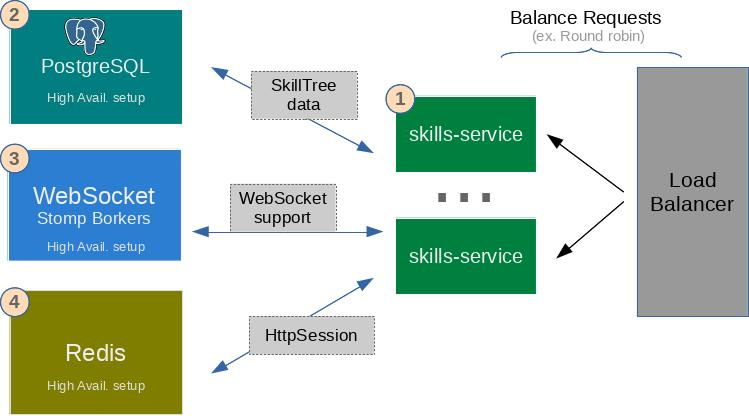

# Production Installation

SkillTree production installation strives for high-availability and horizontal scalability. 
To achieve both of these goals multiple instances of skill-service must be installed on different nodes/instances. 
Each skill-service node will have the same configuration and is designed to scale-up or scale down horizontally. 
You can add or remove instances any time. 

<import-content path="/dashboard/install-guide/common/install-tip.html"/>

There are two installation modes: 

- [Password Auth Mode Install](/dashboard/install-guide/prodInstall.html#password-auth-mode-install): Accounts created and managed by SkillTree and/or delegated to OAuth2 authentication provider (ex. GitHub, Google, etc..)  
- [PKI Auth Mode Install](/dashboard/install-guide/prodInstall.html#pki-auth-mode-install): User's browser must be setup with a personal PKI certificate and that certificate must be issued by a Certificate Authority trusted in the dashboard application's truststore.
  
:::tip
Definitely use Password Auth Mode if you are not sure which mode is applicable to you.
:::

## Password Auth Mode Install

Production grade installation requires a cluster of ``skills-service`` daemons which must reside on multiple machines/instances with a load balancer in between.
There is a number of products that needs to be installed in high-availability mode in order to support clustered SkillTree setup.  


 

<import-content path="/dashboard/install-guide/common/services-explanations.html"/>
1. Redis: Required for clustered skill-service deployment to persist HttpSession  
    - [Redis](https://redis.io/)'s installation, setup and management is outside of the scope of this section, please visit [https://redis.io/](https://redis.io/)        
 
### skill-service configuration

<import-content path="/dashboard/install-guide/common/prod-install-basic-config.html"/>
             
Configure ``https``:
```properties
server.port=8443
server.ssl.enabled=true
server.ssl.key-store-type=PKCS12
server.ssl.key-store=/path/to/keystore.p12
server.ssl.key-store-password=
server.ssl.enabled-protocols=TLSv1.2
```   

<import-content path="/dashboard/install-guide/common/prod-install-basic-jvm-props.html"/>

## PKI Auth Mode Install


### skill-service configuration

<import-content path="/dashboard/install-guide/common/prod-install-basic-config.html"/>

<import-content path="/dashboard/install-guide/common/prod-install-basic-jvm-props.html"/>
