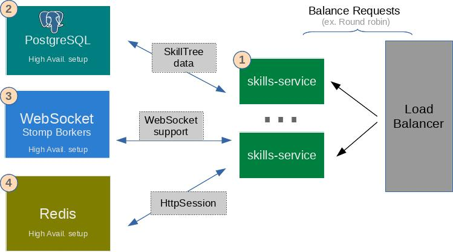

# Production Installation

SkillTree encourages a high-availability and horizontally scalable production installation. 
To achieve both of these goals, multiple instances of skills-service must be installed on different nodes/instances. 
Each skills-service node will have the same configuration and is designed to scale-up or scale down horizontally. 
You can add or remove instances any time. 

<Content path="/dashboard/install-guide/common/install-tip.md"/>

There are two installation modes: 

- [Password Auth Mode](/dashboard/install-guide/prodInstall.html#password-auth-mode-install): Accounts created and managed by SkillTree and/or delegated to OAuth2 authentication provider (ex. GitHub, Google, etc..)  
- [PKI Auth Mode](/dashboard/install-guide/prodInstall.html#pki-auth-mode-install): PKI Mode is for intranets where organizations utilize PKI with 2-way SSL certificates to implement authentication and authorization. User's browser must be setup with a personal PKI certificate and that certificate must be issued by a Certificate Authority trusted in the dashboard application's truststore.

:::tip
Definitely use Password Auth Mode if you are not sure which mode is applicable to you.
:::

## Password Auth Mode Install

<Content path="/dashboard/install-guide/common/install-type-intro.md"/> 

 

<Content path="/dashboard/install-guide/common/services-explanations.md"/>
**4: Spring Session for HTTP Session Management:** Required for a clustered skills-service deployment to persist HttpSession
   - SkillTree uses <external-url label="Spring Session" url="https://docs.spring.io/spring-boot/docs/2.7.0/reference/htmlsingle/#web.spring-session"/> for managing a user’s session information in a clustered environment without being tied to an application container-specific solution.        
:::tip
SkillTree recommends using JDBC to store the HTTP session in a clustered environment due to its simplicity, and since a shared PostgreSQL instance is already required there is no need to run a separate product. 
For example, adding the following two properties is all that is required to utilize the existing SkillTree PostgreSQL database for session management:
```properties
spring.session.store-type=jdbc
spring.session.jdbc.initialize-schema=always
```
:::

**5: Shared keystore for JSON Web Token (JWT) Generation:** Required for a clustered skills-service deployment for JWT generation.  If running your SkillTree server in [https SSL](/dashboard/install-guide/config.html#https-ssl-pass-auth-mode-only) mode, you can use the same keystore file for JWT by adding the following property:
```properties
security.oauth2.jwt.useKeystore=true
```
### Auth Mode skills-service Configuration

<Content path="/dashboard/install-guide/common/prod-install-basic-config.md"/>
             

<Content path="/dashboard/install-guide/common/ssl-props.md"/>

<Content path="/dashboard/install-guide/common/prod-install-basic-jvm-props.md"/>

## PKI Auth Mode Install
<Content path="/dashboard/install-guide/common/install-type-intro.md"/>


<Content path="/dashboard/install-guide/common/services-explanations.md"/>
**4: User Info Service** - Provides user information based on PKI's Distinguished Name (DN)
   - You are responsible for implementing this service, please visit the [User Info Service](/dashboard/install-guide/installModes.html#user-info-service) section to learn more.
   - Make sure to run it in High Availibility mode 

### PKI Mode skills-service configuration

<Content path="/dashboard/install-guide/common/prod-install-basic-config.md"/>

Enable PKI mode install:
```properties
skills.authorization.authMode=PKI
```

<Content path="/dashboard/install-guide/common/two-way-ssl-props.md"/>

``User Info Service`` client properties:
<Content path="/dashboard/install-guide/common/user-info-service-props-endpoints.md"/>

If ``User Info Service`` utilizes 2-way SSL then add the following client authentication properties (Java System Properties):
<Content path="/dashboard/install-guide/common/user-info-service-props-ssl.md"/>

<Content path="/dashboard/install-guide/common/prod-install-basic-jvm-props.md"/>

## Version 5 Migration Guide

skills-service version 5.0 introduces changes to database migrations, skills-client compatibility, and HTTP session storage. Review the requirements below before upgrading and coordinate the service deployment with any client application and configuration updates.

For existing installations, complete the database migrations in version 4.6 before deploying version 5.0. Upgrade integrated applications to skills-client **3.6.5 or later** at the same time, and switch Redis-backed HTTP session storage to JDBC if applicable.

### Database Migration: Liquibase to Flyway

Starting with version 5.0, SkillTree uses Flyway instead of Liquibase to manage database schema migrations. Existing installations must complete the version 4.6 database migrations before upgrading to version 5.0 so that the database has the required Liquibase migration history.

For an existing installation running a version earlier than 4.6:

1. Upgrade skills-service to version 4.6 using the existing SkillTree database.
2. Allow version 4.6 to start successfully and complete its database migrations.
3. Upgrade skills-service to version 5.0 using that same database.

If your installation is already running version 4.6 and its database migrations have completed, you can proceed with the upgrade to version 5.0.

Before Flyway runs its migrations, SkillTree checks the existing Liquibase migration history for the required version 4.6 migration record. If that record is missing, the upgrade is blocked with the following error:

```text
In the 5.0 major release, the Liquibase database migration library was replaced with Flyway. To ensure a proper database schema migration, you must first upgrade to the 4.6 release before upgrading to 5.0
```

If you encounter this error, run version 4.6 against the database and allow its migrations to complete before retrying the version 5.0 upgrade.

New installations without a Liquibase `databasechangelog` table do not require the intermediate upgrade to version 4.6.

### Upgrade Integrated skills-client Applications

Applications that integrate with SkillTree using [skills-client](/skills-client/js.html) must use skills-client version **3.6.5 or later** when skills-service is upgraded to version **5.0**.

Coordinate any required client application upgrades with the skills-service 5.0 deployment so that all integrated applications use a compatible skills-client version at the same time.

### Migrate Redis HttpStore to JDBC

Version 5.0 removes Redis support for HTTP session storage (HttpStore). If your installation stores sessions in Redis, switch to JDBC-backed session storage in the shared SkillTree PostgreSQL database when upgrading skills-service.

Replace `spring.session.store-type=redis` with the following configuration on every skills-service instance:

```properties
spring.session.store-type=jdbc
spring.session.jdbc.initialize-schema=always
```

Remove the Redis session configuration properties, including `spring.data.redis.host`, `spring.data.redis.password`, `spring.data.redis.port`, `spring.session.redis.flush-mode`, and `spring.session.redis.namespace`. Continue using `server.servlet.session.timeout` to configure session duration, if needed.

Existing Redis sessions are not transferred to the JDBC session store, so users will need to sign in again after the switch. See [HttpStore configuration](/dashboard/install-guide/config.html#httpstore) for JDBC session settings.
