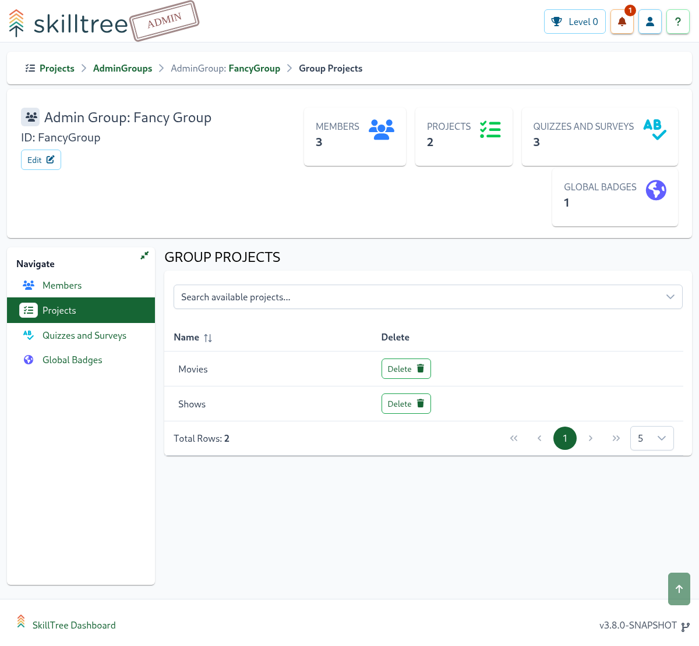
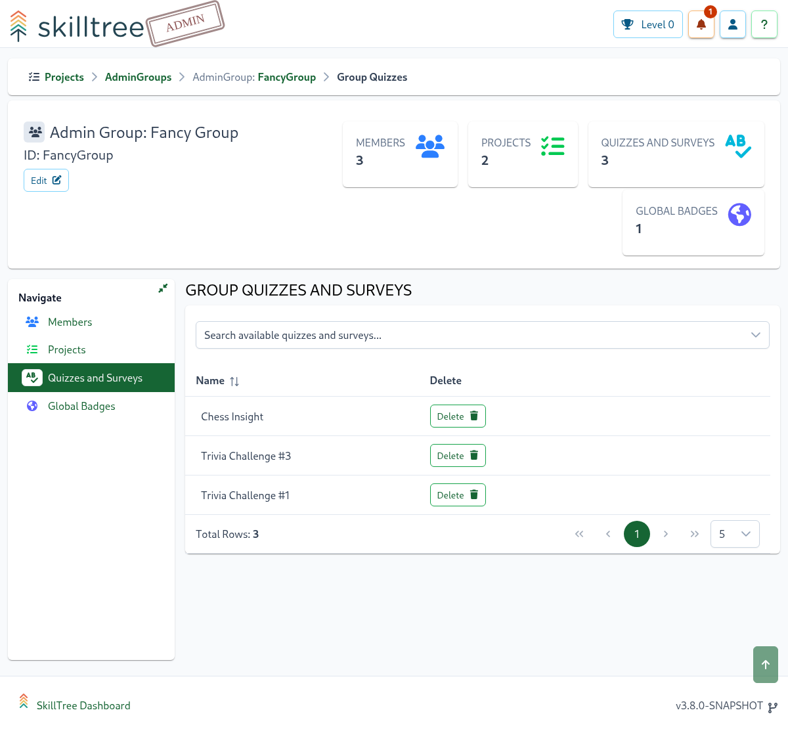

# Admin Groups

Admin Groups streamline the ability to manage a list of administrators for one or more projects and/or quizzes.
Once an Admin Group is created you can easily add and remove members to and from the group. A group can then be assigned to one or more projects and/or quizzes 
which then allows the members of the group to have administrative privileges to the assigned projects and/or quizzes. 
 
To create an admin group please navigate to the ``Admin Groups`` page and then click the ``Admin Group +`` button.

To assign a group to a project please navigate to ``Adming Groups -> Projects`` then select one of the existing projects from the dropdown. 

To assign a group to a quiz please navigate to ``Adming Groups -> Quizzes`` then select one of the existing quizzes from the dropdown.

