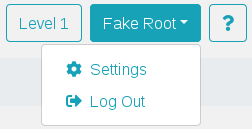
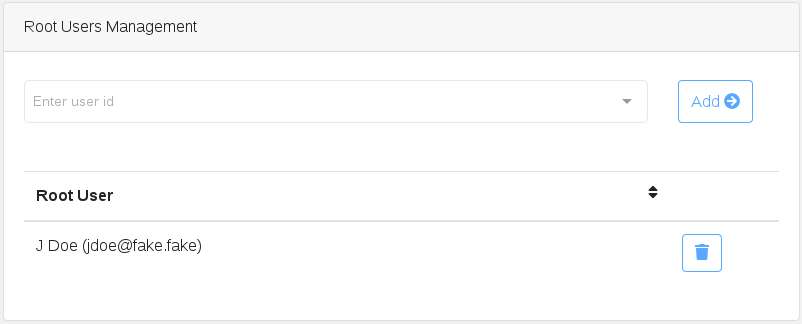
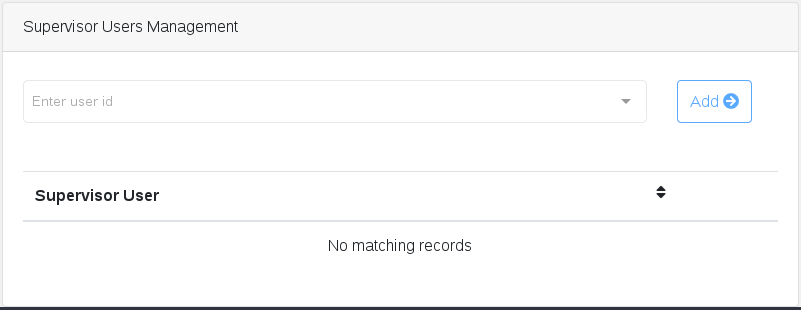
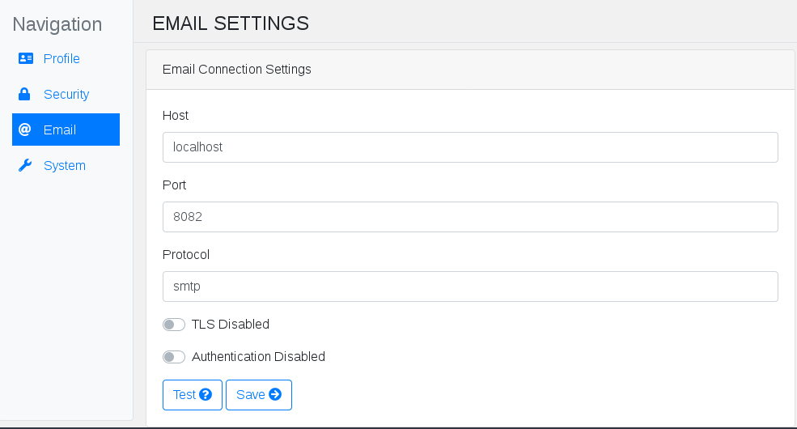
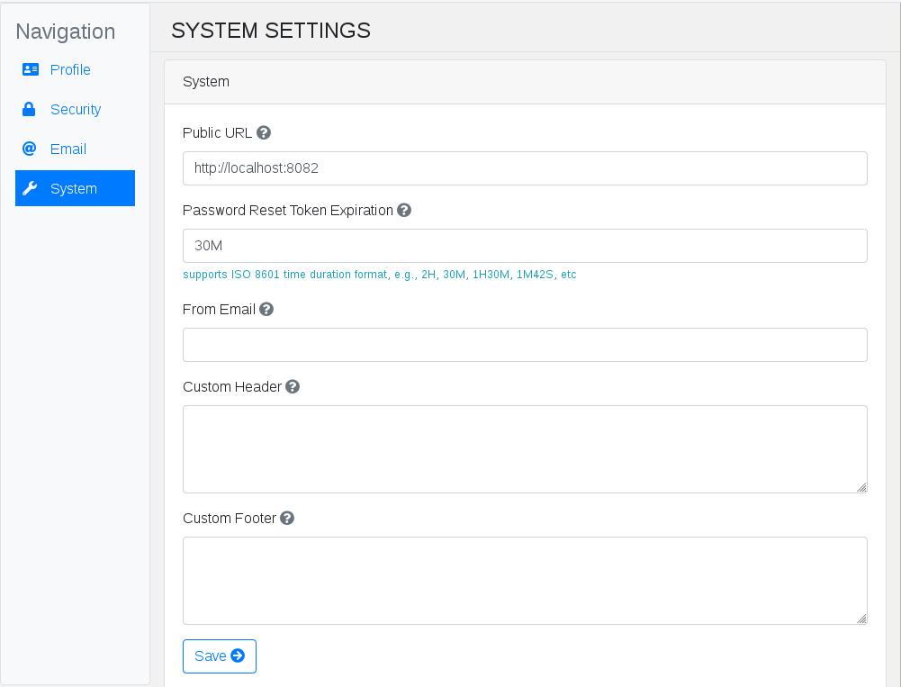
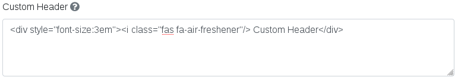
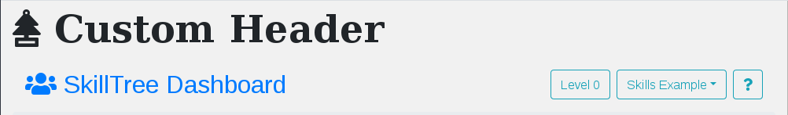
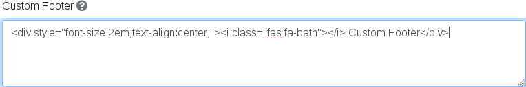
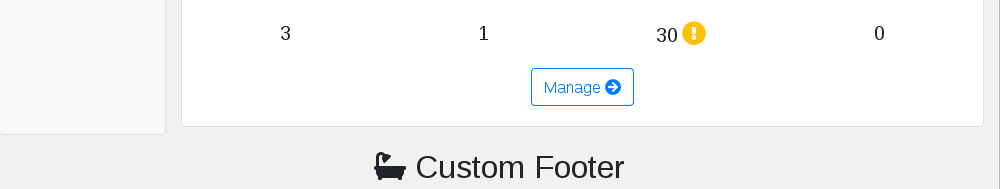

# Administration Settings

The SkillTree Dashboard requires very little administration, however there are several settings that may need attention depending on your configuration.

Administration settings can be accessed by the [Root](/dashboard/user-guide/users.html#root) user via the ```Settings``` menu entry in the drop down menu available by clicking on the Root user's username.



## Security Settings
The ```Security``` menu item supports the administration of [Root](/dashboard/user-guide/users.html#root) users and [Supervisor](/dashboard/user-guide/users.html#supervisor) users.





To grant [Root](/dashboard/user-guide/users.html#root) or [Supervisor](/dashboard/user-guide/users.html#supervisor) privileges to a user, that user must have an existing account for the SkillTree Dashboard. User management will also prevent any permissions being removed from the currently authenticated user.  

## Email Settings
The primary scenario in which the SkillTree dashboard will send emails is in support of password reset requests for Dashboard users. If Email Server settings are not configured, the password reset feature will be disabled.



Email server configuration supports TLS enabled smtp servers, as well as username/password authentication. Changing the ```Authentication``` switch to ```Authentication Enabled``` will reveal the ```Username``` and ```Password``` configuration fields.

::: tip
The email settings form provides a ```Test``` button that can be used to confirm that the dashboard will be able to communicate with the configured mail server. The configured settings will not be applied if the dashboard is unable to successfully communicate with the configured mail server.
:::

## System Settings


Both the ```Public URL``` and ```Password Reset Token Expiration``` settings are specific to supporting the dashboard password reset feature.

Because the dashboard itself may be deployed behind a load balancer or proxy, the ```Public URL``` setting must be configured so that emails emanating from the system can provide valid links back to the dashboard.

The ```Password Reset Token Expiration``` setting allows the ```Root``` user to configure how long a password reset token remains valid. This configuration supports the time component of the ISO 8601 format e.g., ```2H``` for two hours, ```15M30S``` for 15 minutes and 30 seconds, etc.

The ```From Email``` settings allows the ```Root``` user to configure what from email will be used for any emails emanating from the SkillTree dashboard. If no value is explicitly configured, ```no_reply@skilltree``` will be used by default.

``Custom Header`` and ```Custom Footer``` allow the ```Root``` user to specify HTML to be used as a custom header and footer that will be applied to the SkillTree dashboard.

::: warning
&lt;script&gt; tags are not permitted in the html configured for the header or footer
:::

for example:



will result in



Likewise, for the ```Custom Footer```:



will result in

 
  

