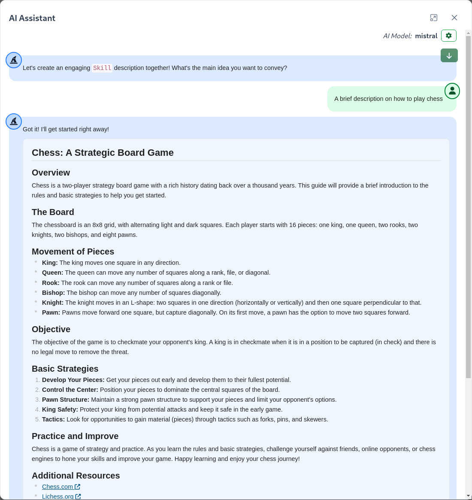
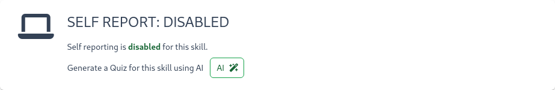
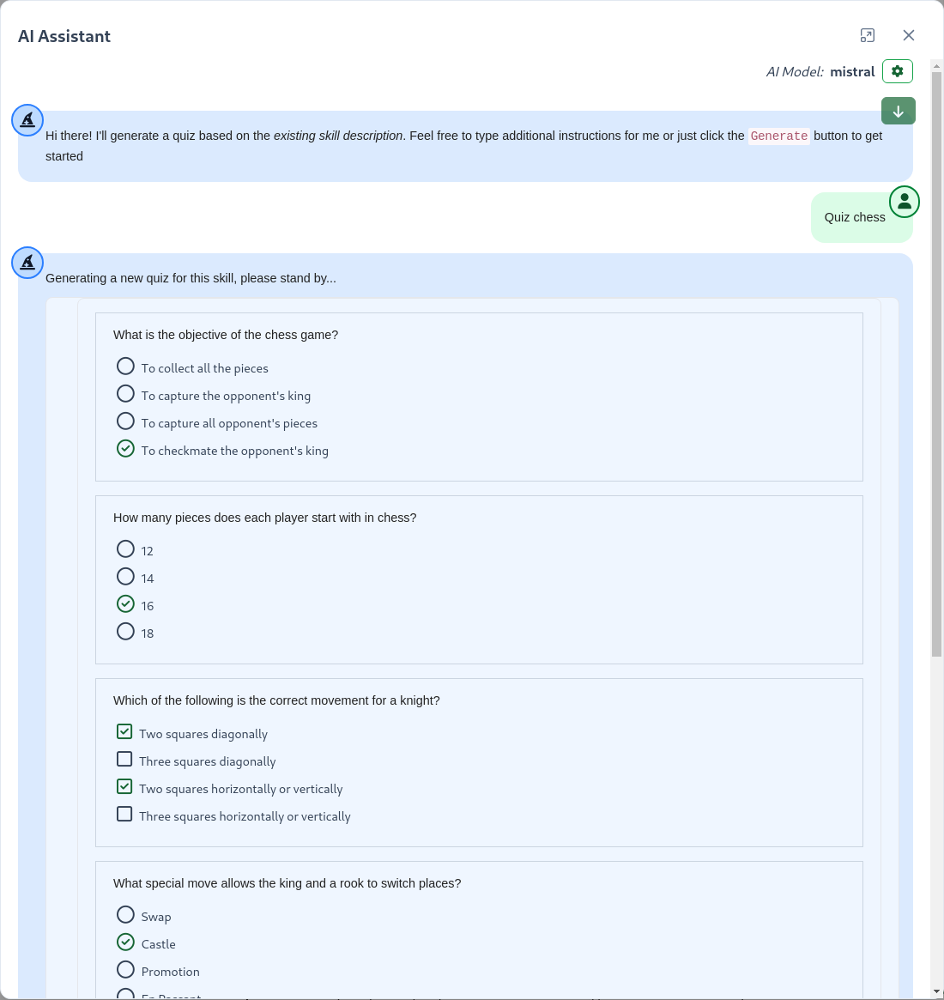
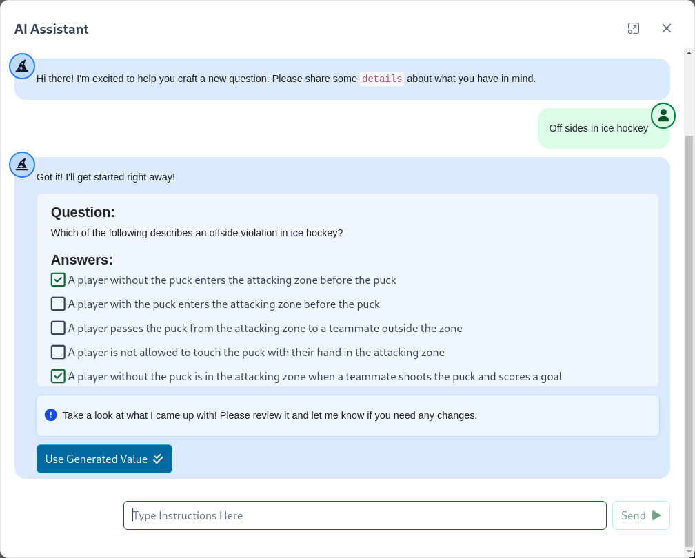
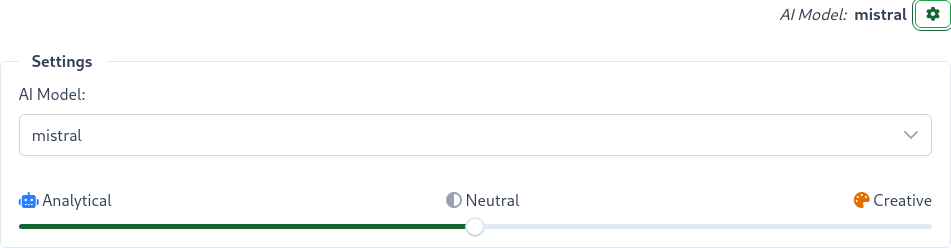

# SkillTree AI Assistant

SkillTree's AI Assistant is a powerful tool that helps administrators create high-quality learning content quickly and efficiently. The AI Assistant is integrated throughout the SkillTree Dashboard, providing automated content generation for various components of your learning ecosystem.

<conditional visibilityFlag="showInstallGuide">

::: warning
SkillTree AI Assistant is disabled by default and must be enabled via Configuration Properties. Please visit the [AI Assistant Configuration Settings](/dashboard/install-guide/config.html#ai-assistant-configuration) to learn more.
:::

</conditional>

## Key Features

### 1. Content Generation
- **Project Descriptions**: Generate comprehensive project overviews
- **Subject Descriptions**: Create detailed subject area descriptions
- **Skill Descriptions**: Develop clear and concise skill definitions
- **Badge Descriptions**: Craft engaging badge descriptions that motivate learners
- **Quiz Descriptions**: Create informative quiz introductions and instructions

### 2. Quiz Generation
- **Single Question Generation**: Get AI-powered suggestions for individual quiz questions
- **Complete Quiz Creation**: Automatically generate full quizzes based on skill descriptions
- **Multiple Question Types**: Supports various question formats including multiple choice, true/false, and more

## Getting Started

The AI Assistant is available throughout the SkillTree Dashboard wherever content creation is required. Look for the AI Assistant button  in the following areas:

1. Project, Subject, Skill, and Badge description editors
2. Quiz generation for a Skill
3. Individual Question generation for an existing Quiz

## AI-Powered Description Generation

The AI Assistant can help you create clear, concise, and engaging descriptions for various components in your SkillTree learning ecosystem. This feature is particularly useful when you need to quickly generate professional-quality content for:

- Project overviews
- Subject area descriptions
- Skill definitions
- Badge descriptions

### How to Generate Descriptions

1. Navigate to the component you want to describe (Project, Subject, Skill, Badge, or Quiz)
2. Click the `AI Assistant` button in the description editor
3. Enter a brief prompt about what you'd like the description to include
4. Click `Send` or press Enter
5. Review the generated content
6. Click `Use Generated Value` to apply it to your description

### Tips for Best Results

- **Be specific** in your prompt to get more relevant results
- **Include key terms** that should appear in the description
- **Mention the tone** you prefer (e.g., "professional," "conversational," "technical")
- **Specify the length** if you have requirements (e.g., "brief 2-3 sentence description")

The AI will generate a well-structured description that you can further customize as needed. You can generate multiple versions until you find one that fits your needs.

## AI-Powered Quiz Generation for a Skill

The AI Assistant can automatically generate a complete quiz for any skill based on its description. This powerful feature saves time and ensures your quizzes are directly aligned with the skill's learning objectives.

### How to Generate a Quiz for a Skill

1. Navigate to the skill you want to create a quiz for
2. In the Self Report section, next to "Generate a Quiz for this skill using AI", click the `AI Assistnant` button
    
3. The AI will analyze the skill's description and generate appropriate quiz questions
4. Optionally add additional instructions and click the `Generate` button or press Enter
5. Review and customize the generated quiz as needed
6. Click the `Use Generated Quiz` button to save the quiz to make it available for learners

::: tip Prerequisites
- The skill **must** have an existing description (more detailed descriptions yield better quiz questions)
- The skill cannot already be configured for self reporting
:::

### What's Included in the Generated Quiz

- Multiple choice questions covering key concepts
- A mix of difficulty levels
- Answers that test understanding of the skill
- Clear, concise question wording

### Tips for Best Results

- Ensure your skill description is detailed and accurate
- Include key terms and concepts you want to be tested
- Review and edit the generated questions to ensure they match your expectations

The generated quiz will be automatically associated with the skill and can be further customized in the quiz editor.

## AI-Powered Single Quiz Question Generation

SkillTree's AI Assistant can help you quickly generate individual, high-quality quiz questions based on your topic. This feature is especially useful when you need to create multiple questions or want suggestions for different question types.

To generate a question using AI:

1. Click the `AI Assistant` button in the question editor
2. Enter a topic or concept in the input field (e.g., "Off sides in ice hockey")
3. Click `Send` or press Enter
4. The AI will generate a complete question with answers
5. Review and edit the generated content as needed
6. Click `Use This Content` to apply it to your question

[//]: # (![AI Assistant Button]&#40;../../screenshots/admin/ai-assistant-button.png&#41;)

## Customizing AI Model Settings

The AI Assistant allows you to customize the behavior of the AI model to better suit your needs. You can access these settings to adjust the model's creativity level or switch between different AI models.

### Accessing Model Settings

1. Click the `AI Assistant` button in any supported interface
2. Look for the gear/settings icon in the AI Assistant dialog 
3. Click the settings icon to reveal the model configuration options

### Available Settings

#### Model Selection
- Choose the model from a dropdown list of all available models

#### Creativity Level
Adjust the temperature setting to control the AI's creativity:

- **Analytical (0.0)**: More focused and deterministic responses
- **Neutral (0.5)**: Balanced between creativity and accuracy
- **Creative (1.0)**: More varied and imaginative responses

*Customizing model behavior*

### When to Adjust Settings

- **For factual content**: Use Analytical mode
- **For brainstorming**: Try Creative mode
- **For most tasks**: The default Neutral setting works well

Your settings will be remembered for future AI Assistant sessions.