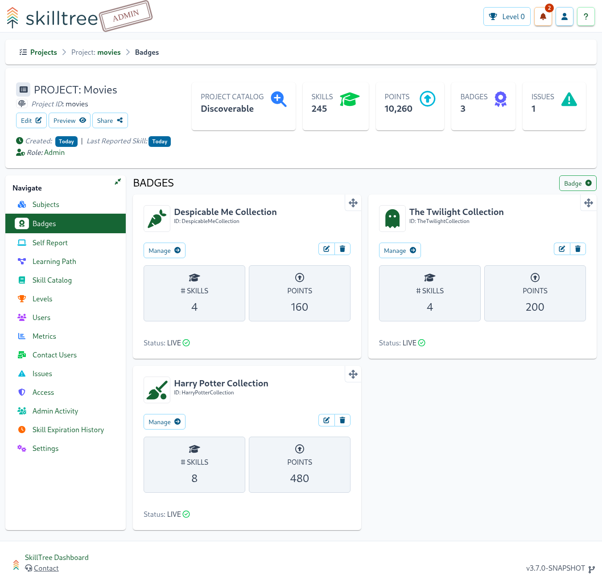
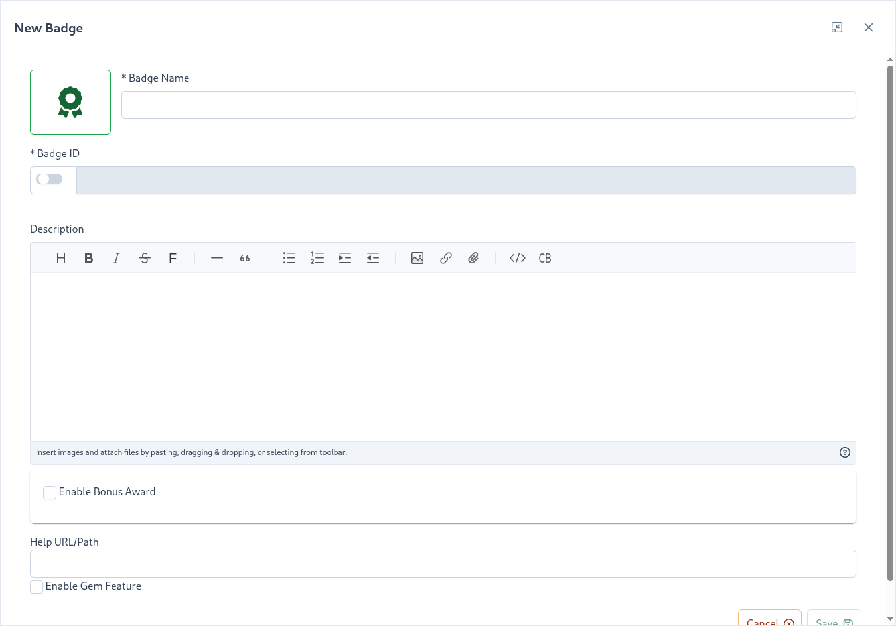

# Badges

Badges add another facet to the overall gamification profile and allows you to further reward your users by providing these prestigious symbols. 
Badges are a collection of skills and when all of the skills are accomplished that badge is earned. 

By default, when badges are created, they are in a disabled state. Disabled badges will not show up in the client display, nor can they be achieved by users.
This is to allow all dependencies to be added to the badge before a user can trigger achievement. 
When a badge is published, all users with existing achievements that meet the Badge criteria will be immediately awarded that badge.

:::tip 
A Badge can only be published one time. Once a Badge has Gone Live, it can no longer be placed into a disabled state 
:::

Examples:
 * Badge1 requires SkillA and SkillB, users who have achieved SkillA and SkillB at the time the badge is published will be awarded Badge1
 * Badge2 is configured as a Gem. Badge2 has an active time window of 01/01/2050 - 02/01/2050 and requires SkillA and SkillB. When Badge2 is published, users who have achieved SkillA and SkillB will be immediately awarded Badge2 so long as SkillA OR SkillB where achieved within the specified time frame. 

Creating badges is simple: 
1. Navigate to ``Project -> Badges`` and click ``Badge +``
   - You can (and should) assign an [Icon](/dashboard/user-guide/icons.html) to your badge.
1. Once a badge is created you can assign existing skills to that badge under ``Project -> Badge -> Skills``
    - When initially created, a badge is in a Disabled state. This is to allow dependencies to be fully added to the badge before it can be achieved by users.
1. After assigning skill dependencies to the badge, locate the badge in the ``Badges`` view and click the ``Go Live`` link on the bottom right of the Badge overview.
    - When the badge is published, any users with existing achievements that meet the badge requirements will be awarded the badge at that time.
 
| Property | Explanation | 
|:------- |:----------- | 
| Badge Name | Display name of the badge |
| Badge ID | The badge ID |
| Description | *(Optional)* Description, can be used to describe how to achieve the badge or what it's significance is. The Description property supports markdown.
| Help URL/Path | *(Optional)* URL pointing to a help article further documenting information about this badge. Please note that this property works in conjunction with the [Root Help Url](/dashboard/user-guide/projects.html#setting-root-help-url) project setting|
| Enable Gem Feature | *(Optional)* Enables the [Gem](#Gem) feature, allowing badges to be only available within a specific time window

## Gem

Gems are special badges that are only available within a configured time window. 
Users must complete all of the gem's skills within that window in order to earn this precious stone!  

You can enable and configure a gem within the badge edit dialog by selecting ``Enable Gem Feature``. 

## Global Badges

Global Badges are a special kind of badge that is made up of a collection of skills and/or levels that span across project boundaries.  

Global Badges consist of:
- *Project's Levels*: Project levels that a user must achieve in order to earn the badge
- *List of Skills*: Skills from any project
 
When all of the configured skills and levels are accomplished, that badge is achieved.
Global Badges are specifically used to reward users for achieving skills that involve multiple projects, 
and can only be created by Dashboard users that have the [Supervisor](/dashboard/user-guide/users.html#user-roles) role.  

Creating Global Badges is simple (<requires-role role="Supervisor" />):

1. Navigate to ``Home -> Badges`` and click ``Badge +``
    - You can (and should) assign an [Icon](/dashboard/user-guide/icons.html) to your badge.
1. Once a badge is created you can assign existing skills and/or project levels to that badge.  
    - To assign skills,  ``Home -> Badge -> Manage -> Skills``
    - To assign project levels,  ``Home -> Badge -> Manage -> Levels``
    - When initially created, a badge is in a Disabled state. This is to allow dependencies to be fully added to the badge before it can be achieved by users.
1. After assigning skills and or project levels, locate the badge in the ``Badges`` view and click the ``Go Live`` link on the bottom right of the Badge overview.
    - When the badge is published, any users with existing achievements that meet the badge requirements will be awarded the badge at that time.
