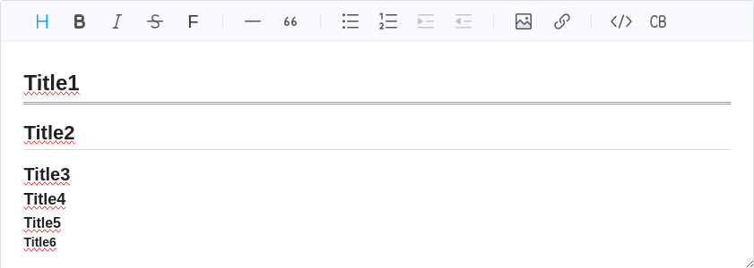
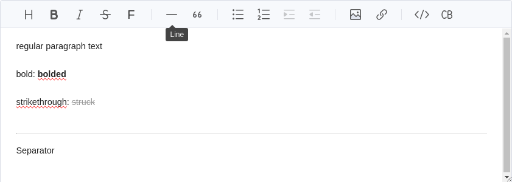
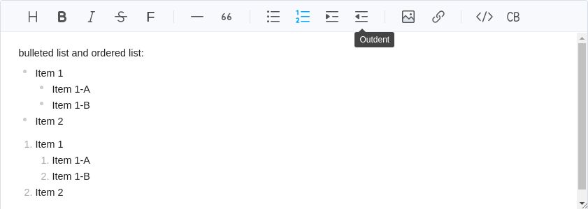
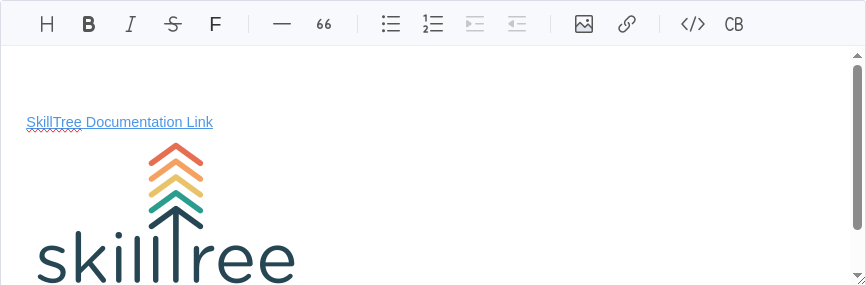
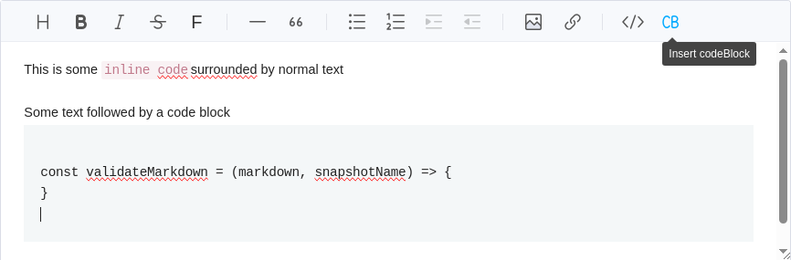

The editor offers the following features:

| Feature        | Shortcut        | Explanation                                                                                                                                                         |
|----------------|-----------------|---------------------------------------------------------------------------------------------------------------------------------------------------------------------|
| Copy & Paste   | Ctrl+C / Ctrl+V | Paste anything from browser, screenshot, excel, powerpoint, etc.                                                                                                    |
| Headings       | Ctrl+Alt+t      | Supports 6 different sized heading                                                                                                                                  |
| Bold           | Ctrl+B          | Apply **bold** formatting to text                                                                                                                                   |
| Italics        | Ctrl+I          | Apply *italic* formating to text                                                                                                                                    |
| Strike         | Ctrl+S          | Apply ~~strike-through~~ formating to text                                                                                                                          |
| Font Size      | Ctrl+Alt+s      | Apply a specific font size to text                                                                                                                                  |
| Line           | Ctrl+L          | Insert a horizontal line seperator                                                                                                                                  |
| Blockquote     | Alt+Q           | Apply quote formatting to line(s) of text                                                                                                                           |
| Unordered List | Ctrl+U          | A bulleted list                                                                                                                                                     |
| Ordered List   | Ctrl+O          | A numbered list                                                                                                                                                     |  
| Indent         | Fn+Tab          | When creating a list, this indent the list one level                                                                                                                |
| Outdent        | Fn+Shift+Tab    | When creating a list, this outdent the list one level                                                                                                               |
| Image          | Ctrl+Alt+i      | Insert an image.  Images may be chosen from a local file, a URL, or copy and pasted.                                                                                |
| Link           | Ctrl+Alt+r      | A hyperlink to an external resource                                                                                                                                 |
| Attachments    | Ctrl+Alt+a      | Attach a file to the description.  Attached files will be stored on the SkillTree server and a link for downloading the attachment will be presented.               |
| Inline Code    | Ctrl+Shift+C    | Apply `code style` formatting inline                                                                                                                                |
| Code Block     | Ctrl+Shift+P    | Apply `code style` to a multiline section                                                                                                                           |

