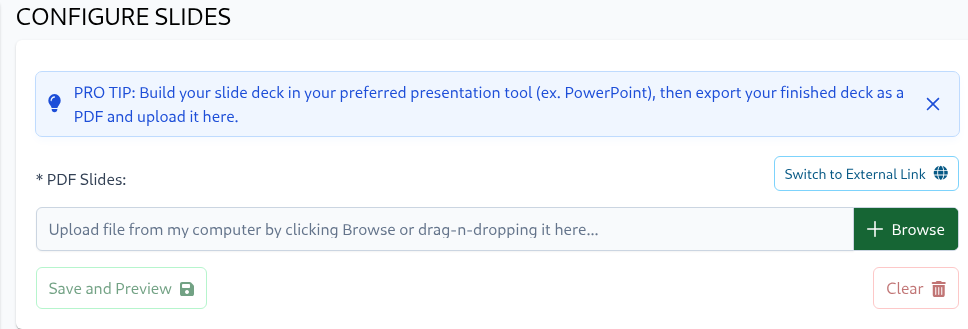
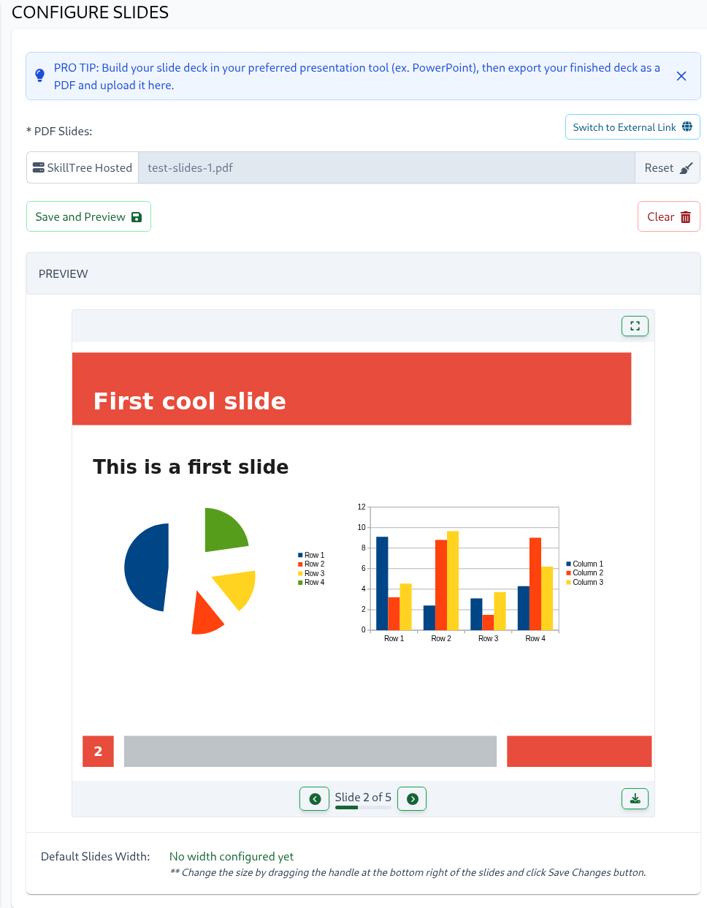

To upload slides from your computer, click the Browse button or drag and drop a file into the upload area. For externally
hosted slides, click "Switch to External Link" and enter the file's URL. Don't forget to click "Save and Preview" to
save your changes.

A preview will appear in the Preview section once configured.

The built-in slide viewer offers:
- Intuitive navigation between slides
- PDF download capability
- Full-screen presentation mode
- Slide resizing (drag the bottom-right corner)

::: tip
Resize slides by dragging the handle in the bottom-right corner. Click "Save Changes" to apply the new dimensions.
Trainees can also adjust slide sizes to their preference. These custom settings are automatically saved in the browser's local storage and will override the default dimensions.
:::

In **full-screen mode**, users can:
- Navigate using `left`/`right` arrow keys
- Access navigation controls by hovering near the bottom
- Exit using the `Escape` key or the exit button in the navigation controls