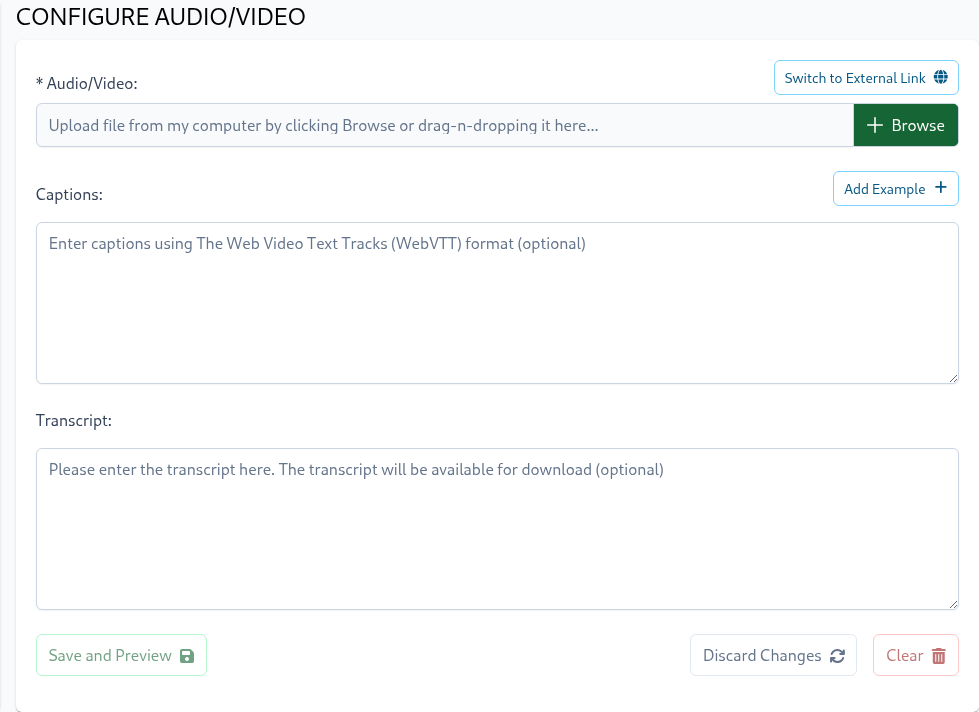

The only required field is `Video` and once the video is configured it will be presented on the training page above the skill's description.

To upload a video from your computer you can click on the `Browse` button or `drag-n-drop` a video file into the video input box.
To configure an externally hosted video click on the `Switch to External Link` button and then enter the URL that points to the externally hosted video.
Please do not forget to click `Save and Preview` button to persist the changes.

To make the video accessible, the settings page offers the ability to specify `Captions` and `Transcript` values.
When captions are configured the video player will present an option to turn captions on or off.  
Captions utilize [Web Video Text Tracks Format (WebVTT)](https://developer.mozilla.org/en-US/docs/Web/API/WebVTT_API) format
and its input form offers an ability to prefill an example in WebVTT format by clicking `Add Example` button above the `Captions` input field.

::: tip
Configure the video size by dragging the button on the bottom-right corner of the video. After resizing, click the
**Save Changes** button to persist the new dimensions.

Trainees can also resize videos, and their personalized configurations will be automatically saved in the browser's
local storage and will take priority over the default.
:::
