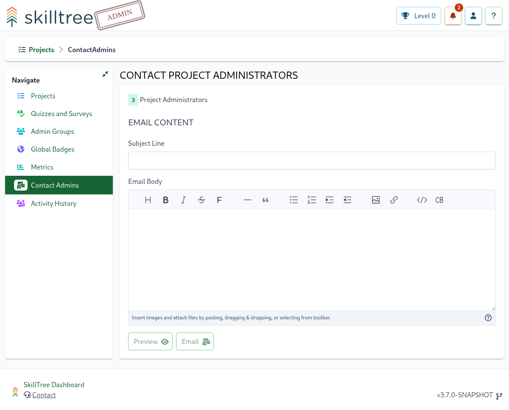

# Contact Admins <requires-role role="Root" />

The Contact Admins page allows root users to communicate with all Project Administrators in this instance of SkillTree. 

::: warning Important
This feature will only be enabled if the necessary [email configuration](/dashboard/user-guide/settings.html#email-notifications) properties have been set for this instance
of SkillTree
:::

 

Once a Root user has crafted an email, the content of the email can be be previewed using the ````Preview```` button which
will send the specified email to the currently authenticated user to preview the content/formatting/display. Once satisfied,
pressing the ```Email``` button will send the specified email to all users of this instance of SkillTree who have the Project Administrator
role.

::: tip
The email body supports markdown
:::
