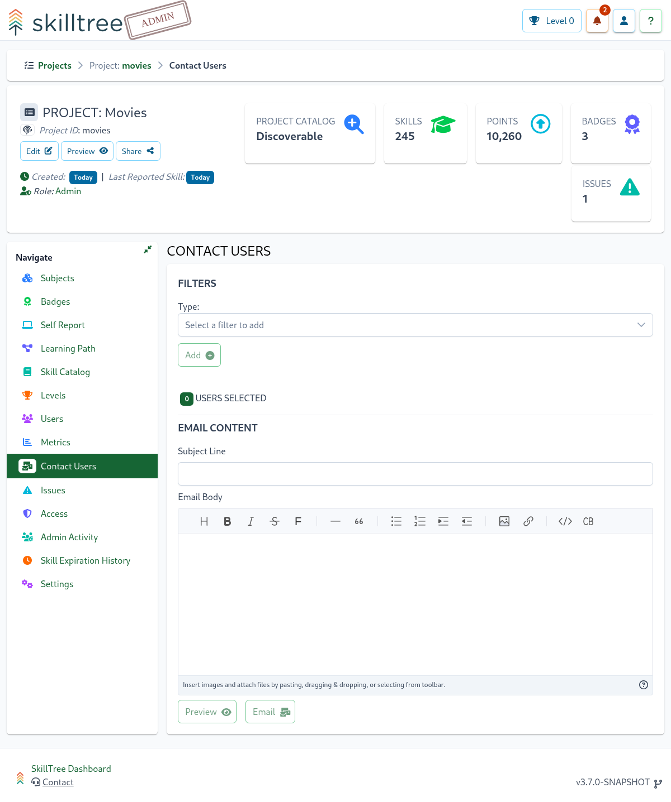

# Contact Users

A Project's Contact Users page gives Project Administrators the ability to communicate with the users of their project
based off a variety of different filters. 

::: warning Important
This feature will only be enabled if the necessary [email configuration](/dashboard/user-guide/settings.html#email-notifications) properties have been set for this instance
of SkillTree
:::

 

Up to 15 different filters can be combined to target users of your project based on the achievement of levels across the Project/Subjects as well as the achievement specific Badges and Skills or the
lack of achievement of specific Skills.

Once a Project Administrator has selected the desired filters, they can create an email that can be sent to the selected users. The
specified email can also be previewed using the ```Preview``` button. This will send the specified email to the currently authenticated
user so that formatting, content, and display can be validated. 

::: tip
The email body supports markdown
:::
