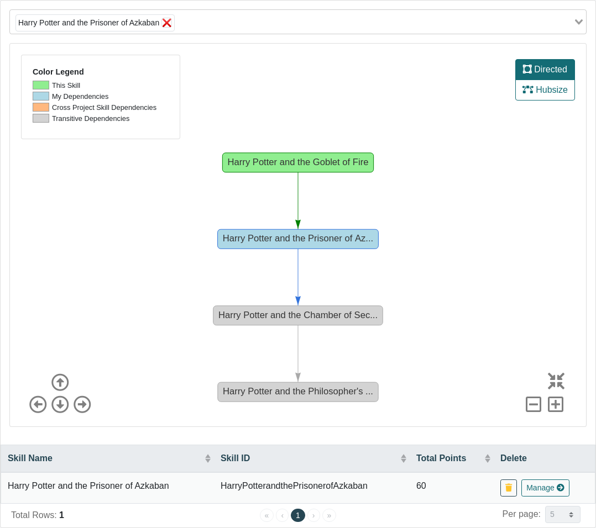

# Dependencies

Dependencies add another facet to the overall gamification profile, which forces users to complete skills in a specified order.
If you set up ``Skill A`` to depend on the completion of ``Skill B`` then no points will be awarded toward ``Skill A`` until ``Skill B`` is fully accomplished.   

Keep in mind that ``Skill B`` must be *fully* completed first before *any* points will be awarded toward ``Skill A``.  

To add a dependency navigate to ``Project -> Subject -> Skill -> Dependencies``

#### Best practices
- Do not create very complex dependency chains - a simple, direct and shallow dependency chain/tree is the best approach.  
- Use dependencies sparingly, they complicate the training profile and may confuse users.

## Cross-Project Dependencies

Cross-Project Dependencies facilitate cross-application training and enable users to become domain experts across several applications. 
These dependencies are critical when actions are required to be performed in more than one tool in order to complete a task.                                        

To create a cross-project skill:
1. In ``Project A`` navigate to ``Project -> Cross Projects``
1. Select skill to share with other projects, for example, ``Skill A`` is selected
1. Select which project to share the skill with *OR* share will all projects, click ``Share`` button
   - for example, ``Skill A`` is shared with ``Project B``
1. In ``Project B`` navigate to ``Project -> Cross Projects``, you will see that ``Skill A`` was shared with this project
1. Now in ``Project B`` ``Skill A`` can be added as a dependency to any local skills using ``Project -> Subject -> Skill -> Dependencies``
   
  

