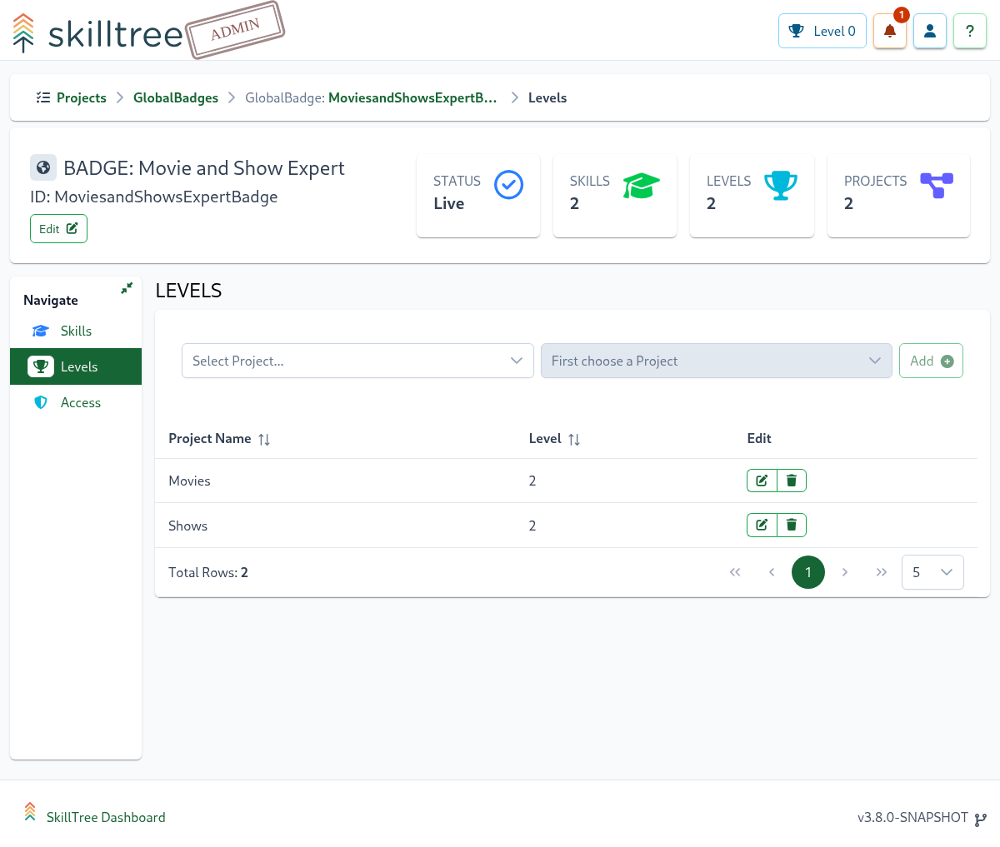
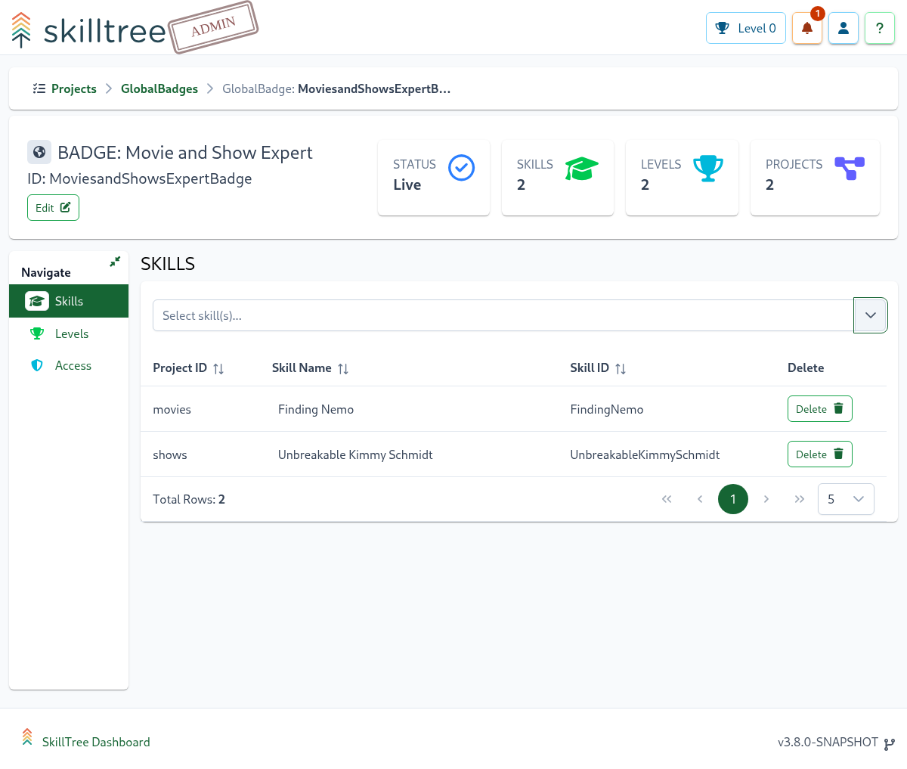
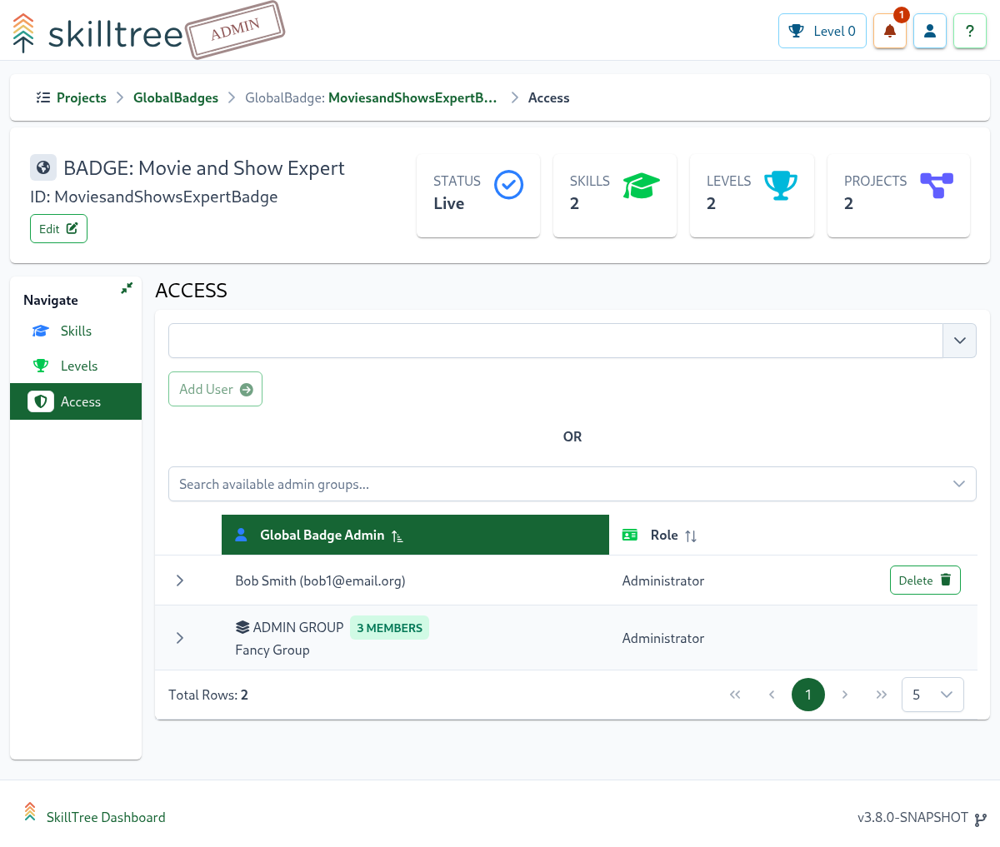

# Global Badges

Global Badges recognize and reward users for achieving skills and levels across multiple projects. These badges help track and celebrate comprehensive skill development that spans different project boundaries.

## Overview

Global Badges are awarded when users meet specific criteria that can include:
- Skills from multiple projects
- Project level achievements
- Any combination of the above

## Components of Global Badges

### Project Levels
Earn badges by reaching specific levels across different projects. These levels demonstrate consistent growth and achievement within individual projects.

### Skills
Showcase expertise by completing specific skills from any project you have access to. These can be combined to create comprehensive achievement paths.

## Access

The Access page supports adding or removing Global Badges Administrators. To add and remove Administrators
please navigate to ``Home -> Global Badges -> Manage -> Access`` page.

## Creating Global Badges

### Step 1: Create a New Badge
1. Navigate to `Home -> Global Badges`
2. Click the `Badge +` button
3. **Recommended**: Add a descriptive [Icon](/dashboard/user-guide/icons.html) for better visual recognition

### Step 2: Configure Badge Requirements
After creation, set up the badge criteria:
- **Adding Skills**: `Home -> Global Badges -> Manage -> Skills`
- **Setting Level Requirements**: `Home -> Global Badges -> Manage -> Levels`

> **Note**: New badges start in a Disabled state, allowing you to fully configure all requirements before they become available to users.

### Step 3: Publish the Badge
1. Go to the `Global Badges` view
2. Locate your badge
3. Click the `Go Live` button in the bottom-right corner of the Badge overview

> **Important**: When published, the system automatically awards the badge to all users who already meet the requirements.