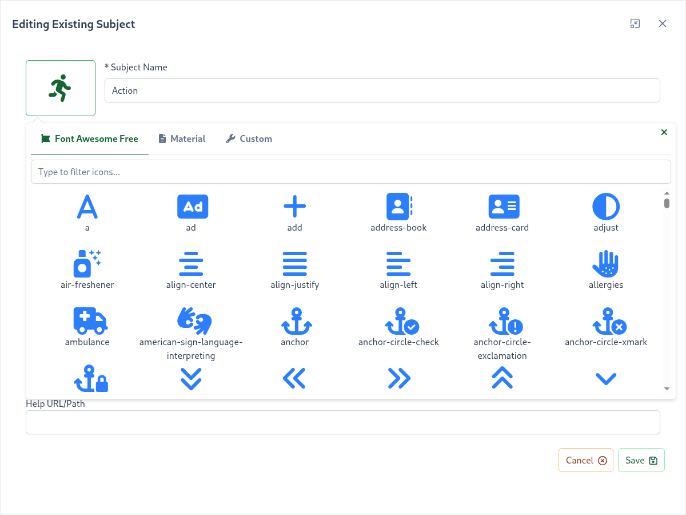

# Icons

The skills platform offers customization of icons for the following items:

- [Subjects](/dashboard/user-guide/subjects.html)
- [Badges](/dashboard/user-guide/badges.html)

When creating or editing these items you can click on the default icon to bring up the icon selector: 

The icon selector supports 2 icon packs: 

- <external-url label="Font Awesome Free" url="https://fontawesome.com" />
- <external-url label="Material" url="https://material.io/tools/icons" /> 

::: tip
To provide consistent branding, use the same icon packs for all of your items
:::

## Custom Icons

The project administrator can upload their own custom images to be used as icons. Supported formats are:

- <external-url label="JPEG" url="https://en.wikipedia.org/wiki/JPEG" />
- <external-url label="PNG" url="https://en.wikipedia.org/wiki/Portable_Network_Graphics" />
- <external-url label="GIF" url="https://en.wikipedia.org/wiki/GIF" />
- <external-url label="BMP" url="https://en.wikipedia.org/wiki/BMP_file_format" />

For the best user experience within the Client Display, custom icons are also constrained to:

- square proportion
- minimum of 48px X 48px
- maximum of 100px X 100px
