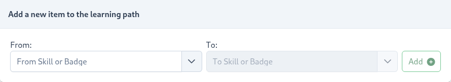

# Learning Path

The Learning Path feature adds another facet to the overall gamification profile, which forces users to complete skills in a specified order.
Project administrators can configure a learning path using the project's [Badges](/dashboard/user-guide/badges.html) or [Skills](/dashboard/user-guide/skills.html). For example, 
if you set up a simple Learning Path of ``Skill A -> Skill B`` then ``Skill A`` will serve as a prerequisite to ``Skill B`` and no points will be awarded toward ``Skill B`` until ``Skill A`` is fully accomplished.   

::: tip
Please note that setting up a Learning Path is an optional feature, so don't feel pressure to configure it right away or at all.
You can always add at a later time. 
::: 

To add a dependency, navigate to ``Project -> Learning Path`` then use the `Add a new item to the learning path` component 
to start adding skills and badges. 

Both `From` and `To` Input fields support [Badges](/dashboard/user-guide/badges.html) and [Skills](/dashboard/user-guide/skills.html). 
The skill/badge specified in the `From` field will serve as a prerequisite to the skill/badge specified in the `To` field. 
The great news is that you can build an extensive learning path for your students by mixing skills and badges.  

::: tip Good To Know
SkillTree will discover circular learning paths at the time of from and to selection and prevent administrators from adding an 
erroneous learning path route. 
::: 

## Orientation
The Learning Path feature supports both vertical and horizontal orientations. The orientation can be toggled by clicking on
the button at the top right of the Learning Path page.

## Fullscreen Mode
The Learning Path page supports fullscreen mode, which can be enabled by clicking on the fullscreen button at the top
right of the Learning Path page.

## Additional Settings
By clicking the settings button on the top right, an additional menu will allow for further customization of the Learning Path.

- Focus On Select - When enabled, clicking on an item in the learning path will cause the learning path to pan and focus on that item. 
- Smooth Focus - When enabled, along with Focus On Select, the learning path will animate the pan and focus transition.
- Dynamic Height - When enabled, the height of the learning path will adjust dynamically based on the dimensions of the path.

## Best practices
- Do not create very complex learning paths - a simple, direct and shallow prerequisite chain/tree is the best approach. 
- Instead of adding a large amount of prerequisite skills consider adding all of those skills to a badge and then using that badge in the Learning Path instead 
- Use prerequisites sparingly as they complicate the training profile

## Cross-Project Prerequisites

Cross-Project Prerequisites facilitate cross-application training and enable users to become domain experts across several applications. 
These dependencies are critical when actions are required to be performed in more than one tool in order to complete a task.                                        

To create a cross-project skill:
1. In ``Project A`` navigate to ``Project -> Learning Path``
2. Scroll down to the ``Share skills from this project with other projects`` section
3. Select a skill to share with other projects, for example, ``Skill A`` is selected
4. Select which project to share the skill with *OR* share will all projects, click ``Share`` button
   - for example, ``Skill A`` is shared with ``Project B``
5. In ``Project B`` navigate to ``Project -> Learning Path``, you will see that ``Skill A`` was shared with this project under ``Available skills from other projects for use as prerequisites`` section
6. Now in ``Project B`` ``Skill A`` can be added as a prerequisite to any local skill
   
  

