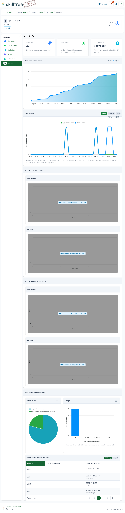

# Metrics

Almost every page in the SkillTree dashboard exposes metrics and statistics about that particular entity/concept. 
These metrics are very much context aware so as an example, graphs and charts you see on a subject page will be for that specific subject and
metrics on the project page will be for the entire project. 

----
----

----
----

----
----

