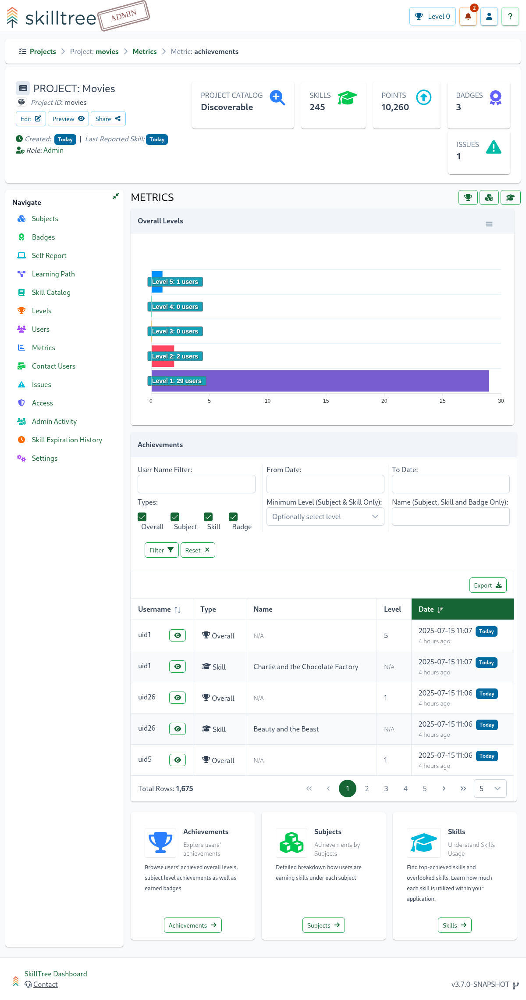

# Metrics

Many project administrative pages in the SkillTree dashboard expose metrics and statistics about that particular entity/concept. 
These metrics are very much context aware so as an example, graphs and charts you see on a subject page will be for that specific subject and
metrics on the project page will be for the entire project. 

## Project Metrics

Project's metrics are accessible via `Project -> Metrics`, providing an overview of project performance. 
Metrics can be further broken down by achievements, subjects, and skills, and can be accessed in two ways:

- Via buttons at the bottom of the Project Metrics page
- Using navigation icons in the top-right corner of the main content area

### Project Achievements Metrics

Accessible via `Project -> Metrics -> Achievements`, displays a level breakdown chart, followed by a detailed achievements table.

Supports filtering and sorting by column. Additionally, achievements can be exported to Excel format, with applied
filters also applied to the exported data.

### Project Subject Metrics

Accessible via Project -> Metrics -> Subjects, providing high-level metrics for each subject, including:

- User Distribution by Level: A bar chart displaying the number of users who have achieved each level for a given subject.
- Level Progression Over Time: A time-based chart, generated after selecting a subject, showing the number of users who have earned each level over time.

### Project Skills Metrics

Accessible via `Project -> Metrics -> Skills`, providing high-level metrics pivoted by skills. The page features a table with the following columns:

- **Skill Name**: The name of the skill.
- **Links**: Deep link to the skill's administrative page and [Single Skill Metrics page](/dashboard/user-guide/metrics.html#single-skill-metrics)
- **Users Achieved**: The number of users who have completed the skill.
- **Users in Progress**: The number of users who have earned at least 1 point but have not yet completed all required occurrences.
- **Last Reported**: The date when the skill was last reported by any user.
- **Last Achieved**: The date when the skill was last achieved by any user.

In addition to the skill metrics table, the page offers several useful filters to help admins quickly identify trends and patterns:
- **Overlooked Skill**: Filter skills that are rarely used or reported.
- **Top Skill**: Filter skills that are most popular or frequently achieved.
- **High Activity**: Filter skills with a high volume of user activity.
- **Never Achieved**: Filter skills that have never been achieved by any user.
- **Never Reported**: Filter skills that have never been reported by any user.

Admins can also export the entire table to Excel format using the `Export All Rows` button located at the top right of the table.

## Single Skill Metrics

The Single Skill Metrics Section provides detailed metrics for a specific skill, allowing admins to dive deeper into the performance and usage of that skill.

This page can be accessed in several ways including:
- `Project -> Subject -> Skill -> Metrics`
- `Project -> Metrics -> Skills -> Skill Link`

This page showcases Post Achievement Metrics, offering administrators valuable insights into whether skills remain
utilized after achievement. Note that these metrics are most effective for skills with automated achievement event
reporting, which can be set up using the [Skills Reporter JS Utility](/skills-client/js.html#skillsreporter-js-utility) or by leveraging the [REST API endpoint](/skills-client/endpoints.html#report-skill-event-endpoint)."

