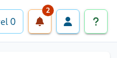
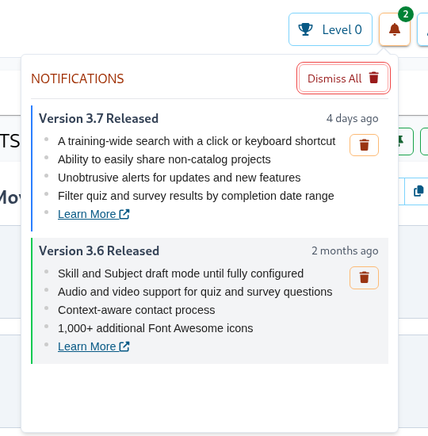

# Notifications
 
Unobtrusive alerts are displayed via the drop-down in the top right corner of the dashboard. These notifications
are time-based, non-intrusive, and easily dismissed.

Clicking the alert drop-down will display the notifications.

A single notification can be dismissed by clicking the "Dismiss" button next to it. All notifications can be dismissed
by clicking the "Dismiss All" button. Once notifications are dismissed, they will no longer appear on the dashboard.

Current alerts notify users about new SkillTree releases and features. Additional notification types may be added in the future.
