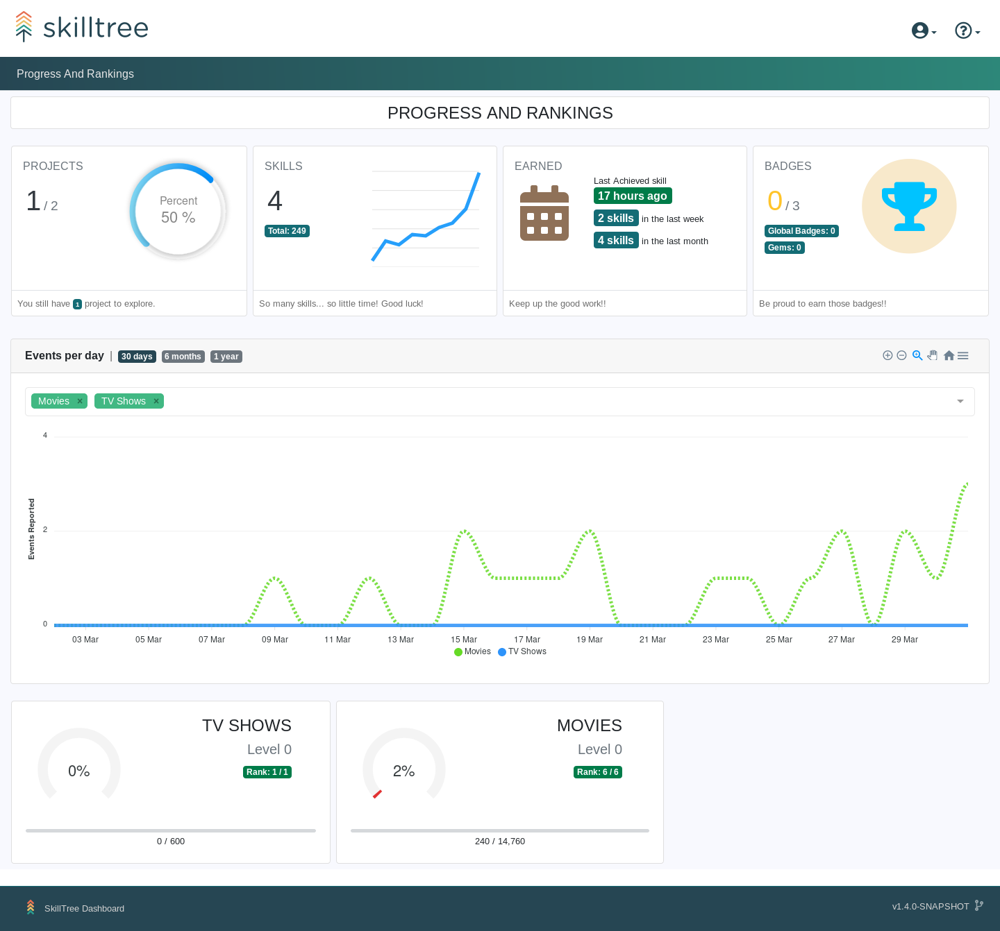

# Progress and Ranking <since project="skills-service" version="1.4.0" />

Progress and ranking visualizes user's current Progress and Ranking across **all** the projects.  

On the bottom of the page each Project Summary information card is clickable and will display the current user's full Skills Display for that project when clicked.

::: tip 
Please note that only projects with the Production Mode enabled are shown on Progress and Ranking view.
Please visit [Project Setting: Production Mode](/dashboard/user-guide/projects.html#setting-production-mode) to learn more
::: 

Progress and Ranking view provides a single point of access for training profiles available to the user as well as a mechanism for Projects that consist entirely of self-reported Skills to provide access to the Skills Display
for their users. Please visit [Self Reporting](/dashboard/user-guide/self-reporting.html) to learn more.  

::: tip
By default Progress and Ranking is the landing page but can be changed to the [Admin View](/dashboard/user-guide/admin-view.html) via [Preferences Page](/dashboard/user-guide/settings.html#preferences)
:::
