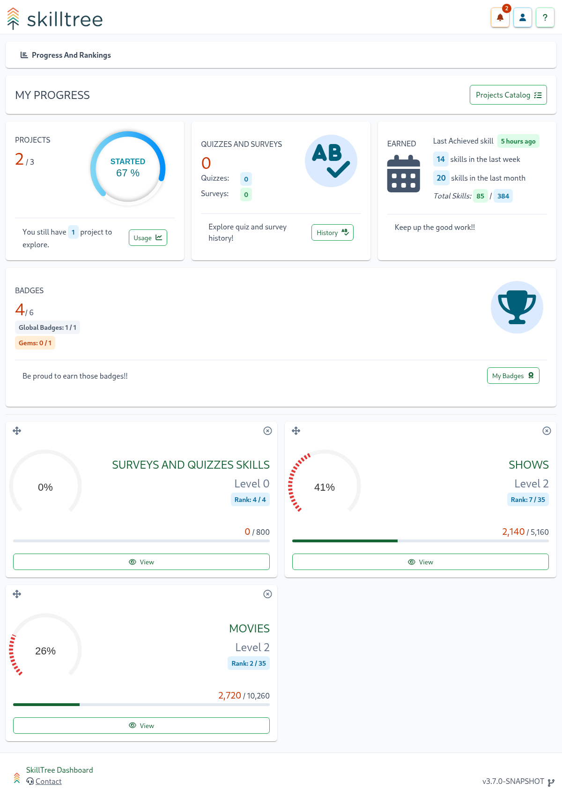
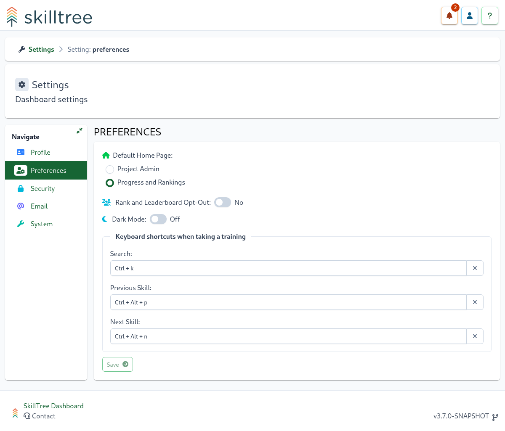
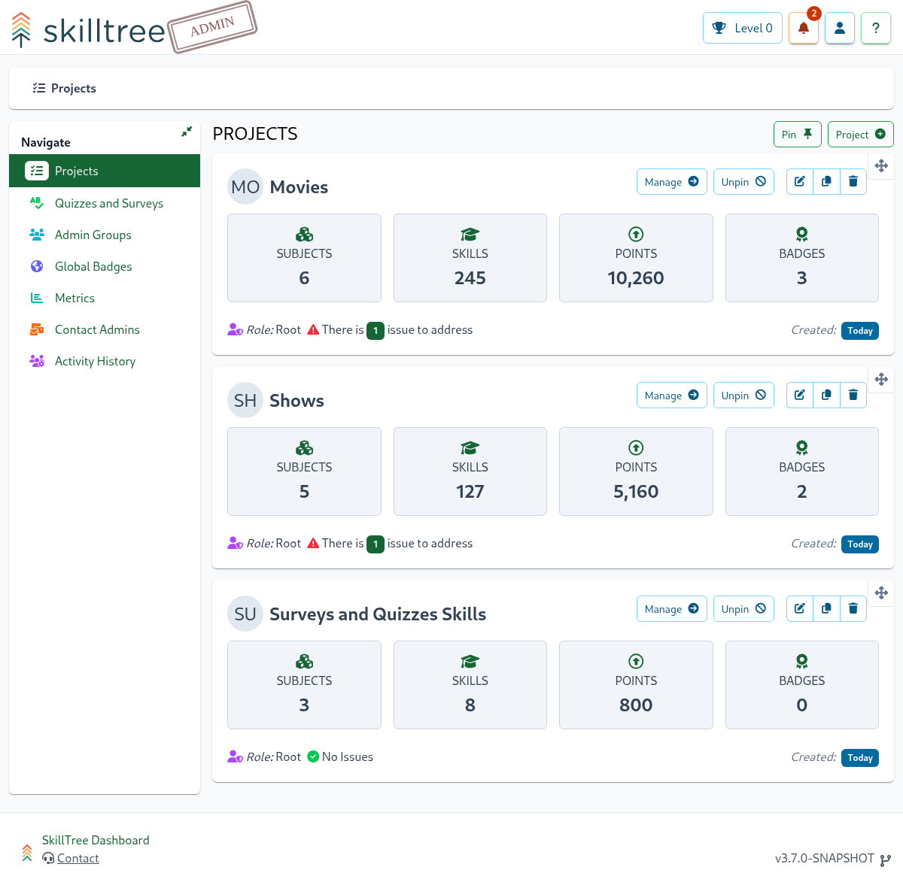

# Progress and Ranking

The Progress and Ranking pages visualize the user's current Progress and Ranking across **multiple** projects. 
There is also a way to drill-down into a specific project to view its progress and ranking.    

::: warning Please Note
Progress and Ranking views are optional pages and not all of the SkillTree installations will have them enabled. 
These views are enabled through daemon start-up [Progress and Ranking views properties](/dashboard/install-guide/config.html#progress-and-ranking-views).
Progress and Ranking pages are generally only applicable when 
- there are a number of applications integrated with this SkillTree installation
- same users utilize multiple integrated applications
- SkillTree dashboard is used to allow users access to the [Self-Reported skills](/dashboard/user-guide/self-reporting.html).
:::

The Progress and Ranking views support:
1. Customization of [My Projects](#manage-my-projects-page) - only view progress and ranking for the selected projects
1. Customization of the sort order of 'My Projects'
1. View [Progress and Ranking](#progress-and-ranking-my-projects) across all of your projects 
1. Drill-down into a specific project to view current progress and ranking
1. Request points for the self-reported skills.  

When [Progress and Ranking views](/dashboard/install-guide/config.html#progress-and-ranking-views) are enabled drop-down menu at the top right 
will feature extra navigation options of ```Progress and Ranking``` and ```Project Admin```


## Manage My Projects Page

``Manage My Project`` page presents a catalog of available projects that can be added to your [Progress and Ranking: My Projects](#progress-and-ranking-my-projects) view. You can find ``Manage My Project`` my navigation to 
Progress and Ranking views and then clicking on "Manage My Projects" button on the top-right. Once there you can easily add and remove projects.  


::: tip
Please note that **only** projects with ``Production Mode`` enabled are presented in the available project catalog. 
Project owners can easily enable ``Production Mode`` on the project's Settings page. 
:::


## Progress and Ranking: My Projects

The Progress and Ranking otherwise known as My Projects page visualizes the user's current Progress and Ranking across **your** projects. 



On the bottom of the page each project summary card is clickable and will display the current user's full Skills Display for that project when clicked.

::: tip Drag-and-Drop!
You can re-arrange projects' display order by grabbing arrows icon on the top left and dragging the project into its new position.  
:::

::: tip
By default, the Progress and Ranking view is the landing page but can be changed to the [Admin View](/dashboard/user-guide/admin-view.html) via [Preferences Page](/dashboard/user-guide/settings.html#preferences)
:::

## Selecting Default Landing Page

You can customize the landing page by visiting ``Settings -> Preferences``:



## Daily Usage Page

You can view your daily usage for the selected projects by visiting ``My Usage`` page from the ``My Projects`` page


## Admin View

Admin view provides access to project administrators to create and manage training profiles. 
The page is clearly labeled with an ``Admin`` stamp which differentiates the view from the Progress and Ranking view



To get started with managing a training profile create a [Project](/dashboard/user-guide/projects.html) followed by [Subjects](/dashboard/user-guide/subjects.html) and then [Skills](/dashboard/user-guide/skills.html). 
Please visit [Building Training Profile](/dashboard/user-guide/#building-training-profile) section to learn more. 

::: tip NOTE
Please note that in the rare case that a single user creates more than 10 projects, they will be displayed in tabular format instead of the default card display. 
:::

