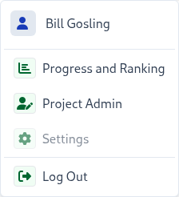
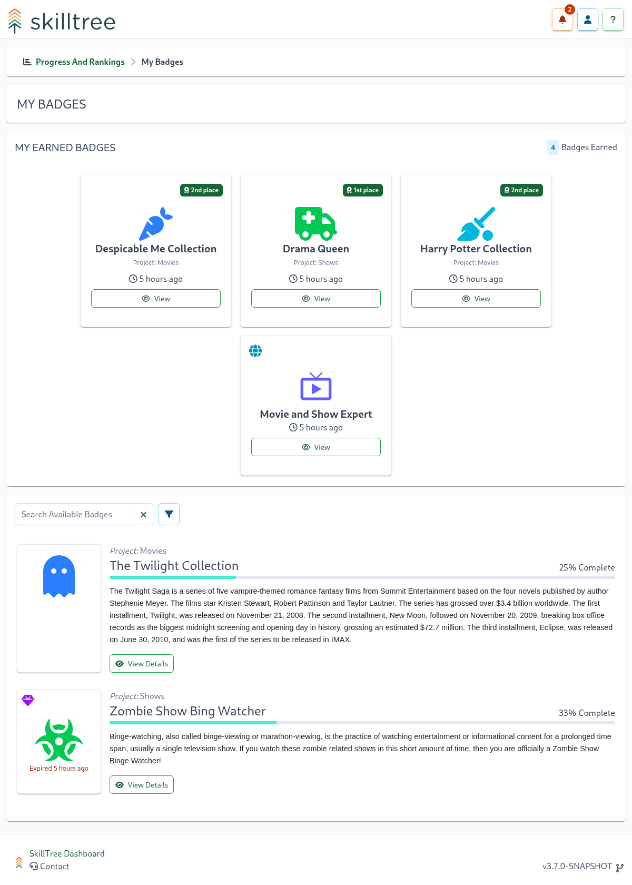
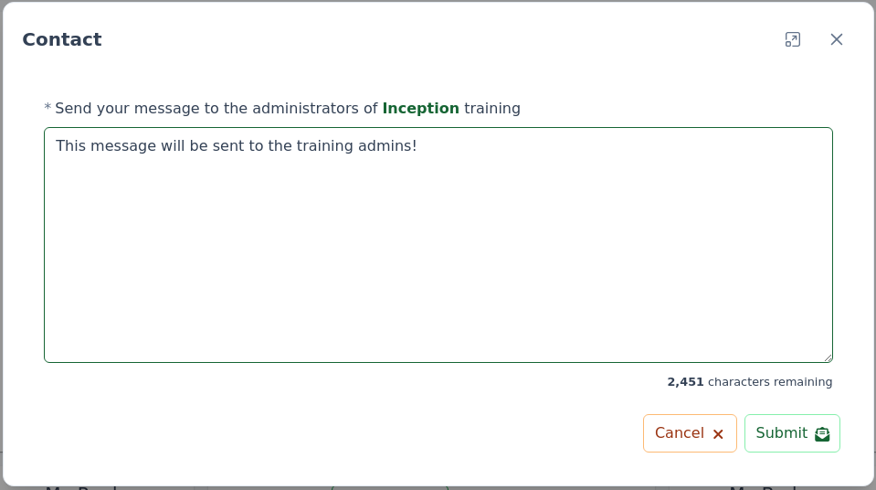

# Progress and Ranking

The Progress and Ranking pages visualize the user's current Progress and Ranking across **multiple** projects. 
There is also a way to drill-down into a specific project to view its progress and ranking.    

<conditional visibilityFlag="progressAndRankingInstallNote">

::: warning Please Note
Progress and Ranking views are optional pages and not all of the SkillTree installations will have them enabled. 
These views are enabled through start-up configuration [Progress and Ranking views properties](/dashboard/install-guide/config.html#progress-and-ranking-views).
Progress and Ranking pages are generally only applicable when 
- there are a number of applications integrated with this SkillTree installation
- the same users utilize multiple integrated applications
- the SkillTree dashboard is used to allow users access to [Self-Reported skills](/dashboard/user-guide/self-reporting.html).
:::

</conditional>


The Progress and Ranking views support:
1. Customization of [My Projects](#manage-my-projects-page) - only view progress and ranking for the selected projects
1. Customization of the sort order of 'My Projects'
1. View [Progress and Ranking](#progress-and-ranking-my-projects) across all of your projects 
1. Drill-down into a specific project to view current progress and ranking
1. Request points for self-reported skills.  

When [Progress and Ranking views](/dashboard/install-guide/config.html#progress-and-ranking-views) are enabled, the drop-down menu at the top right 
will feature extra navigation options of ```Progress and Ranking``` and ```Project Admin```




## Manage My Projects Page

The ``Manage My Project`` page presents a catalog of available projects that can be added to your [Progress and Ranking: My Projects](#progress-and-ranking-my-projects) view. You can find ``Manage My Project`` by navigating to the
Progress and Ranking views and then clicking on the "Manage My Projects" button on the top-right. Once there you can easily add and remove projects.  


::: tip
Please note that **only** projects with ``Discoverable`` enabled are presented in the available project catalog. 
Project owners can easily enable ``Discoverable`` on the project's Settings page. 
:::


## Progress and Ranking: My Projects

The Progress and Ranking view, otherwise known as the My Projects page, visualizes the currently authenticated user's current Progress and Ranking across all selected projects. 


On the bottom of the page each project summary card is clickable and will display the current user's full Skills Display for that project when clicked.

::: tip Drag-and-Drop!
You can re-arrange projects' display order by grabbing the arrows icon on the top left and dragging the project into its new position.  
:::

::: tip
By default, the Progress and Ranking view is the landing page for the SkillTree dashboard. This can be changed to the [Admin View](/dashboard/user-guide/admin-view.html) via the [Preferences Page](/dashboard/user-guide/settings.html#preferences).
:::

## Selecting Default Landing Page

You can customize the landing page by visiting ``Settings -> Preferences``:


## Badges Page <since project="skills-service" version="1.7.0" />

You can view your earned and available badges by visiting the ``My Badges`` page from the ``My Projects`` page.



The ``My Badges`` page is broken down into ``My Earned Badges`` and available badges. 
You can click on each earned badge to see the skills and points that were achieved to earn this prestigious award.  

Available badges lists all of the badges that have not been fully achieved and 
- are from one of the Projects selected for ``My Projects`` OR
- are a Global Badges that has a Skill or Project Level requirement from on of the Projects selected for ``My Projects``

::: tip
You can search badges by name as well as filter by  to ``Project Badges``, ``Gems`` or ``Global Badges``
:::

## Contact Project Admins

Users consuming a micro-learning training using SkillTree can easily communicate with the administrators of that 
specific training profile. After drilling down into a specific project to view that project's progress and ranking views, a
 button is presented on the top right. 

The ``Contact Project`` button displays the contact form where users can enter and submit a message for that project's admins. 



Once the ``Submit`` button is clicked an email with the provided message is sent to all project's admins. 

::: danger IMPORTANT
Please note that the ``Contact Project`` button is only display if the [Email Server Settings](/dashboard/user-guide/settings.html#email-settings)
are configured, otherwise the button is not displayed as emails cannot be sent.
:::


## Daily Usage Page

You can view your daily usage for the selected projects by visiting the ``My Usage`` page from the ``My Projects`` page


## Admin View

The admin view provides access for project administrators to create and manage training profiles. 
The page is clearly labeled with an ``Admin`` stamp which visually differentiates it from the Progress and Ranking view


To get started with managing a training profile create a [Project](/dashboard/user-guide/projects.html) followed by [Subjects](/dashboard/user-guide/subjects.html) and then [Skills](/dashboard/user-guide/skills.html). 
Please visit the [Building Training Profile](/dashboard/user-guide/#building-training-profile) section to learn more. 

::: tip NOTE
Please note that in the rare case that a single user creates more than 10 projects, they will be displayed in tabular format instead of the default card display. 
:::

