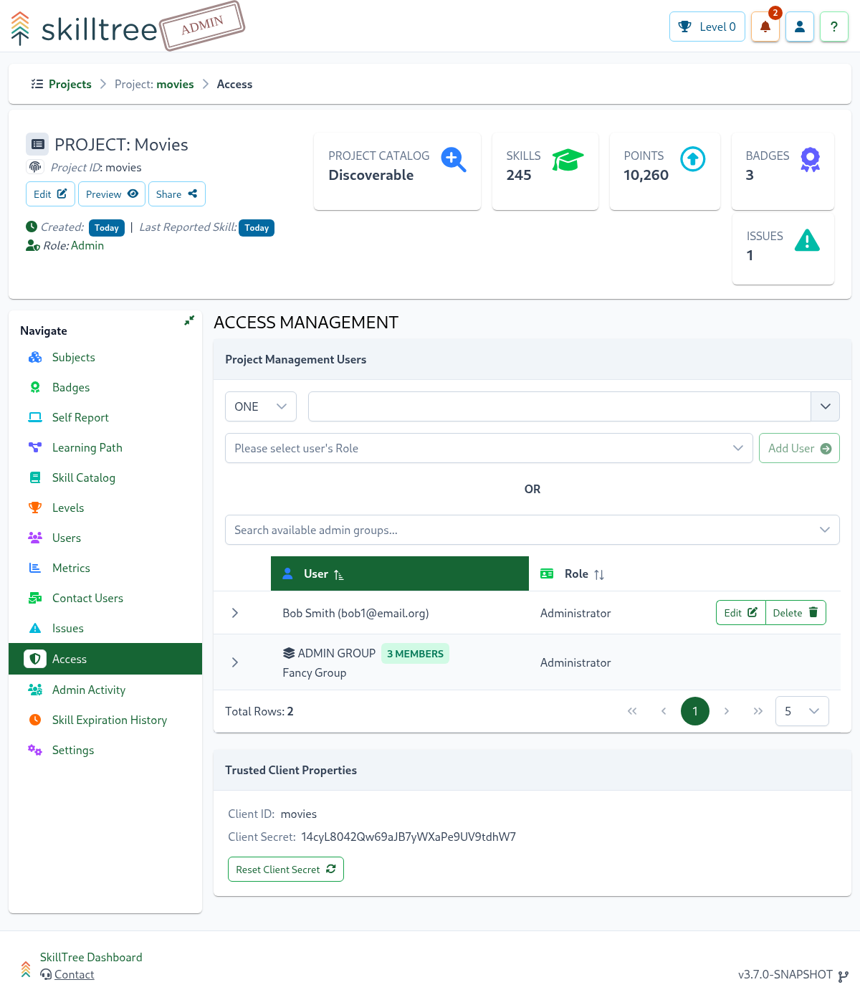
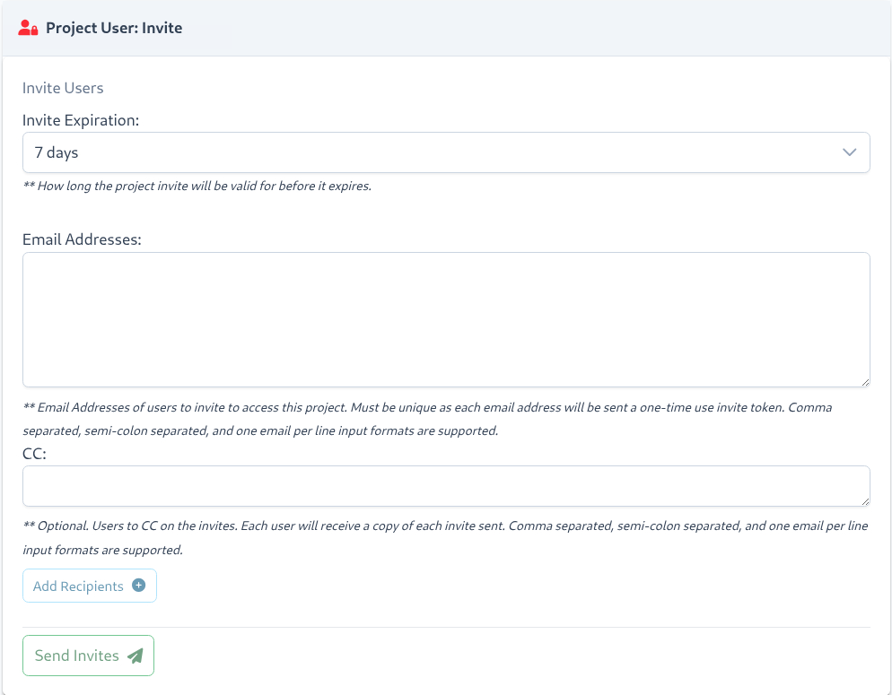
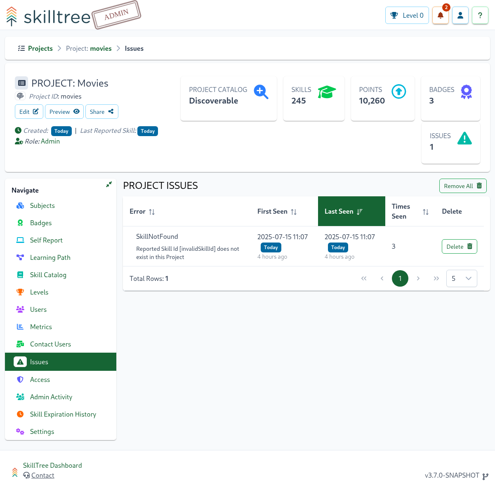

# Projects

A Project is an overall container that represents the skills ruleset for a single application with gamified training. 
Project's administrator(s) manage skill definitions, subjects, levels, dependencies and other attributes that make up an application's training profile.


Creating a project is simple, all you need is a name. While the project id is required, it will be automatically generated (you can optionally override the generated id).

::: tip
As of 2.1.0 there is now a description field available for projects. Where the project description is displayed is controlled by the new [Project Description](/dashboard/user-guide/projects.html#setting-project-description) setting in Project Settings
:::


To create a project click the ``Project +`` button.


A Project is composed of Subjects which are made up of Skills and a single skill defines a training unit within the gamification framework. 
Once the project is created you have an empty canvas on which to compose and manage your application's training profile. 
Generally the next step is to create a number of Subjects and then start constructing Skill definitions within those Subjects.

The Dashboard user that creates a project is automatically granted the role of administrator of that project. Project administrators enjoy the following benefits: 

| Function                                                                                | Explanation                                                                                                                                                    | 
|:----------------------------------------------------------------------------------------|:---------------------------------------------------------------------------------------------------------------------------------------------------------------| 
| [Subjects](/dashboard/user-guide/subjects.html)                                         | Add, edit or remove Subjects                                                                                                                                   | 
| [Skills](/dashboard/user-guide/skills.html)                                             | Add, edit or remove Skill definitions                                                                                                                          |
| [Self Reporting](/dashboard/user-guide/self-reporting.html)                             | Self Report is a feature that empowers users to mark skills as completed directly in the SkillTree dashboard OR through the embedded Skills Display component. |
| [Access Management](/dashboard/user-guide/projects.html#access)                         | Manage Project's Admin/Approver roles and Private Invite Only access                                                                                           |                                                                                                                                         | 
| [Badges](/dashboard/user-guide/badges.html)                                             | Add, edit or remove Project's Badges                                                                                                                           |
| [Levels](/dashboard/user-guide/levels.html)                                             | Customize number of Levels and their attributes                                                                                                                |
| [Learning Path](/dashboard/user-guide/learning-path.html)                               | Specify the order of Skills completion. For example Skill A must be completed before Skill B can be attempted                                                  | 
| [Cross-project Prerequisites](/dashboard/user-guide/learning-path.html#cross-project-prerequisites) | Create and manage Skill prerequisites across multiple Projects which practically equates to cross-application Skills                                           |
| [Contact Users](/dashboard/user-guide/contact-project-users.html)                       | Communicate with users of your Project                                                                                                                         |
| [Metrics](/dashboard/user-guide/metrics.html)                                           | Charts and graph. These are page specific - Project, Subject, Badge, and User will have stats specifically for those pages                                     |
| [Issues](/dashboard/user-guide/projects.html#issues)                                             | Errors related to the Project such as non-existant Skills that have been reported                                                                              |       
| [Settings](/dashboard/user-guide/projects.html#settings)                                | Project level settings                                                                                                                                         |   

## Settings

To manage and view project-wide settings navigate to ``Project -> Settings``. 


The following project-level settings are available: 

### Setting: Project Discoverability
There are three possible values for the Project Discoverability setting:

1. Not in the Project Catalog (default value)
2. Add to Project Catalog
3. Private Invite Only


``Not in the Project Catalog`` projects can be accessed by users who have a direct link (Preview button) to the project's Skills Display or by applications that have integrated the SkillTree client libraries. The project will not be available in the
[Projects Catalog](/dashboard/user-guide/progress-and-ranking.html#progress-and-ranking-my-projects) view.

``Add to Project Catalog`` projects can be discoverd by users in the [Projects Catalog](/dashboard/user-guide/progress-and-ranking.html#progress-and-ranking-my-projects) view.

``Private Invite Only`` projects can only be accessed by users who have been invited to join the project and who have accepted the invite. Any other user attempting to access the project will receive an Access Denied error. Users who have been 
designated as Project Administrators will continue to have access to the project. Users can be invited to join the project using the [Project Access](/dashboard/user-guide/projects.html#invite-only) page.

::: warning
There may be a delay of up to several minutes after changing a [Project Discoverability](/dashboard/user-guide/projects.html#setting-project-discoverability) from or to ``Private Invite Only`` before the change is reflected for all users.
:::

### Setting: Project Description
There are two possible values for the Project Description setting:

1. Only show Project Description in Manager My Projects (default value)
2. Show Project Description everywhere

``Only show Project Description in Manager My Projects`` is the default value for a Project. With this setting, any project description that has been configured will only be displayed in the Manage My Projects view - in the future the description may be visible to other Project Administrators in the Import Skills From the Catalog dialog.
``Show Project Description everywhere`` will cause any configured project description to be displayed anywhere that the training profile is displayed, including in the Manage My Proejcts view. This setting may be most applicable for SkillTree users whose training profile is viewed primarily through the Progress and Ranking view in the SkillTree dashboard.

### Setting: Use Points For Levels
 
``Use Points For Levels`` - switch between two level management strategies: 
1. Percentage based - levels are calculated based on configured percentages of total available points (ex. Level 1 = 10% of total points)
1. Point based - project admins specify start and end point values for each level

By default, the Percentage based strategy is configured, changing the ``Use Points For Levels`` setting to ``true`` enables Point Based explicit level point management. To learn more please see the [Levels](/dashboard/user-guide/levels.html) section.

::: warning
You must define at least 100 points for a project before switching to point-based levels management
:::

### Setting: Root Help Url

Skill definition's ``Help Url/Path`` will be treated relative to this ``Root Help Url``. For example, if 

- ``Root Help Url`` =  ``http://www.myHelpDocs.com``
-  and a Skill definition's ``Help Url`` = ``/important/article`` 

then the client display will concatenate ``Root Help Url`` and  ``Help Url`` to produce ``http://www.myHelpDocs.com/important/article``.

::: tip
If a Skill's ``Help Url`` starts with ``http`` or ``https`` then ``Root Help Url`` will NOT be utilized.
:::  

If a Skill's ``Help Url`` is blank then no url will be displayed even if ``Root Help Url`` is configured. 
In other words ``Root Help Url`` only works in conjunction with a Skill's ``Help Url``.

### Setting: Self Report Default

By default, Self Reporting is disabled when creating or modifying a skill.
If your project primarily consists of Self Reported skills, enabling Self Report Default will result in 
the selected Self Report Approval type being the default for any skills created after this point

Please visit [Self Report](/dashboard/user-guide/self-reporting.html) section to learn further.

### Setting: Rank Opt-Out for ALL Admins

When enabled, all project admins will be excluded from the Leaderboard and will not be assigned a rank within the embedded Skills Display component

### Setting: Custom Labels

Certain terminology in SkillTree may be overloaded to some organizations and could be confusing to end users. 
If this is the case, admins can customize the following labels displayed to users in the embedded Skills Display component and Progress and Ranking pages:
- Project
- Subject
- Group
- Skill
- Level

### Setting: Always Show Group Descriptions

Toggle this setting to always show the group's descriptions in this project embedded Skills Display component and Progress and Ranking pages.

## Access
The Project Access page supports adding or removing Project Administrators, Project Approvers, and inviting users to join a project if the project has been configured as an Invite Only project as well as revoking a user's access.

To add and remove project Administrators and Approvers navigate to ``Project -> Access`` page.



You must have an Admin role in order to manage other Admin and/or Approver users for a project. 
There supported project roles are: 
- **Admin**: enables management of the training profile for that project such as creating and modifying subjects, skills, badges, etc. 
- **Approver**: allowed to approve and deny [Self Reporting](/dashboard/user-guide/self-reporting.html#approval-queue) approval requests while only getting a read-only view of the project. 

### Invite Only
If the project has been configured with a visibility of ``Private Invite Only``, invite and access revocation are controlled here.

::: tip
The ``Project User: Invite`` and ``Project User: Revoke`` user interface controls are only displayed if the project has been configured with a [Project Discoverability](/dashboard/user-guide/projects.html#setting-visibility) of Invite Only
:::

#### Invite Users
Users are invited to join a project that has been configured as ``Private Invite Only`` via email. Invite recipients are added via the ``Email Addresses`` input field and can be added one at a time or by using a comma or semicolon separated list
or by entering one email address per line in the ``Email Addresses`` input field (email addresses in the form of ``<some@email.address> Firstname Lastname`` are also supported). Once email addresses have been entered into the ``Email Addresses`` input field,
they must be added as recipients using the ``Add Recipients`` button. These steps may be performed several times before the ``Send Invites`` button is pressed at which point all accumulated email addresses will be sent an email with a unique, one-time use invite to join the project.



Project invites may be configured to expire if not accepted within a certain time frame. Please note that the expiration configuration is only applicable to how long the invite code itself is valid. Once a user has accepted a valid invite code and joined the project, the invite expiration
configuration is no longer relevant for that user.

::: tip
Each email recipient receives a unique project invite code, therefore distribution lists or group email accounts should not be added as recipients as only the first person to claim the invite will be able to use it.
:::

::: warning Important
To invite users to join a ``Private Invite Only`` project, the SkillTree instance MUST be configured to support email. Please see [Email Server Settings](/dashboard/user-guide/settings.html#email-settings) for more information.
:::

##### Manage Invites Pending Acceptance
Once Project Invites have been sent to users, any invites that have not yet been accepted or invites that have recently expired can be managed through the ```Invites Pending Acceptance``` table below the ```Invite Users``` form. 


Once an invite has been accepted by a user, it will no longer be displayed in the ```Invites Pending Acceptance``` table, in that case the user will appear in the [Revoke Access](/dashboard/user-guide/projects.html#revoke-access) table.

The actions that can be performed on each invite are: expiration time extension, remind user of invite, and delete invite.

```Expiration Time Extension``` can be performed for any invite listed in the ```Invites Pending Acceptance``` table. For invites that are not yet expired, the selected extension time will be added to the invite's current expiration time. For invites that have expired,
the selected extension time will be added to the time at which the extension is performed. For example, if an invite expires in 15 minutes and it is extended by 30 minutes, it will expire in 45 minutes. If an invite is currently expired and is extended by 30 minutes, it will expire in 30 minutes.

```Remind User of Invite``` will send a reminder email to the user, encouraging the user to accept the project invite. It is important to note that a reminder cannot be sent for an invite that has expired. If an invite has expired, it must first be given an extension at which point
the notification button will become enabled and a reminder may be sent to the user.

```Delete invite``` will cause the selected project invite to be deleted, any future attempts to use that invite code will fail. Note that a new invite can be generated for the user whose invite was deleted if desired. Expired invites may be deleted to remove them from the view prior to removal by automated cleanup processes.

::: tip
Expired invites are, by default, visible for 30 days after they have expired; however, this is a configurable, system level, property that may be configured differently depending on the environment
:::


#### Revoke Access
Once a user has accepted an invitation to join a project configured for Invite Only visibility, that user will show up under the Revoke Access table at which point their access can be revoked and they will no longer have access to the project.

::: tip
When a user's access to an Invite Only project has been revoked, only that user's access is removed. Their achievement history is retained in case they are granted access in the future or the project's visibility is changed.
:::


## Copy Project

To use an existing Project as a template you can easily copy its training profile (subjects, skills, badges, etc..) into a brand-new project.  
To copy a project please use the  button available on a project card on the Project page. 
The system will prompt you to enter a new project name and optionally modify the project id. 

The following training profile elements are copied into the new project: 
- [Subjects](/dashboard/user-guide/subjects.html) and their attributes (description, help url, etc..)
- [Skills](/dashboard/user-guide/skills.html) definitions and their attributes (description, points, self-reporting, etc...)
- [Skill Groups](/dashboard/user-guide/skills-groups.html)
- Configured display order subjects and skills  is preserved in the copied project
- [Levels](/dashboard/user-guide/levels.html)
- [Badges](/dashboard/user-guide/badges.html)
- Project-Based [Learning Path](/dashboard/user-guide/learning-path.html)
- [Re-used Skills](/dashboard/user-guide/skills.html#same-project-skill-reuse)
- [Project's Settings](/dashboard/user-guide/projects.html#settings) are copied with the exception of the exclusions specified below

The following training profile elements are **NOT** copied into a new project:
- [Catalog](/dashboard/user-guide/skills-catalog.html) imported skills are **not** copied
- [Cross-Project Prerequisites](/dashboard/user-guide/learning-path.html#cross-project-prerequisites) are **not** copied
- If the original [Project Discoverability](/dashboard/user-guide/projects.html#setting-visibility) setting was changed to be ``Add to Project Catalog`` the copied project will instead use the default value of ``Not in the Project Catalog``

::: tip
Once a project has been copied, the new project is disconnected from the original such that changes to the original project will not be reflected in the copy
:::

## Share Project

Public projects that are configured to be [discoverable](/dashboard/user-guide/projects.html#setting-visibility) can be easily shared with users so they can begin consuming the micro-learning gamified training! 

To share a project click on the ``Share`` button on the project admin page:


Once the ``Share`` button is clicked the share information modal is displayed:


Copy the url and share it with your trainees. 
When the link is visited, two things happen:
- The Progress and Ranking page for that project is displayed *AND*
- the project is automatically added to [My Projects](/dashboard/user-guide/progress-and-ranking.html#progress-and-ranking-my-projects).

::: warning Important
The ``Share`` button is only displayed if the [Project Discoverability](/dashboard/user-guide/projects.html#setting-visibility) is configured to the ``Add to Project Catalog`` option. 
:::

## Activity History <since project="skills-service" version="2.10" />

The Activity History feature provides a comprehensive record of all administrative changes made to this project.

<Content path="/dashboard/user-guide/common/activity-history.md"/>

## Issues

Displays any errors that have been recorded for a Project, how many times they have occurred, and when the most recent occurrence was.



There are a number of different issues that are captured here. One example includes attempts to report a Skill that doesn't exist in a Project. This commonly occurs when a typo has been made
during the integration of skill reporting into an application, or when switching an application from using a staging project to a production project where
the staging skills do not exist or have been created with different Skill IDs.


