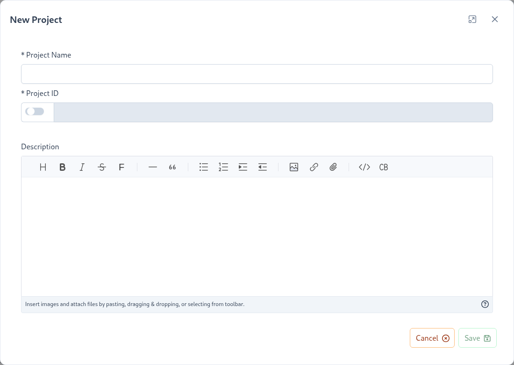
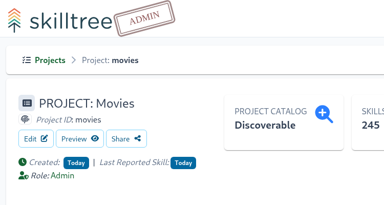
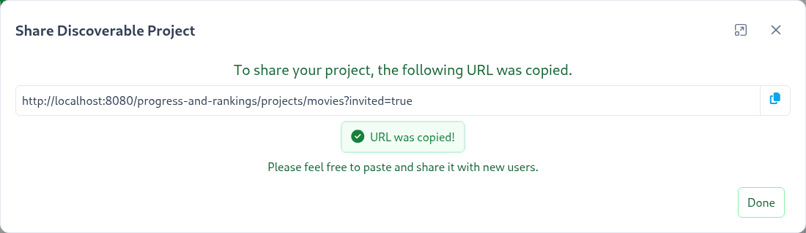

# Projects

A Project is an overall container that represents the skills ruleset for a single application with gamified training. 
Project's administrator(s) manage skill definitions, subjects, levels, dependencies and other attributes that make up an application's training profile.

Creating a project is simple, all you need is a name. While the project id is required, it will be automatically generated (you can optionally override the generated id).

To create a project click the ``Project +`` button.

A Project is composed of Subjects which are made up of Skills and a single skill defines a training unit within the gamification framework. 
Once the project is created you have an empty canvas on which to compose and manage your application's training profile. 
Generally the next step is to create a number of Subjects and then start constructing Skill definitions within those Subjects.

The Dashboard user that creates a project is automatically granted the role of administrator of that project. Project administrators enjoy the following benefits: 

| Function | Explanation | 
|:------- |:----------- | 
| [Subjects](/dashboard/user-guide/subjects.html) | Add, edit or remove Subjects | 
| [Skills](/dashboard/user-guide/skills.html)  | Add, edit or remove Skill definitions |
| [Self Reporting](/dashboard/user-guide/self-reporting.html) | Self Report is a feature that empowers users to mark skills as completed directly in the SkillTree dashboard OR through the embedded Skills Display component. |
| [Access Management](/dashboard/user-guide/access.html) | Assign or remove Project's administrators | 
| [Badges](/dashboard/user-guide/badges.html) | Add, edit or remove Project's Badges |
| [Levels](/dashboard/user-guide/levels.html) | Customize number of Levels and their attributes |
| [Dependencies](/dashboard/user-guide/dependencies.html) | Specify the order of Skills completion. For example Skill A must be completed before Skill B can be attempted | 
| [Cross-project Dependencies](/dashboard/user-guide/dependencies.html#cross-project-dependencies) | Create and manage Skill dependencies across multiple Projects which practically equates to cross-application Skills |
| [Contact Users](/dashboard/user-guide/contact-project-users.html) | Communicate with users of your Project |
| [Metrics](/dashboard/user-guide/metrics.html) | Charts and graph. These are page specific - Project, Subject, Badge, and User will have stats specifically for those pages |
| [Issues](/dashboard/user-guide/issues.html) | Errors related to the Project such as non-existant Skills that have been reported |       
| [Settings](/dashboard/user-guide/projects.html#settings) | Project level settings |   

## Settings

To manage and view project-wide settings navigate to ``Project -> Settings``. 

The following project-level settings are available: 

#### Setting: Visibility <since project="skills-service" version="2.0.0" />
There are three possible values for the Project Visibility setting:

1. Public Not Discoverable (default value)
2. Private Invite Only
3. Discoverable on Progress And Ranking

``Public Not Discoverable`` projects can be accessed by users who have a direct link to the project's client display or by applications that have integrated the SkillTree client libraries. The project will not be available in 
[Manage My Projects](/dashboard/user-guide/progress-and-ranking.html#progress-and-ranking-my-projects) if the [Progress and Ranking](/dashboard/user-guide/progress-and-ranking.html) views have been enabled.

``Private Invite Only`` projects can only be accessed by users who have been invited to join the project and who have accepted the invite, any other user attempting to access the project will receive an Access Denied error. Users who have been 
designated as Project Administrators will continue to have access to the project. Users can be invited to join the project using the [Project Access](/dashboard/user-guide/access.html#invite-only) page.

``Discoverable on Progress And Ranking`` projects can be discoverd by users in the [Manage My Projects](/dashboard/user-guide/progress-and-ranking.html#progress-and-ranking-my-projects) view. This option will only be displayed if the instance
of SkillTree has been configured to enable the [Progress and Ranking](/dashboard/user-guide/progress-and-ranking.html) views.

::: tip
Prior to 2.0.0 this setting was called Discoverable and applied only to a project's discoverability in the Progress and Ranking view.
::: 

::: warning
There may be a delay of up to several minutes after changing a project's visibility from or to ``Private Invite Only`` before the change is reflected for all users.
:::

#### Setting: Use Points For Levels
 
``Use Points For Levels`` - switch between two level management strategies: 
1. Percentage based - levels are calculated based on configured percentages of total available points (ex. Level 1 = 10% of total points)
1. Point based - project admins specify start and end point values for each level

By default the Percentage based strategy is configured, changing the ``Use Points For Levels`` setting to ``true`` enables Point Based explicit level point management. To learn more please see the [Levels](/dashboard/user-guide/levels.html) section.

::: warning
You must define at least 100 points for a project before switching to point-based levels management
:::

#### Setting: Root Help Url

Skill definition's ``Help Url/Path`` will be treated relative to this ``Root Help Url``. For example, if 

- ``Root Help Url`` =  ``http://www.myHelpDocs.com``
-  and a Skill definition's ``Help Url`` = ``/important/article`` 

then the client display will concatenate ``Root Help Url`` and  ``Help Url`` to produce ``http://www.myHelpDocs.com/important/article``.

::: tip
If a Skill's ``Help Url`` starts with ``http`` or ``https`` then ``Root Help Url`` will NOT be utilized.
:::  

If a Skill's ``Help Url`` is blank then no url will be displayed even if ``Root Help Url`` is configured. 
In other words ``Root Help Url`` only works in conjunction with a Skill's ``Help Url``.

#### Setting: Self Report Default

By default, Self Reporting is disabled when creating or modifying a skill.
If your project primarily consists of Self Reported skills, enabling Self Report Default will result in 
the selected Self Report Approval type being the default for any skills created after this point

Please visit [Self Report](/dashboard/user-guide/self-reporting.html) section to learn further.

#### Setting: Rank Opt-Out for ALL Admins

When enabled, all project admins will be excluded from the Leaderboard and will not be assigned a rank within the embedded Skills Display component

#### Setting: Custom Labels

Certain terminology in SkillTree may be overloaded to some organizations and could be confusing to end users. 
If this is the case, admins can customize the following labels displayed to users in the embedded Skills Display component and Progress and Ranking pages:
- Project
- Subject
- Group
- Skill
- Level

#### Setting: Always Show Group Descriptions

Toggle this setting to always show the group's descriptions in this project embedded Skills Display component and Progress and Ranking pages.

## Copy Project

To use an existing Project as a template you can easily copy its training profile (subjects, skills, badges, etc..) into a brand-new project.  
To copy a project please use the  button available on a project card on the Project page. 
The system will prompt you to enter a new project name and optionally modify the project id. 

The following training profile elements are copied into the new project: 
- [Subjects](/dashboard/user-guide/subjects.html) and their attributes (description, help url, etc..)
- [Skills](/dashboard/user-guide/skills.html) definitions and their attributes (description, points, self-reporting, etc...)
- [Skill Groups](/dashboard/user-guide/skills-groups.html)
- Configured display order subjects and skills  is preserved in the copied project
- [Levels](/dashboard/user-guide/levels.html)
- [Badges](/dashboard/user-guide/badges.html)
- Project-Based [Dependencies](/dashboard/user-guide/dependencies.html)
- [Re-used Skills](/dashboard/user-guide/skills.html#same-project-skill-reuse)
- [Project's Settings](/dashboard/user-guide/projects.html#settings) are copied with the exception of the exclusions specified below

The following training profile elements are **NOT** copied into a new project:
- [Catalog](/dashboard/user-guide/skills-catalog.html) imported skills are **not** copied
- [Cross-Project Dependencies](/dashboard/user-guide/dependencies.html#cross-project-dependencies) are **not** copied
- If the original project [Visibility](/dashboard/user-guide/projects.html#setting-visibility) setting was changed to be ``Discoverable on Progress And Ranking`` the copied project will instead use the default value of ``Public Not Discoverable``

::: tip
Once a project has been copied, the new project is disconnected from the original such that changes to the original project will not be reflected in the copy
:::

## Share Project

Public projects that are configured to be [discoverable](/dashboard/user-guide/projects.html#setting-visibility) can be easily shared with the users, so they can begin 
consuming micro-learning gamified training! 

To share a project click on the ``Share`` button on the project admin page:

Once the ``Share`` button is clicked the share information modal is displayed:

Copy the url and share it with your trainees. 
When the link is visited, 2 things happen:
- Progress and Ranking page for that project is displayed *AND*
- the project is automatically added to [My Project](/dashboard/user-guide/progress-and-ranking.html#progress-and-ranking-my-projects).

::: warning Important
The ``Share`` button is only displayed if the [Project Visibility](/dashboard/user-guide/projects.html#setting-visibility) is configured to the ``Discoverable on Progress and Ranking`` option. 
:::

