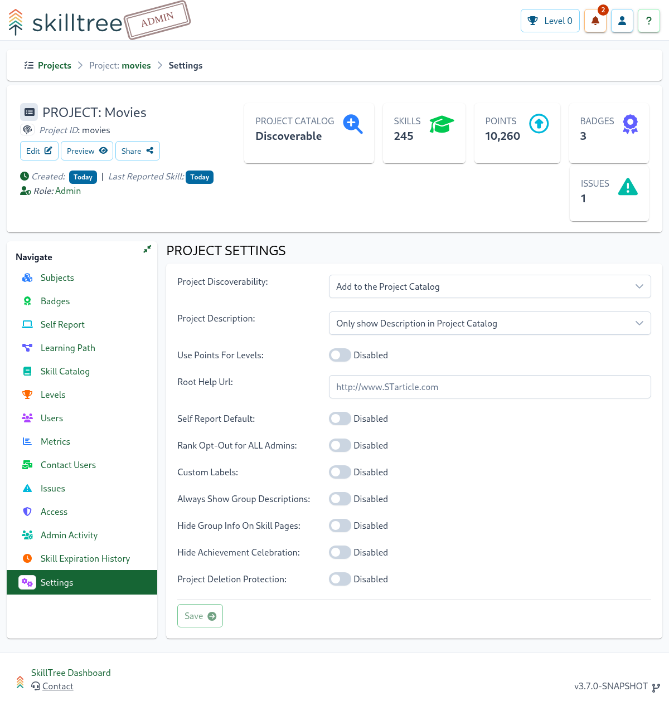

# Projects

A Project is an overall container that represents the skills ruleset for a single application with gamified training. 
Project's administrator(s) manage skill definitions, subjects, levels, dependencies and other attributes that make up an application's training profile.

Creating a project is simple, all you need is a name. While the project id is required, it will be automatically generated (you can optionally override the generated id).

To create a project click the ``Project +`` button.

A Project is composed of Subjects which are made up of Skills and a single skill defines a training unit within the gamification framework. 
Once the project is created you have an empty canvas on which to compose and manage your application's training profile. 
Generally the next step is to create a number of Subjects and then start constructing Skill definitions within those Subjects.

The Dashboard user that creates a project is automatically granted the role of administrator of that project. Project administrators enjoy the following benefits: 

| Function | Explanation | 
|:------- |:----------- | 
| [Subjects](/dashboard/user-guide/subjects.html) | Add, edit or remove Subjects | 
| [Skills](/dashboard/user-guide/skills.html)  | Add, edit or remove Skill definitions |
| [Self Reporting](/dashboard/user-guide/self-reporting.html) | Self Report is a feature that empowers users to mark skills as completed directly in the SkillTree dashboard OR through the embedded Skills Display component. |
| [Access Management](/dashboard/user-guide/access.html) | Assign or remove Project's administrators | 
| [Badges](/dashboard/user-guide/badges.html) | Add, edit or remove Project's Badges |
| [Levels](/dashboard/user-guide/levels.html) | Customize number of Levels and their attributes |
| [Dependencies](/dashboard/user-guide/dependencies.html) | Specify the order of Skills completion. For example Skill A must be completed before Skill B can be attempted | 
| [Cross-project Dependencies](/dashboard/user-guide/dependencies.html#cross-project-dependencies) | Create and manage Skill dependencies across multiple Projects which practically equates to cross-application Skills |
| [Contact Users](/dashboard/user-guide/contact-project-users.html) | Communicate with users of your Project |
| [Metrics](/dashboard/user-guide/metrics.html) | Charts and graph. These are page specific - Project, Subject, Badge, and User will have stats specifically for those pages |
| [Issues](/dashboard/user-guide/issues.html) | Errors related to the Project such as non-existant Skills that have been reported |       
| [Settings](/dashboard/user-guide/projects.html#settings) | Project level settings |   

## Settings

To manage and view project-wide settings navigate to ``Project -> Settings``. 

The following project-level settings are available: 

#### Setting: Production Mode
This setting is only available when Progress and Ranking views are enabled. Please visit [Progress and Ranking](/dashboard/user-guide/progress-and-ranking.html) section to learn more.   

#### Setting: Use Points For Levels

``Use Points For Levels`` - switch between two level management strategies: 
1. Percentage based - levels are calculated based on configured percentages of total available points (ex. Level 1 = 10% of total points)
1. Point based - project admins specify start and end point values for each level

By default the Percentage based strategy is configured, changing the ``Use Points For Levels`` setting to ``true`` enables Point Based explicit level point management. To learn more please see the [Levels](/dashboard/user-guide/levels.html) section.

::: warning
You must define at least 100 points for a project before switching to point-based levels management
:::

#### Setting: Root Help Url

Skill definition's ``Help Url/Path`` will be treated relative to this ``Root Help Url``. For example, if 

- ``Root Help Url`` =  ``http://www.myHelpDocs.com``
-  and a Skill definition's ``Help Url`` = ``/important/article`` 

then the client display will concatenate ``Root Help Url`` and  ``Help Url`` to produce ``http://www.myHelpDocs.com/important/article``.

::: tip
If a Skill's ``Help Url`` starts with ``http`` or ``https`` then ``Root Help Url`` will NOT be utilized.
:::  

If a Skill's ``Help Url`` is blank then no url will be displayed even if ``Root Help Url`` is configured. 
In other words ``Root Help Url`` only works in conjunction with a Skill's ``Help Url``.

#### Setting: Self Report Default

By default, Self Reporting is disabled when creating or modifying a skill.
If your project primarily consists of Self Reported skills, enabling Self Report Default will result in 
the selected Self Report Approval type being the default for any skills created after this point

Please visit [Self Report](/dashboard/user-guide/self-reporting.html) section to learn further.
