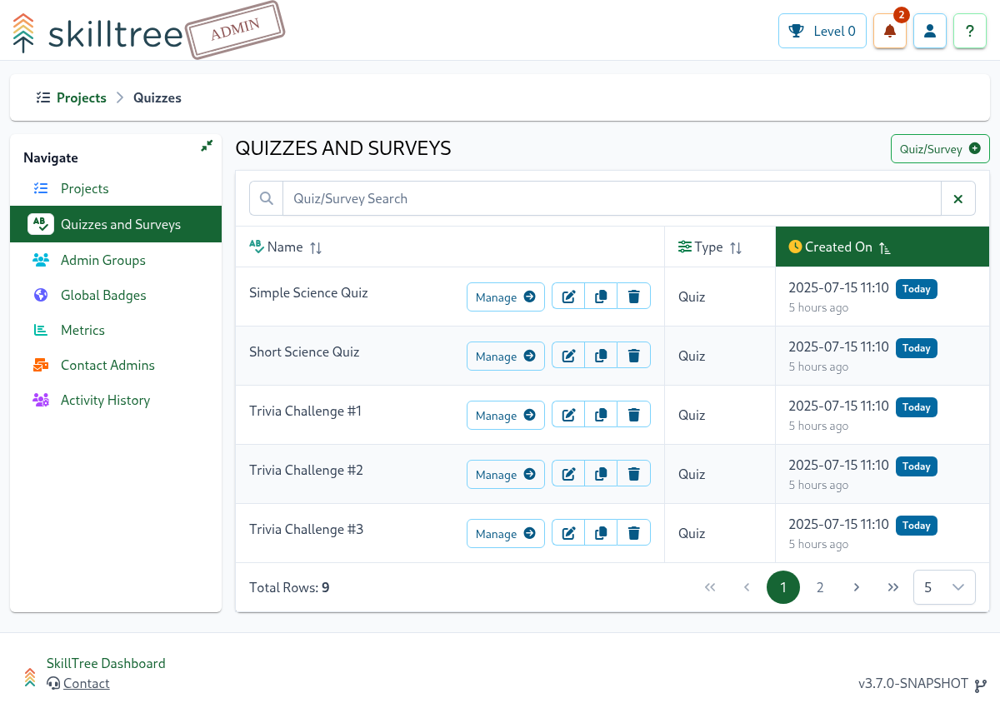
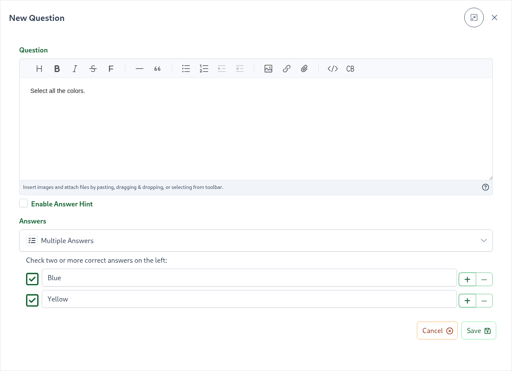
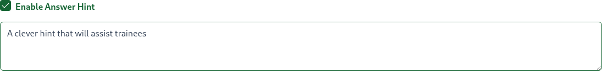
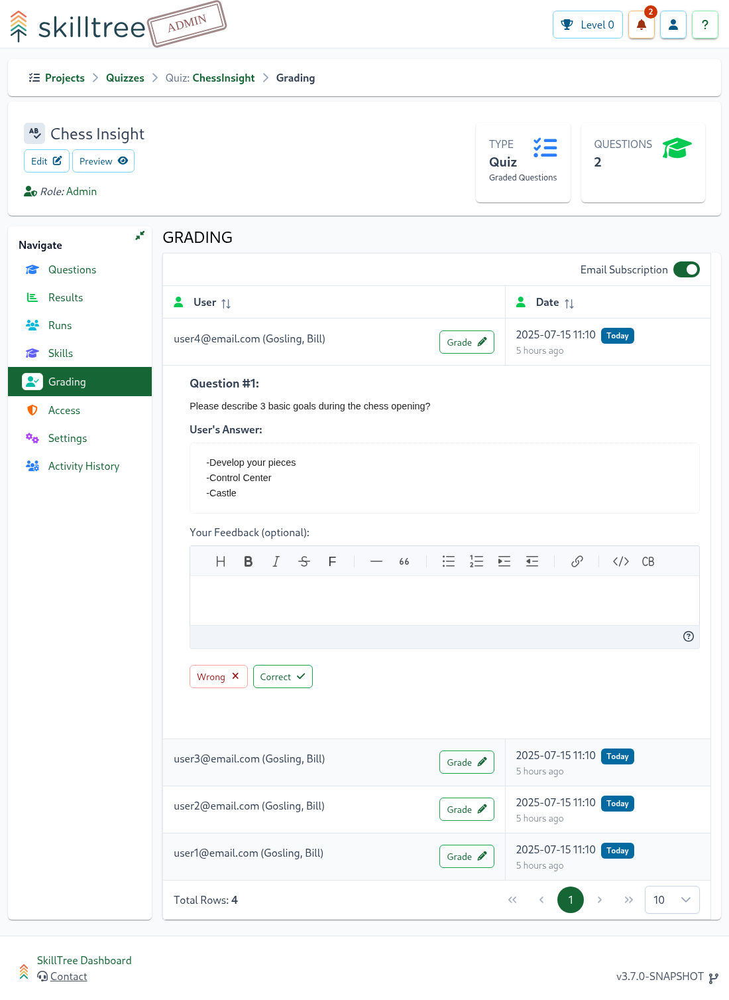
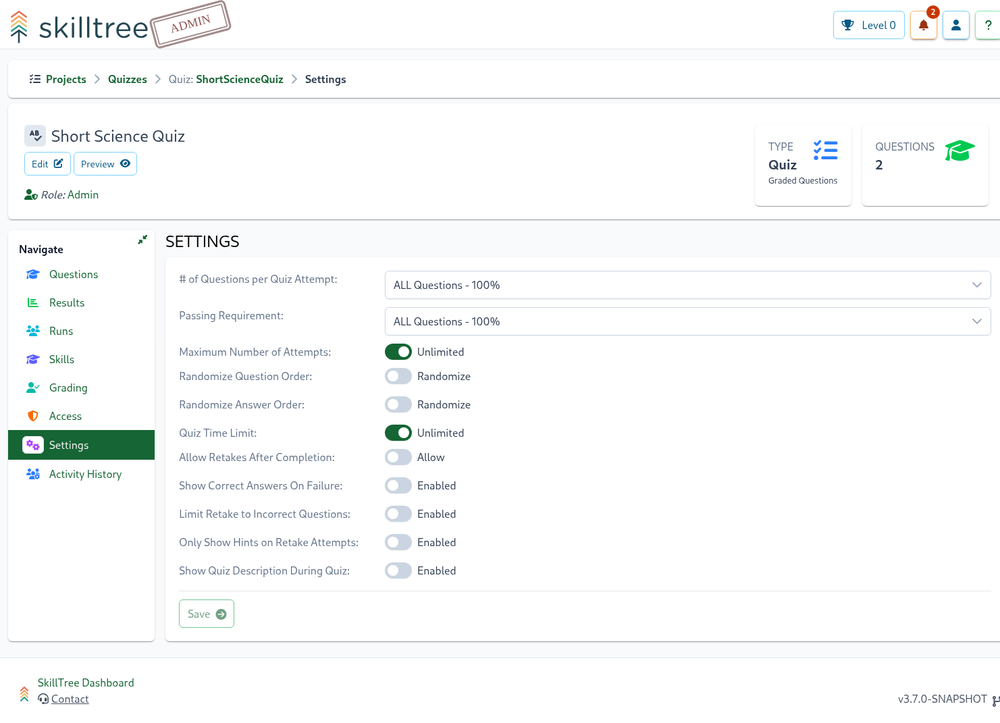
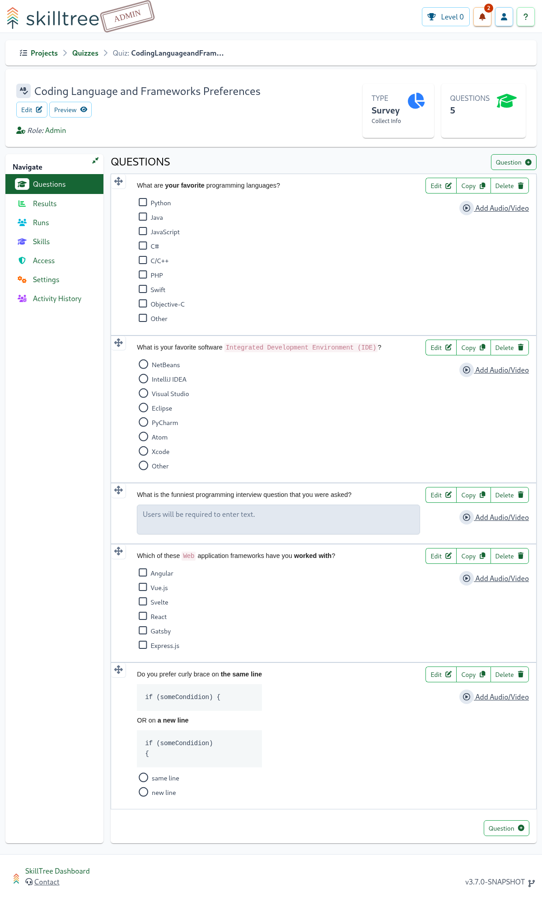
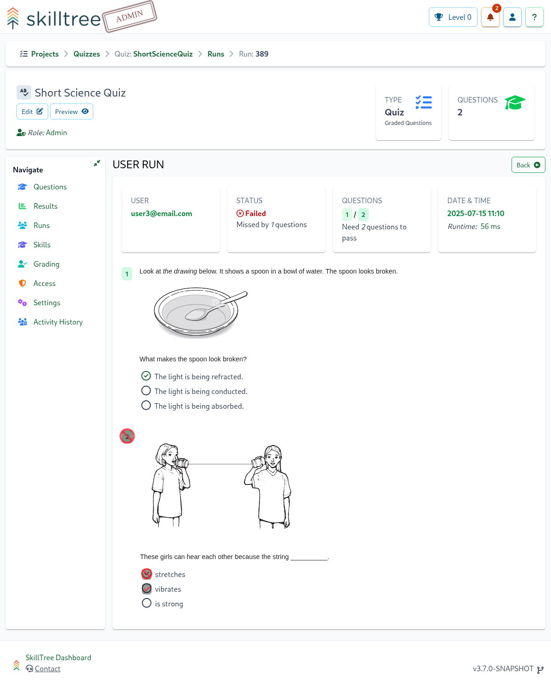

# Quizzes and Surveys

Quizzes and Surveys can be created and managed on the administrative side of the SkillTree Dashboard
and seamlessly administered by associating them to [Skills](/dashboard/user-guide/self-reporting.html) or running them independently.

- [Quiz](/dashboard/user-guide/quizzes-and-surveys.html#quiz) - a knowledge check composed of multiple questions with a passing requirement
- [Survey](/dashboard/user-guide/quizzes-and-surveys.html#survey) - data collection technique utilizing one or more questions

A Quiz/Survey association to an existing skill requires successful completion of that Quiz/Survey
in order to earn the skill and its points. In the case of a quiz, then the quiz serves as the skill's knowledge check.
On the other hand associating a survey is method to get feedback about that skill or collect some pieces of important
data related to the skill.

To view existing quizzes or surveys or to create a new Quiz or Survey please navigate to `Quizzes and Surveys` page
featured under the main Navigation on the administrative part of the Dashboard. 

To create a new Quiz or a Survey please click on `Quiz/Survey+` button and the `New Quiz/Survey` form will be displayed. 

``New Quiz/Survey`` form fields are: 

| Field       | Explanation                                                                                                                                                                                                                              | 
|:------------|:-----------------------------------------------------------------------------------------------------------------------------------------------------------------------------------------------------------------------------------------| 
| Name        | The name of the quiz or the survey                                                                                                                                                                                                       |
| Type        | Can either be `Quiz` or `Survey`; the type is *immutable* and can only be changed at the initial creation time.                                                                                                                          |
| Description | A description will be visualized on a splash screen when a user starts a quiz or a survey. You can build a visually pleasing comprehensive description using SkillTree's [Rich Text Editor](/dashboard/user-guide/rich-text-editor.html) |

::: warning Friendly Reminder
The `Type` for a `Quiz` or a `Survey` must be selected at creation time and cannot be modified at a later time.
:::

::: tip
Although the description is optional it is generally recommended to create one.
Using the [Rich Text Editor](/dashboard/user-guide/rich-text-editor.html) we encourage authoring visually pleasing
descriptions.
:::

## Quiz

A quiz is a knowledge check composed of multiple questions with a passing requirement. Quizzes can be associated to a skill 
or can be executed independently. Associating a Quiz to an existing skill will require successful completion of that Quiz
in order to earn the skill and its points. In the case of a quiz, then the quiz serves as the skill's knowledge check.

Quizzes support three types of questions:
- ``Multiple Choice`` - Single correct answer
- ``Multiple Answers`` - Multiple correct choices; all must be selected to earn credit
- ``Input Text`` - Free-form text response, graded by quiz administrators

To administer a quiz click `Manage` button for that quiz on the `Quizzes and Surveys` page. 

To add a new question please click `Question +` button.

The Question's text supports all the same features that the [Description Editor](/dashboard/user-guide/rich-text-editor.html) currently affords which 
includes a generous feature set including attaching or copy-and-pasting screenshots. 

::: tip
Use the `Preview` button on the top left below the Quiz name in order to see what the quiz will look like to your users.
:::

### Answer Hints

When creating a question, quiz administrators can configure helpful answer hints, which are displayed next to the
question during the quiz. To enter a hint, create a new question or edit an existing one and click the
`Enable Answer Hint` switch.

Additionally, administrators can enable the [Only Show Hints on Retake Attempts](/dashboard/user-guide/quizzes-and-surveys.html#setting-only-show-hints-on-retake-attempts) option, which
will only display answer hints on subsequent quiz retakes after the first attempt was unsuccessful.
To enable or disable this option, navigate to the Quiz's Settings page.

### Slide Deck for Quiz

SkillTree enables seamless integration of PDF-based slide decks directly into quizzes, allowing you to enhance training
materials with professionally designed presentations created in tools like PowerPoint and exported as PDFs.

You have two methods to add slide decks:

- **SkillTree Hosted:** Upload PDF files directly using the file upload form (Browse button) or via drag-and-drop
- **Externally Hosted:** Provide a URL to a PDF hosted on an external web server (e.g., https://example.com/slides.pdf)

To set up a slide deck, navigate to `Quiz -> Slides` and upload your PDF file.

<Content path="/dashboard/user-guide/common/slide-deck.md"/>

### Audio/Video for Quiz

SkillTree supports embedding video or audio clips into quiz questions, which will be available for playback during the quiz.

#### Videos
<Content path="/dashboard/user-guide/common/videos-intro.md"/>

To configure a video, navigate to a quiz and click the `Add Audio/Video` link next to a question.

::: tip
Note that you can configure a different video for each question.
:::

<Content path="/dashboard/user-guide/common/videos-configure.md"/>

#### Audio

Similarly to videos, users can embed audio clips into their quizzes using the `Add Audio/Video` link. To upload audio files:
1. Navigate to a quiz
2. Click the `Add Audio/Video` link next to a question
3. Select your file using either the Browse button or drag-and-drop functionality

<Content path="/dashboard/user-guide/common/audio.md"/>

### Answer Grading

If a quiz has at least 1 ``Input Text`` question then after a quiz taker submits an attempt a quiz administrator will be able to grade the answers for the ``Input Text`` questions.

To do so please navigate to ``Quizzes and Surveys -> Quiz -> Grading`` page.

A table of quiz attempts that contain ``Input Text`` questions will be displayed. Click on the ``Grade`` button to the right of the user to open the grading request. 
Once expanded answers can be marked as either "Correct" or "Wrong", in addition a justification can be provided. 
Once all the answers are marked as either correct or wrong, the system will grade the quiz attempt in its entirety considering all the questions in this quiz.

#### Grading Notifications
SkillTree will send email notifications to quiz administrators when grading is requested, and also send email notifications to quiz takers when answers are graded.

Quiz administrators can unsubscribe from notifications by navigating to the ``Quizzes and Surveys -> Quiz -> Grading`` page.

The Grading section contains a Subscribed/Unsubscribed toggle on the top-right of the component.

### Quiz Settings

A Quiz has a number of customization parameters, to customize a quiz please navigate to ``Quizzes and Surveys -> Quiz -> Settings`` page.

#### Setting: # of Questions per Quiz Attempt

When enabled, a sub-set of random questions will be presented to the user taking this quiz. 
For example, if there are 10 questions and this setting is set to 5, then each time a user takes this quiz
only 5 random questions will be presented for that quiz attempt. If a user fails a quiz attempt the following attempt
will present another 5 random questions from the available question pool.

#### Setting: Passing Requirement

This setting adjusts the minimum number of questions required to pass this quiz. By default, all questions have to be
answered correctly in order to get the credit.  

#### Setting: Maximum Number of Attempts

By default, users have an unlimited number of attempts to pass a quiz. You can set the maximum number of attempts to 1 or more. 

#### Setting: Randomize Question Order

If enabled, questions are presented in a random order each time the quiz is taken. 

#### Setting: Randomize Answers Order

If enabled, each question's answers are presented in a random order each time the quiz is taken.

#### Setting: Quiz Time Limit

If a time limit is set, users will have a specific duration to complete the quiz. 
If they exceed the time limit, their attempt will be marked as 'Failed'.

#### Setting: Allow Retakes After Completion

With this feature enabled, users can retake quizzes even after achieving a passing score. The system
accurately tracks each successful attempt, providing a comprehensive view of user progress and performance. 

#### Setting: Show Correct Answers On Failure

Enabling this feature will provide the correct answers on failed quiz attempts, allowing users to review and understand
the correct answers, improving their learning and understanding of the material.

#### Setting: Limit Retake to Incorrect Questions

Enabling this feature limits the questions presented to users when retaking a quiz to those that were answered
incorrectly on the previous attempt.

#### Setting: Only Show Hints on Retake Attempts 

Enabling this feature will only display answer hints on subsequent quiz retakes after the first attempt was unsuccessful.

#### Setting: Display Quiz Description During Quiz

Enabling this feature will display the quiz description while the quiz is being taken.

## Survey

A Survey is a data collection technique utilizing one or more questions. Surveys can be associated to a skill or can be
executed independently. Associating a Survey to an existing skill will require completion of that Survey in order to
earn the skill and its points. 
When associated to a skill, the survey is a method to gather feedback about that skill or collect some
pieces of important data related to the skill. 

A Survey currently supports four types of questions:
- ``Multiple Choice`` - question will only allow a single choice to be selected
- ``Multiple Answers`` - one or more choices are required to be selected  
- ``Text Input`` - a freeform answer text is required
- ``Rating`` - a star-based rating question with an ability configure between 3 and 10 stars  

To administer a survey click the `Manage` button for that survey on the `Quizzes and Surveys` page.

To add a new question please click the `Question +` button.

The Question's text supports all the same features that the [Description Editor](/dashboard/user-guide/rich-text-editor.html) currently affords which
includes a generous feature set including attaching or copy-and-pasting screenshots.
Please use the Answer's dropdown to select the type.

::: tip
Use the `Preview` button on the top left below the Survey name in order to see what the survey will look like to your users.
:::

### Slide Deck for Survey

SkillTree enables seamless integration of PDF-based slide decks directly into surveys, allowing you to enhance training
materials with professionally designed presentations created in tools like PowerPoint and exported as PDFs.

You have two methods to add slide decks:

- **SkillTree Hosted:** Upload PDF files directly using the file upload form (Browse button) or via drag-and-drop
- **Externally Hosted:** Provide a URL to a PDF hosted on an external web server (e.g., https://example.com/slides.pdf)

To set up a slide deck, navigate to `Survey -> Slides` and upload your PDF file.

<Content path="/dashboard/user-guide/common/slide-deck.md"/>

### Audio/Video for Survey

SkillTree supports embedding video or audio clips into survey questions, which will be available for playback during the survey.

#### Videos
<Content path="/dashboard/user-guide/common/videos-intro.md"/>

To configure a video, navigate to a survey and click the `Add Audio/Video` link next to a question.

::: tip
Note that you can configure a different video for each question.
:::

<Content path="/dashboard/user-guide/common/videos-configure.md"/>

#### Audio

Similarly to videos, users can embed audio clips into their surveys using the `Add Audio/Video` link. To upload audio files:
1. Navigate to a survey
2. Click the `Add Audio/Video` link next to a question
3. Select your file using either the Browse button or drag-and-drop functionality

<Content path="/dashboard/user-guide/common/audio.md"/>

### Survey Settings

A Survey has customization parameters, to customize a survey please navigate to ``Quizzes and Surveys -> Survey -> Settings`` page.

#### Setting: Allow Retakes After Completion

With this feature enabled, users can retake surveys unlimited number of times. The system
accurately tracks each completion, providing a comprehensive view of user progress and performance.

## Copy

Quizzes, surveys and questions can easily be copied. 

To use an existing Quiz/Survey as a template you can easily copy its declarations (questions, settings, etc..) into a brand-new Quiz/Survey.  
To copy a Quiz/Survey please use the  button available on a quizzes/surveys administration page.
The system will prompt you to enter a new Quiz/Survey name and optionally modify the Quiz/Survey id.

Similarly, to copy a question please use the  button available on a questions page within a single Quiz/Survey administration.

## Results
Summarized quiz/survey results can be located on the Results page (``Quizzes and Surveys -> Quiz/Survey -> Results ``). 

The page features 
- total number of users' attempts
- number of passed and failed attempts
- average quiz/survey runtime
- in the case of quizzes, a bar chart breakdown for each question depicting the difference between the correct and the wrong question attempts
- number of times each answer was selected and its associated selection percentage
- for each answer, an ability to drill down to its history
- Date range filter

::: tip Filter
Quiz results can be filtered by completion date range. To filter results, click the date range input in the top right
corner of the quiz results page and click the "Apply" button.
:::

::: warning Good to know
Please note that only the completed quizzes/surveys are shown on this page, if you are looking for `In Progress`
runs please visit [Runs](/dashboard/user-guide/quizzes-and-surveys.html#runs) page.
:::

## Runs
To track individual quiz/survey runs please visit the Runs page (``Quizzes and Surveys -> Quiz/Survey -> Results ``). Each row represents a single Quiz/Survey for a single user.

Select the run details button to the right of the user to view details of that particular Quiz/Survey run.

Quiz results will depict selected answer(s) and its correctness status. Survey results will simply display which results were selected. 

## Skill Association

A Quiz/Survey association to an existing skill requires successful completion of that Quiz/Survey
in order to earn the skill and its points. In the case of a quiz, then the quiz serves as the skill's knowledge check.
On the other hand associating a survey is method to get feedback about that skill or collect some pieces of important
data related to the skill.

To make a quiz-to-skill association when creating or editing a skill
1. select ``Self Reporting`` checkbox
1. then select ``Quiz/Survey``

To configure a Quiz-based or a Survey-based skill please select `Quiz/Survey` option and then use the drop-down to locate one of
the available Quizzes or Surveys.

::: tip Useful Tips
A Quiz or a Survey can be associated to more than one skill in one or more project(s). 
:::

A quiz/survey administrator can easily view which skills the quiz/survey is associated with by navigating 
to the Skills page in that particular quiz/survey (``Quizzes and Surveys -> Quiz/Survey -> Skills ``)
:

## Access

The Quiz/Survey Access page supports adding or removing Quiz Administrators. To add and remove Administrators
please navigate to ``Quiz/Survey -> Access`` page.

## Activity History

The Activity History feature provides a comprehensive record of all administrative changes made to this quiz/survey.

<Content path="/dashboard/user-guide/common/activity-history.md"/>
