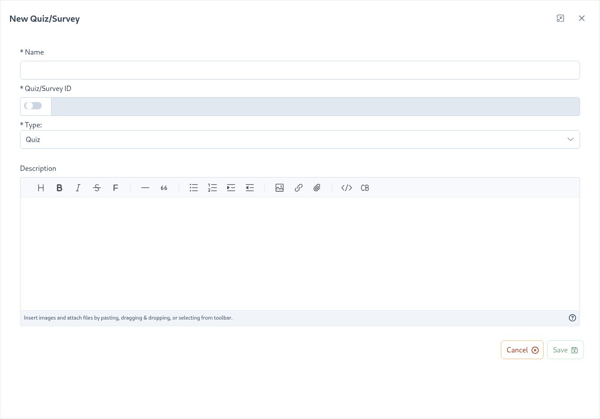
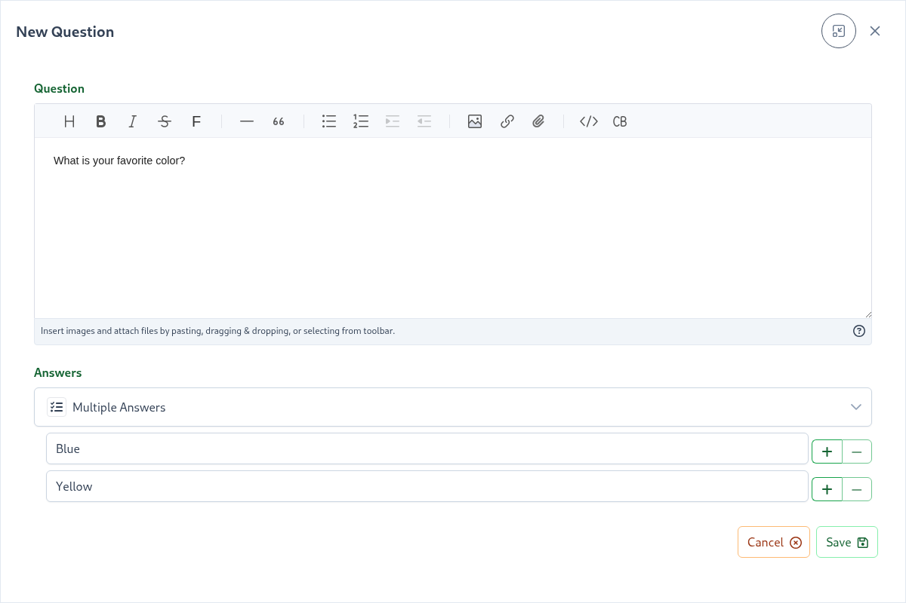
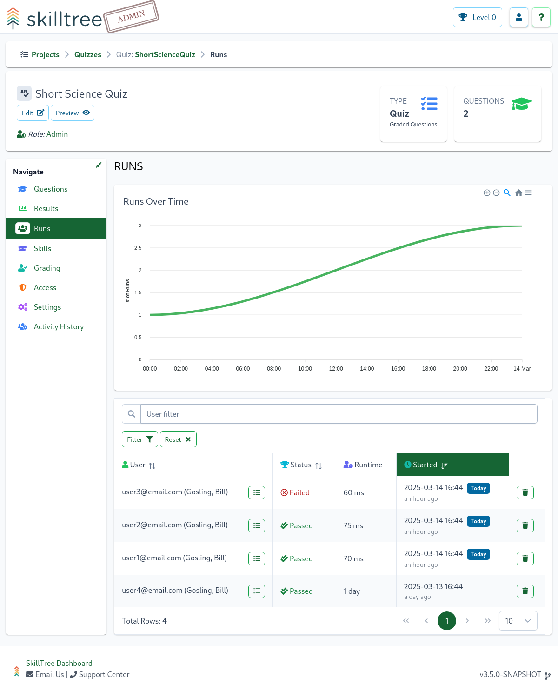
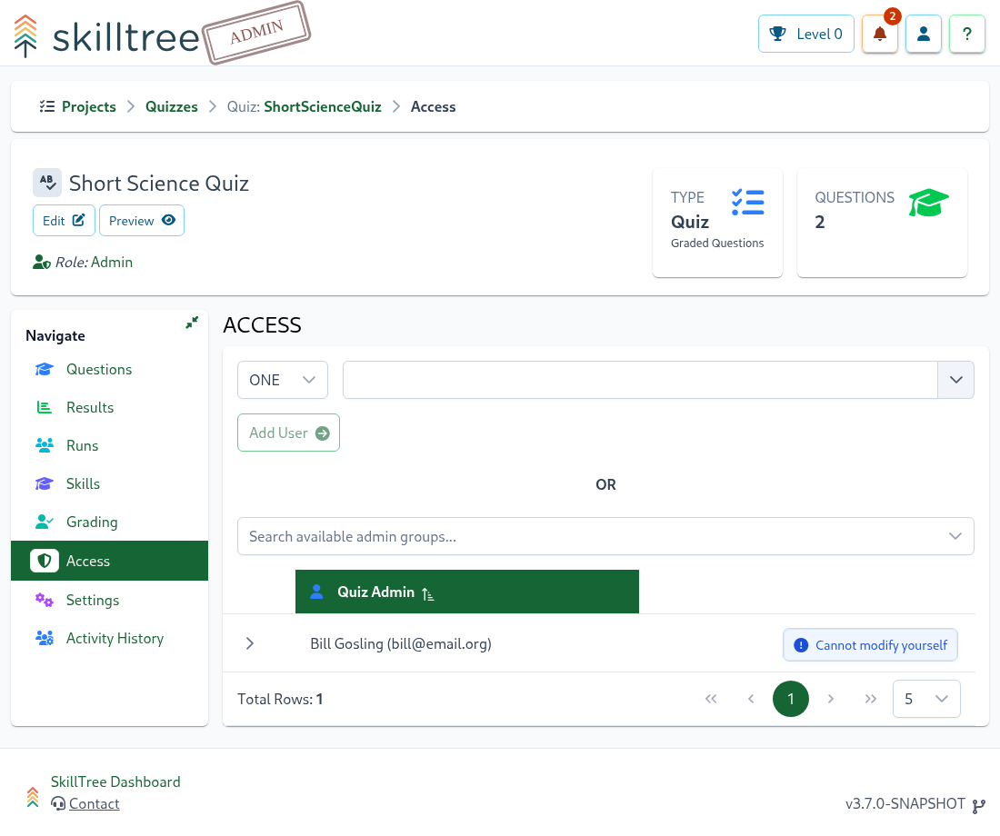

# Quizzes and Surveys

Quizzes and Surveys can be created and managed on the administrative side of the SkillTree Dashboard
and seamlessly administered by associating them to [Skills](/dashboard/user-guide/self-reporting.html) or running them independently.

- [Quiz](/dashboard/user-guide/quizzes-and-surveys.html#quiz) - a knowledge check composed of multiple questions with a passing requirement
- [Survey](/dashboard/user-guide/quizzes-and-surveys.html#survey) - data collection technique utilizing one or more questions

A Quiz/Survey association to an existing skill requires successful completion of that Quiz/Survey
in order to earn the skill and its points. In the case of a quiz, then the quiz serves as the skill's knowledge check.
On the other hand associating a survey is method to get feedback about that skill or collect some pieces of important
data related to the skill.

To view existing quizzes or surveys or to create a new Quiz or Survey please navigate to `Quizzes and Surveys` page
featured under the main Navigation on the administrative part of the Dashboard. 

To create a new Quiz or a Survey please click on `Quiz/Survey+` button and the `New Quiz/Survey` form will be displayed. 

``New Quiz/Survey`` form fields are: 

| Field       | Explanation                                                                                                                                                                                                                              | 
|:------------|:-----------------------------------------------------------------------------------------------------------------------------------------------------------------------------------------------------------------------------------------| 
| Name        | The name of the quiz or the survey                                                                                                                                                                                                       |
| Type        | Can either be `Quiz` or `Survey`; the type is *immutable* and can only be changed at the initial creation time.                                                                                                                          |
| Description | A description will be visualized on a splash screen when a user starts a quiz or a survey. You can build a visually pleasing comprehensive description using SkillTree's [Rich Text Editor](/dashboard/user-guide/rich-text-editor.html) |

::: warning Friendly Reminder
The `Type` for a `Quiz` or a `Survey` must be selected at creation time and cannot be modified at a later time.
:::

::: tip
Although the description is optional it is generally recommended to create one.
Using the [Rich Text Editor](/dashboard/user-guide/rich-text-editor.html) we encourage authoring visually pleasing
descriptions.
:::

## Quiz

A quiz is a knowledge check composed of multiple questions with a passing requirement. Quizzes can be associated to a skill 
or can be executed independently. Associating a Quiz to an existing skill will require successful completion of that Quiz
in order to earn the skill and its points. In the case of a quiz, then the quiz serves as the skill's knowledge check.

Quizzes currently support two types of questions:
- ``Single Choice`` - question will only have 1 correct answer 
- ``Mulitple Choice`` - question has 2 or more correct choices; all correct choices must be selected to get credit for the question

To administer a quiz click `Manage` button for that quiz on the `Quizzes and Surveys` page. 

To add a new question please click `Question +` button.

The Question's text supports all the same features that the [Description Editor](/dashboard/user-guide/rich-text-editor.html) currently affords which 
includes a generous feature set including attaching or copy-and-pasting screenshots. 
The two supported question's types and ``Single Choice`` and ``Mulitple Choice`` and are implicitly derived from the number of the selected correct answers.
A single selected correct answer implies ``Single Choice`` question type and when more than one corrected answers selected then ``Mulitple Choice`` is used.
::: tip
When multiple correct answers are selected users will be required to properly identify all of those correct answers in
order to receive the credit for the question
:::

::: tip
Use the `Preview` button on the top left below the Quiz name in order to see what the quiz will look like to your users.
:::

### Quiz Settings

A Quiz has a number of customization parameters, to customize a quiz please navigate to ``Quizzes and Surveys -> Quiz -> Settings`` page.

#### Setting: # of Questions per Quiz Attempt <since project="skills-service" version="2.9" />

When enabled, a sub-set of random questions will be presented to the user taking this quiz. 
For example, if there are 10 questions and this setting is set to 5, then each time a user takes this quiz
only 5 random questions will be presented for that quiz attempt. If a user fails a quiz attempt the following attempt
will present another 5 random questions from the available question pool.

#### Setting: Passing Requirement

This setting adjusts the minimum number of questions required to pass this quiz. By default, all questions have to be
answered correctly in order to get the credit.  

#### Setting: Maximum Number of Attempts

By default, users have an unlimited number of attempts to pass a quiz. You can set the maximum number of attempts to 1 or more. 

#### Setting: Randomize Question Order <since project="skills-service" version="2.9" />

If enabled, questions are presented in a random order each time the quiz is taken. 

#### Setting: Randomize Answers Order <since project="skills-service" version="2.9" />

If enabled, each question's answers are presented in a random order each time the quiz is taken.

#### Setting: Quiz Time Limit <since project="skills-service" version="2.10" />

If a time limit is set, users will have a specific duration to complete the quiz. 
If they exceed the time limit, their attempt will be marked as 'Failed'.

## Survey

A Survey is a data collection technique utilizing one or more questions. Surveys can be associated to a skill or can be
executed independently. Associating a Survey to an existing skill will require completion of that Survey in order to
earn the skill and its points. 
When associated to a skill, the survey is a method to gather feedback about that skill or collect some
pieces of important data related to the skill. 

A Survey currently supports four types of questions:
- ``Single Choice`` - question will only allow a single choice to be selected
- ``Mulitple Choice`` - one or more choices are required to be selected  
- ``Text Input`` - a freeform answer text is required
- ``Rating`` - a star-based rating question with an ability configure between 3 and 10 stars  

To administer a survey click the `Manage` button for that survey on the `Quizzes and Surveys` page.

To add a new question please click the `Question +` button.

The Question's text supports all the same features that the [Description Editor](/dashboard/user-guide/rich-text-editor.html) currently affords which
includes a generous feature set including attaching or copy-and-pasting screenshots.
Please use the Answer's dropdown to select the type, currently available options are  ``Single Choice``, ``Mulitple Choice`` and ``Text Input``.

::: tip
Use the `Preview` button on the top left below the Survey name in order to see what the survey will look like to your users.
:::

## Results
Summarized quiz/survey results can be located on the Results page (``Quizzes and Surveys -> Quiz/Survey -> Results ``). 

The page features 
- total number of users' attempts
- number of passed and failed attempts
- average quiz/survey runtime
- in the case of quizzes, a bar chart breakdown for each question depicting the difference between the correct and the wrong question attempts
- number of times each answer was selected and its associated selection percentage
- for each answer, an ability to drill down to its history

::: tip
Please note that only the completed quizzes/surveys are shown on this page, if you are looking for `In Progress`
runs please visit [Runs](/dashboard/user-guide/quizzes-and-surveys.html#runs) page.
:::

## Runs
To track individual quiz/survey runs please visit the Runs page (``Quizzes and Surveys -> Quiz/Survey -> Results ``). Each row represents a single Quiz/Survey for a single user.

Select the run details button to the right of the user to view details of that particular Quiz/Survey run.

Quiz results will depict selected answer(s) and its correctness status. Survey results will simply display which results were selected. 

## Skill Association

A Quiz/Survey association to an existing skill requires successful completion of that Quiz/Survey
in order to earn the skill and its points. In the case of a quiz, then the quiz serves as the skill's knowledge check.
On the other hand associating a survey is method to get feedback about that skill or collect some pieces of important
data related to the skill.

To make a quiz-to-skill association when creating or editing a skill
1. select ``Self Reporting`` checkbox
1. then select ``Quiz/Survey``

To configure a Quiz-based or a Survey-based skill please select `Quiz/Survey` option and then use the drop-down to locate one of
the available Quizzes or Surveys.

::: tip Useful Tips
A Quiz or a Survey can be associated to more than one skill in one or more project(s). 
:::

A quiz/survey administrator can easily view which skills the quiz/survey is associated with by navigating 
to the Skills page in that particular quiz/survey (``Quizzes and Surveys -> Quiz/Survey -> Skills ``)
:

## Access

The Quiz/Survey Access page supports adding or removing Quiz Administrators. To add and remove Administrators
please navigate to ``Quiz/Survey -> Access`` page.

## Activity History <since project="skills-service" version="2.10" />

The Activity History feature provides a comprehensive record of all administrative changes made to this quiz/survey.

<import-content path="/dashboard/user-guide/common/activity-history.html"/>