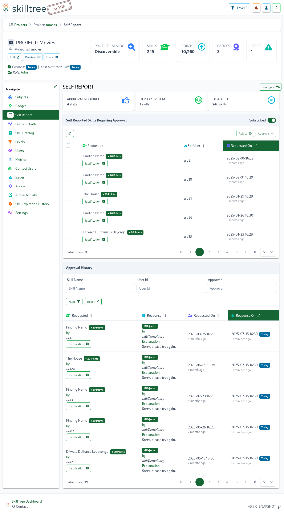

# Self Reporting

Self Report is a feature that empowers users to mark skills as completed directly in the SkillTree dashboard OR through the embedded Skills Display component. 
A project administrator can enable ``Self Reporting`` for a skill, set of skills or even all the skills in a project. 
Skills that have been configured with Self Reporting expose an ``I did it`` button, allowing users to self report completion of those skills. 

There are two ``Self report`` types available:  
1. ``Honor System`` - points are awarded immediately 
1. ``Approval Queue`` - request goes into the project's approval queue; project administrators can approve or deny requests

::: tip 
Project administrators can craft training profiles consisting of:
  - only self-reported skills *OR*
  - a mix of self-reported skills and skills that are reported programmatically *OR* 
  - a project could have no self-reported skills at all
:::  
    
## Configuring

Self reporting is enabled and configured for each skill individually. 
When creating or editing a skill 
1. select ``Self Reporting`` checkbox
1. then select ``Self Reporting`` type (``Approval Queue`` or ``Honor System``)

::: tip
By default, Self Reporting is disabled when creating or modifying a skill. 
If your project primarily consists of Self Reported skills then you can easily change the default by navigating to the ``Project -> Settings`` tab.
There you can enable Self Reporting and select its default type for all the skills that will be created after that point. 
:::

Please see [Setting: Self Report Default](/dashboard/user-guide/projects.html#setting-self-report-default)

## Skills Display

Once Self Reporting is enabled for a skill, users will see an ``I did it`` button on the Skills Display that will allow them to report the completion of that skill 

Skills with Self Reporting can be accessed in the Skills Display component embedded within your application (via [Client Libraries](/skills-client/#client-display-integration)) 

::: tip IDEA
You could create a project that consists purely of Self Reported skills! 
Alternatively you can have only some skills configured with Self Reporting or no skills at all.  
:::

## Approval Queue

If a skill is configured with Self Reporting type of the ``Approval Queue`` then points will not be awarded right away but rather go
through the simple approval workflow:
1. User click ``I did it`` button and requests points
1. Request appears on the project's Self Report page (see the Screenshot below)
1. Project administrator approves or reject requests

### Approval History <since project="skills-service" version="1.7.0" /> 

Project administrators can can either approve or reject points/skill requests. 
Approvals and rejections are documented in the ``Approval History`` section. 

Approval History tracks: 
- Skill name and skill id
- Whether request was approved or rejected
- Requester's and approver's user ids
- requested and approved/rejected dates 

::: tip
The ``Approval History`` table can be sorted by all of its columns or filtered by ``Skill Name``, ``User Id`` and/or ``Approver Id``. 
::: 

### Notifications

SkillTree will send email base notifications to project's administrators when points are requested, approved or rejected. 

Project administrators can unsubscribe from notifications by navigation to the ``Self Report`` page within their project. 
``Self Reported Skills Requiring Approval`` section contains Subscribed/Unsubscribed toggle on the top-right of the component. 

<conditional visibilityFlag="showInstallGuide">

Please note, depending on the installation mode, an email sometimes is not available for non-admin users, 
in that case an email notification will not be emitted. This is not an issue in the PKI or Oauth installation modes. 
To learn more please visit [Installation Modes](/dashboard/install-guide/installModes.html) section.
If your organization is already running a centralized service then your POC would be able to answer that question. 

::: warning
SkillTree [Root Admin](/dashboard/user-guide/users.html#root) must configure email notification settings before this feature can work. 
Please visit the [Email Notifications Settings](/dashboard/user-guide/settings.html#email-notifications) to learn more.
:::

</conditional>

