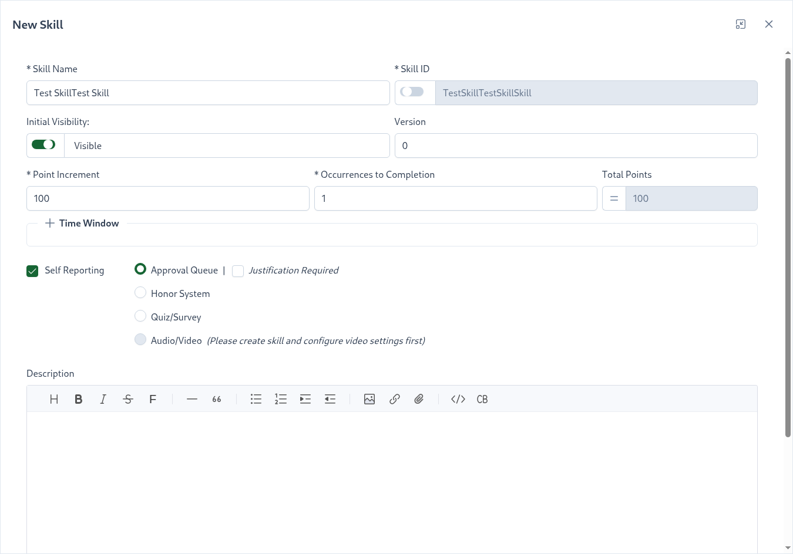
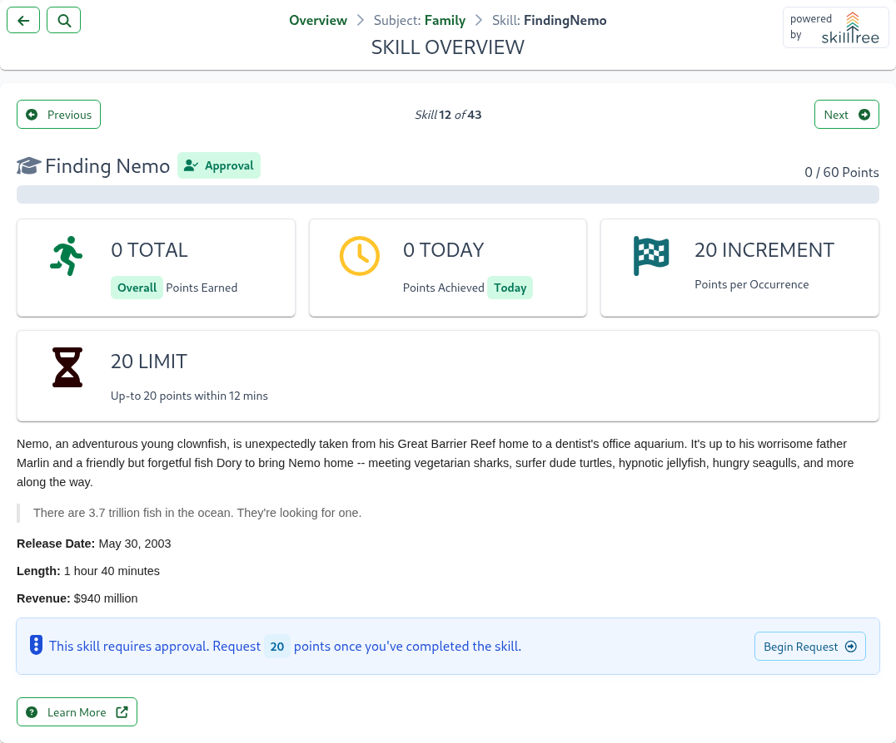
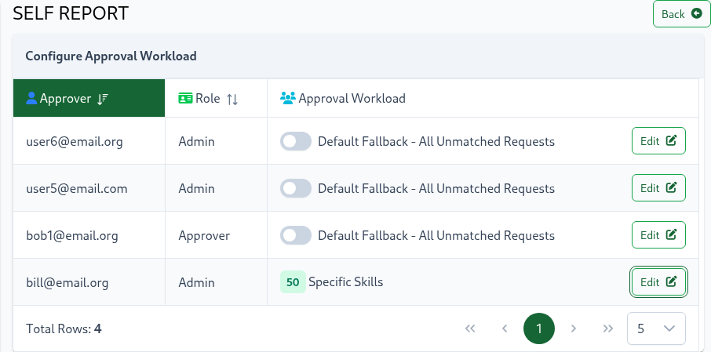
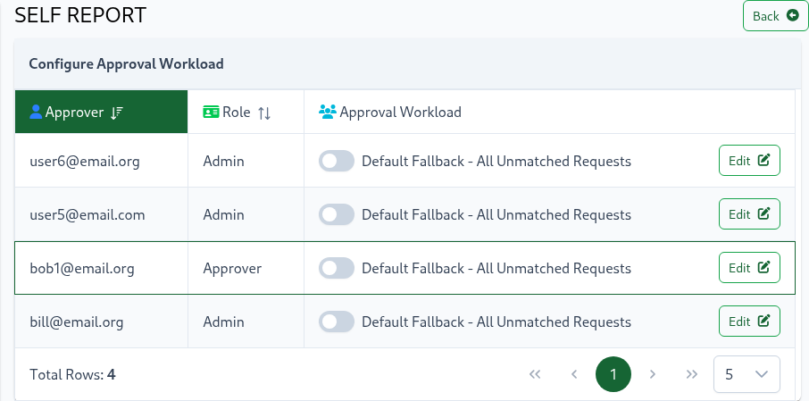

# Self Reporting

Self Report is a feature that empowers users to mark skills as completed directly in the SkillTree dashboard OR through the embedded Skills Display component. 
A project administrator can enable ``Self Reporting`` for a skill, set of skills or even all the skills in a project. 
Skills that have been configured with Self Reporting expose a button allowing users to self report completion of those skills. 

There are four ``Self report`` types available:  
1. Honor System - points are awarded immediately 
1. [Approval Queue](/dashboard/user-guide/self-reporting.html#approval-queue) - request goes into the project's approval queue; project administrators can approve or deny requests.  Note When choosing Approval Queue, you may also choose to require users to submit a justification when self-reporting this skill by selecting the 'Justification Required' check box.
1. [Quiz](/dashboard/user-guide/quizzes-and-surveys.html) - a knowledge check composed of multiple questions with a passing requirement; association of a Quiz requires successful passage of that Quiz in order to earn the skill and its points
1. [Survey](/dashboard/user-guide/quizzes-and-surveys.html) - a method to get feedback about that skill or collect information related to the skill; association of a Survey requires completion of that Survey before skill and its points are awarded
1. [Audio/Video](/dashboard/user-guide/skills.html#audio-video) - points are awarded upon full playback

::: tip 
Project administrators can craft training profiles consisting of:
  - only self-reported skills *OR*
  - a mix of self-reported skills and skills that are reported programmatically *OR* 
  - a project could have no self-reported skills at all
:::  

## Configuring

Self reporting is enabled and configured for each skill individually. 
When creating or editing a skill 
1. select ``Self Reporting`` checkbox
1. then select ``Self Reporting`` type (``Approval Queue``, ``Honor System``, ``Quiz/Survey`` or ``Video``)

::: tip
By default, Self Reporting is disabled when creating or modifying a skill. 
If your project primarily consists of Self Reported skills then you can easily change the default by navigating to the ``Project -> Settings`` tab.
There you can enable Self Reporting and select its default type for all the skills that will be created after that point.
Please see [Setting: Self Report Default](/dashboard/user-guide/projects.html#setting-self-report-default)
:::

To configure a Quiz-based or a Survey-based skill please select `Quiz/Survey` option and then use the drop-down to locate one of
the available Quizzes or Surveys.  

::: tip
Did you know, you can use **SkillTree's AI Assistant** to generate descriptions, [Learn more](/dashboard/user-guide/ai-assistant.html#ai-powered-description-generation)
:::

::: tip Useful Tips
- Association of a Quiz or a Survey to an existing skill requires successful completion of that Quiz/Survey in order to
earn the skill and its points
- A Quiz or a Survey can be associated to more than 1 skill
- Please learn more in the [Quizzes and Surveys](/dashboard/user-guide/quizzes-and-surveys.html) section
:::

::: tip Audio/Video
Please note that in order to select the `Audio/Video` type, the skill's [audio/video settings](/dashboard/user-guide/skills.html#audio-video) must be configured.
:::

## Skills Display

Once Self Reporting is enabled for a skill, users will see a button on the Skills Display that will allow them to report the completion of that skill.
The button's label will depend on the Self Reporting type, below is an example when the ``Approval Queue`` type was configured.

Skills with Self Reporting can be accessed in the Skills Display component embedded within your application (via [Client Libraries](/skills-client/#client-display-integration)) 

In case of Self Reporting type of `Video` the configured video is displayed above the description and once fully
watched (>96%) then the skill and its points are awarded!  

::: tip IDEA
You could create a project that consists purely of Self Reported skills! 
Alternatively you can have only some skills configured with Self Reporting or no skills at all.  
:::

## Approval Queue

When a skill is configured with the **Approval Queue** self-reporting type, points are not awarded immediately. Instead, they go through the following approval workflow:

1. **User Request**: The user clicks the **Begin Request** button to request points for the skill
2. **Queue Display**: The request appears in the project's **Self Report** page under the Approval Queue (see screenshot below)
3. **Admin Review**: A project administrator reviews and either approves or rejects the request

**To approve or deny requests:**
1. Select one or more requests from the queue
2. Click the **Approve** or **Reject** button
3. Enter an optional justification for your decision
4. Confirm the action

**Filtering the Approval Queue:**
The approval queue can be filtered by:
- **Skill Name** - Search for specific skills
- **User ID** - Filter by specific users

### Approval History 

Project administrators can can either approve or reject points/skill requests. 
Approvals and rejections are documented in the ``Approval History`` section. 

Approval History tracks: 
- Skill name and skill id
- Whether request was approved or rejected
- Requester's and approver's user ids
- requested and approved/rejected dates 

::: tip
The ``Approval History`` table can be sorted by all of its columns or filtered by ``Skill Name``, ``User Id`` and/or ``Approver Id``. 
::: 

### Notifications

SkillTree will send email notifications to project administrators when points are requested, approved or rejected. 

Project administrators can unsubscribe from notifications by navigating to the ``Self Report`` page within their project. 
The ``Self Reported Skills Requiring Approval`` section contains a Subscribed/Unsubscribed toggle on the top-right of the component. 

<conditional visibilityFlag="showInstallGuide">

Please note, depending on the installation mode, an email sometimes is not available for non-admin users, 
in that case an email notification will not be emitted. This is not an issue in the PKI or Oauth installation modes. 
To learn more please visit [Installation Modes](/dashboard/install-guide/installModes.html) section.
If your organization is already running a centralized service then your POC would be able to answer that question. 

::: warning
SkillTree [Root Admin](/dashboard/user-guide/users.html#root) must configure email notification settings before this feature can work. 
Please visit the [Email Notifications Settings](/dashboard/user-guide/settings.html#email-notifications) to learn more.
:::

</conditional>

## Split Approval Workload

By default, all Self Approval requests are routed to the project's approvers and administrators
and they all will see the requests and will be able to approve them. 
All approvers and administrators will also get notifications, unless disabled of course 
(please see the [Notification](/dashboard/user-guide/self-reporting.html#notifications) section).

If your SkillTree project has a large number of users submitting Self Report Approval requests it may overwhelm your
project's Approvers. SkillTree offers a flexible way to split the Self Approval workload between multiple Approvers
and/or Administrators.
- An approver can be assigned to approve requests from specific users
- An approver can be assigned to approve requests for specific skills
- An approver can be assigned to approve requests from users that have a certain user tag and/or that tag starts with a certain value (example: user's assigned org)
- Ability to designate a fallback (i.e catch-all) approver

To configure the Self Approval workload please navigate to the ``Project -> Self Report`` and then click the ``Configure`` button on the top right.

::: tip
Please note that the project needs at least 2 Approvers/Admins in order to configure the Approval Workload. 
To add Approvers please navigate to the [``Project -> Access``](/dashboard/user-guide/projects.html#access) page
:::

There are 2 user roles that can approve/deny Self Report requests, let's review:

- **Admin**: enables management of the training profile for that project such as creating and modifying subjects, skills, badges, etc.
- **Approver**: allowed to approve and deny Self Reporting approval requests while only getting a read-only view of the project.

Please visit the [Access](/dashboard/user-guide/projects.html#access) section to learn more about adding these roles.

To configure which requests are routed to an approver please click the ``Edit`` button for that Approver/Admin. 
That will expand the configuration options. Here is an example of configured skills:

Any request for a configured skill will then be routed to that approver and the remaining unmatched requests are forwarded to the 
fallback user (in this case implicit Default Fallback user). 

The overall strategy is simple - if the request matched a setting parameter (ex. skill) then it's routed to that approver. 
If multiple approvers are matched, for example:
1. one approver is assigned to approve requests for a skill **and**
2. another approver is configured to approve all the requests for a particular user. 

Then *the requests for that skill by the configured user* will be forwarded to both Aprovers:
1. first approver matching by skill configuration **and**
2. second approver matching by user-based configuration.

::: tip Pending Requests vs. History 
If Split Approval Workload is configured then each Approver/Admin will see approval requests that only match their configuration. 

As far as approval history goes however, Aprovers and Admins have a slightly different view. 
Users with an *Approver* role will **only** see the history of the requests that they approved while users with 
an *Admin* role will see the history of all the requests *(it's an Admin role after all)*.
:::

Even when Split Approval Workload is configured an Approver or an Admin can still turn off email notifications  (please see the [Notification](/dashboard/user-guide/self-reporting.html#notifications) section).
Users that turn off notifications simply won't get an email but will still be able to see and approve pending requests.

Any unmatched requests are forwarded to all the fallback Approvers or Admins. Fallback can be implicit or explicit. 
Implicit means that specific Approvers/Admins were not specified as handlers of the unmatched request.
To configure an explicit fallback user change its switch to "on":

Configuring explicit fallback users will then prevent requests from being forwarded to users without any configuration.
A very simple example is utilizing this feature to configure all the requests to go to a specific
Approver only, as depicted in the screenshot above. 

