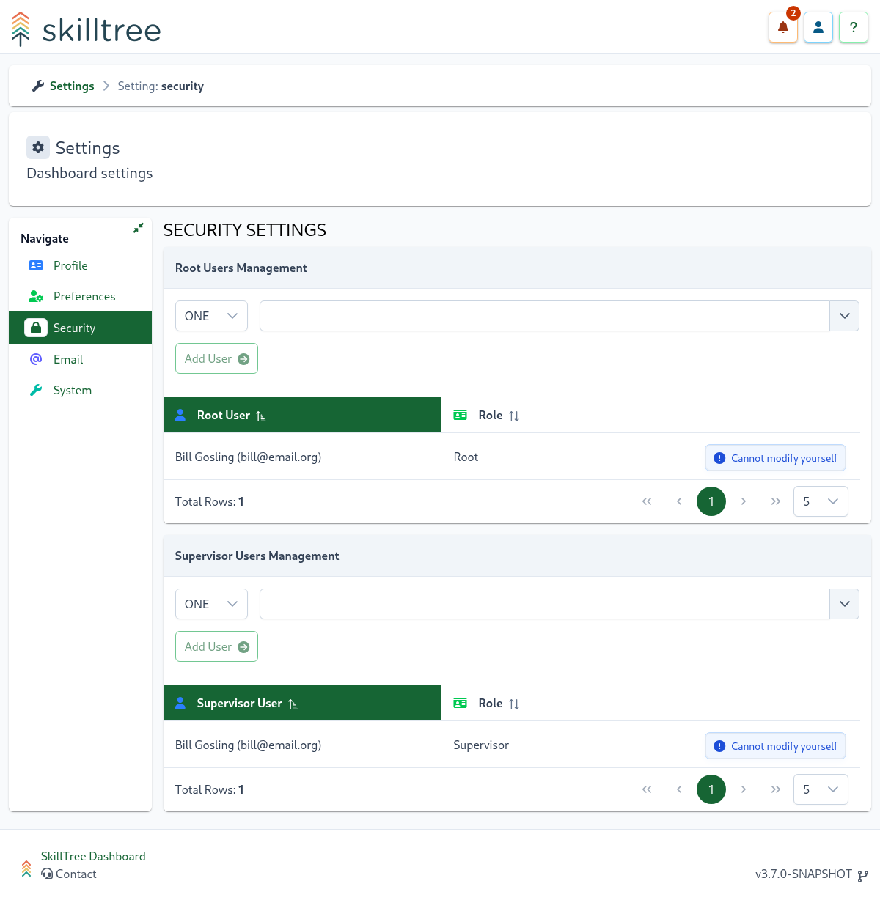
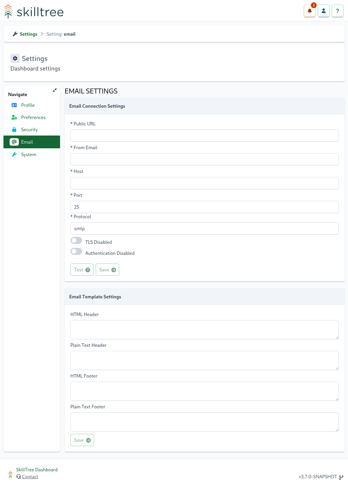
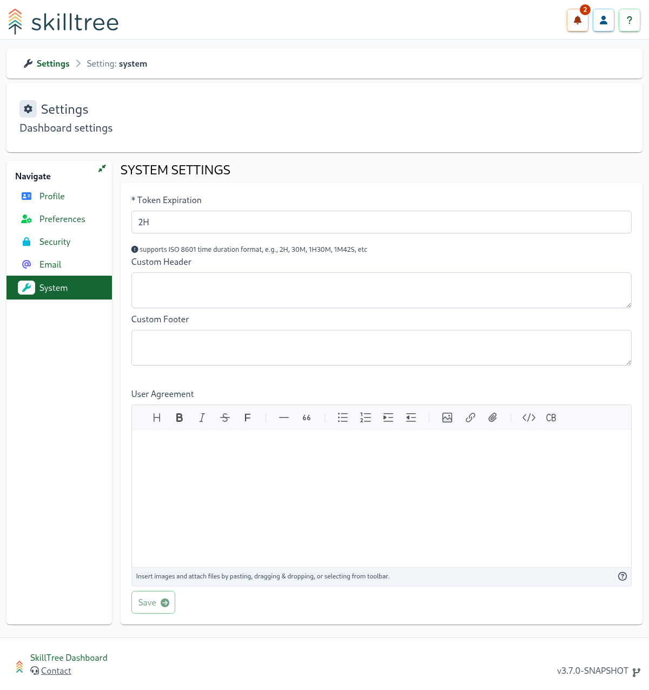
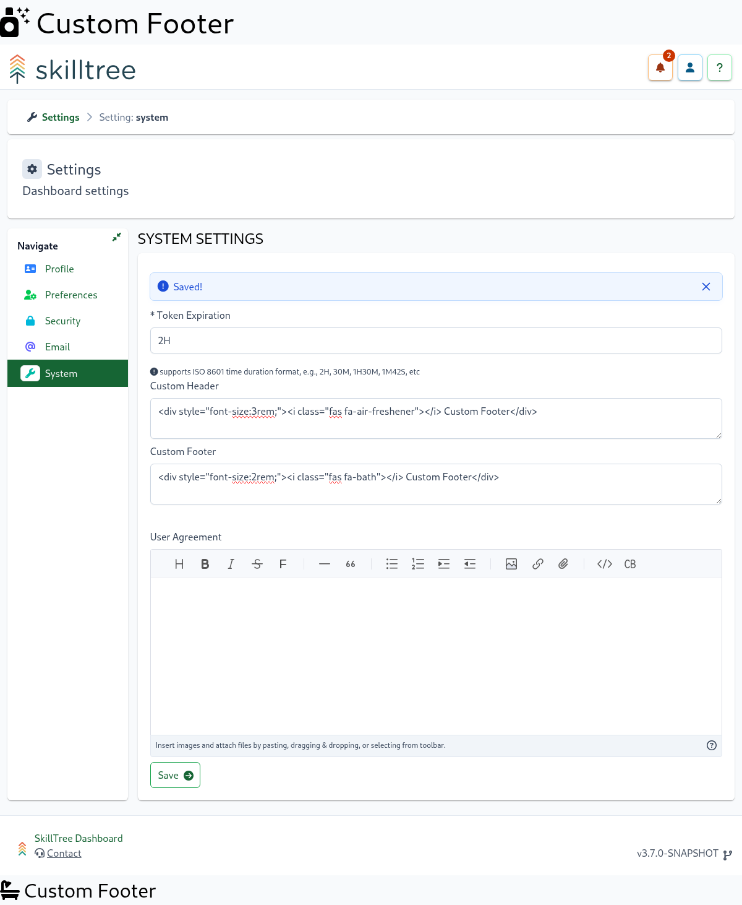

# Settings

The SkillTree Dashboard requires very little administration, however there are several settings that may need attention depending on your configuration.

Administration settings can be accessed by users via the ```Settings``` menu entry in the drop-down menu located on the top-right of the application.
Please note that number of settings' section are only visible to users with the [Root](/dashboard/user-guide/users.html#root) role. 

## Preferences
Ability to customize your personal user preference:

### Setting: Rank and Leader Opt-Out

Changing this setting to true and you will not be shown on the Leaderboard or assigned a rank for all projects. 


## Security Settings <requires-role role="Root" />

The ```Security``` menu item supports the administration of [Root](/dashboard/user-guide/users.html#root) users and [Supervisor](/dashboard/user-guide/users.html#supervisor) users.




To grant [Root](/dashboard/user-guide/users.html#root) or [Supervisor](/dashboard/user-guide/users.html#supervisor) privileges to a user, that user must have an existing account for the SkillTree Dashboard. User management will also prevent the removal of any permissions from the currently authenticated user.  

## Email Settings <requires-role role="Root" />

The SkillTree dashboard will send emails in support of password reset requests for Dashboard users, as well as self-reported Skill approval requests. If Email Server settings are not configured, the password reset feature will be disabled.



Email server configuration supports TLS enabled smtp servers, as well as username/password authentication. Changing the ```Authentication``` switch to ```Authentication Enabled``` will reveal the ```Username``` and ```Password``` configuration fields.

::: tip
The email settings form provides a ```Test``` button that can be used to confirm that the dashboard will be able to communicate with the configured mail server. The configured settings will not be applied if the dashboard is unable to successfully communicate with the configured mail server.
:::

An optional Header and Footer can be configured to be included on emails that emanate from the Skilltree platform. 
::: tip
both html and plaintext are required if configuring a header or footer
:::

::: warning
&lt;script&gt; tags are not permitted in the html configured for email header or footer
:::

## Email Notifications
SkillTree sends email notifications (ex. when [Self Reported](/dashboard/user-guide/self-reporting.htm) skills are requested). 

In order for the notifications to work the following must be configured: 
- [Email Server Settings](/dashboard/user-guide/settings.html#email-settings)
- Set ``Public URL`` in the [System Settings](/dashboard/user-guide/settings.html#system-settings)
- Set ``From Email`` in the [System Settings](/dashboard/user-guide/settings.html#system-settings)

## System Settings <requires-role role="Root" />



Both the ```Public URL``` and ```Password Reset Token Expiration``` settings are specific to supporting the dashboard password reset feature.

Because the dashboard itself may be deployed behind a load balancer or proxy, the ```Public URL``` setting must be configured so that emails emanating from the system can provide valid links back to the dashboard.

The ```Password Reset Token Expiration``` setting allows the ```Root``` user to configure how long a password reset token remains valid. This configuration supports the time component of the ISO 8601 format e.g., ```2H``` for two hours, ```15M30S``` for 15 minutes and 30 seconds, etc.

The ```From Email``` settings allows the ```Root``` user to configure what from email will be used for any emails emanating from the SkillTree dashboard. If no value is explicitly configured, ```no_reply@skilltree``` will be used by default.

``Custom Header`` and ```Custom Footer``` allow the ```Root``` user to specify HTML to be used as a custom header and footer that will be applied to the SkillTree dashboard.

The ```User Agreement``` setting <since project="skills-service" version="1.5.0" :is-block="true"/>  allows the ```Root``` user to configure a User Agreement that all dashboard users must acknowledge before being permitted to use any features of the Dashboard application. The User Agreement setting configuration supports Markdown.
Once a User Agreement has been configured, all Dashboard users will be required to acknowledge the User Agreement after logging in. 

::: tip
Note that if the content of the User Agreement is changed, dashboard users who acknowledged a previous version will be required to acknowledge the updated version.
::: 


::: warning
&lt;script&gt; tags are not permitted in the html configured for the header or footer
:::

The example below configures custom header and footer: 




