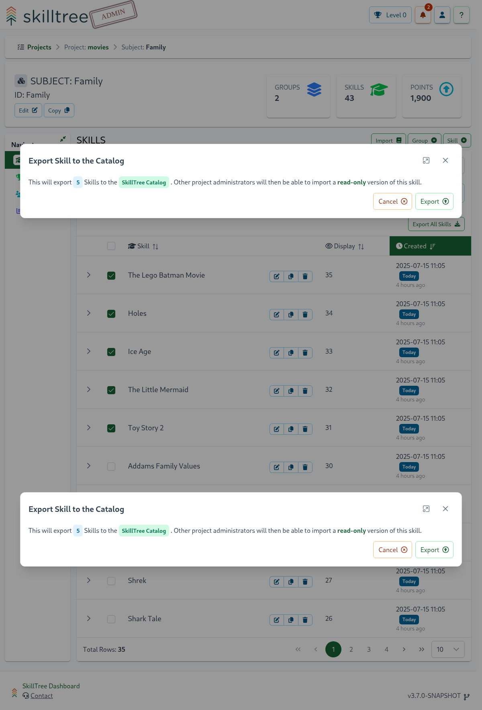
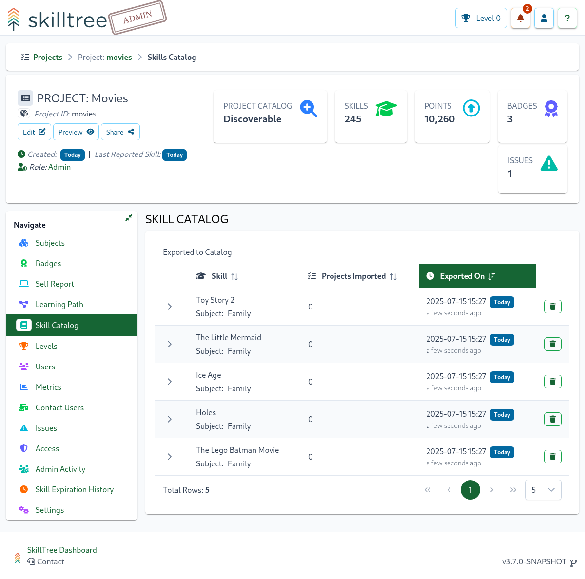
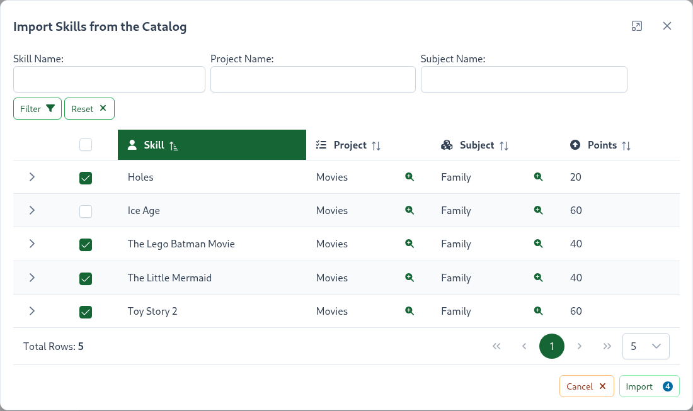
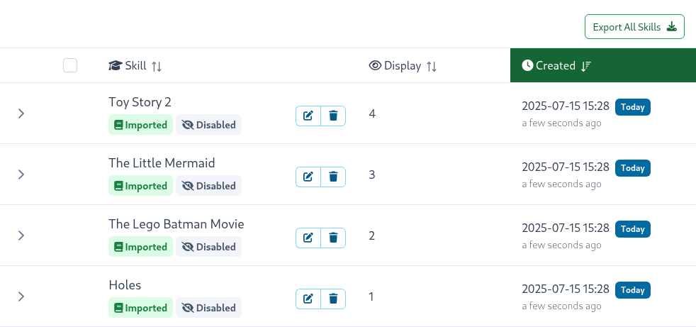
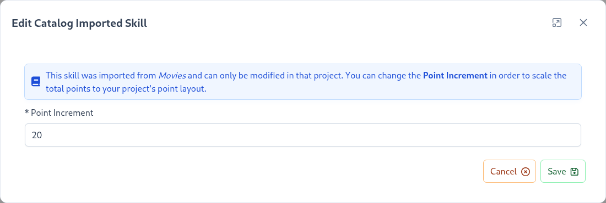

# Skills Catalog

Skills Catalog is a feature that facilitates re-use of skills across projects. 
Skills can be exported to the Catalog which makes those skills available for re-use in other projects. 
Then the read-only version of those skills can be easily imported into other projects. 
As skill occurrences are reported to the original project they are also automatically propagated 
to the imported skills within other projects. Changes to the original skill (ex. description) are 
automatically synchronized to all the imported skills as well. 

In the diagram above two skills from ``Project A`` and two skills from ``Project B`` were exported to the Skills Catalog. 
These skills were then imported by the three projects. 

## Exporting Skills
To export to the Skills Catalog please navigate to the Skills page (``Project -> Subject``), 
then select skills to export and click on the ``Action`` button located on the top-right above the skills' table. 
Select ``Export to Catalog`` and proceed with the catalog export.

Once skills are exported to the Catalog you will see an "Exported" tag next to each skill. 
You can also review and manage currently exported skills on the ``Skills Catalog`` page (``Project -> Skill Catalog``)  

::: warning
Please note that skills defined under a Skills Group cannot be exported to the Catalog as of now. 
The support for skills under a Group will be added in the future.
:::

Please note that:
- all the skills under a subject can be easily selected for export via ``Select All`` button
- skill name and ID duplicates are not allowed in the Skill Catalog

## Importing Skills

To import skills please follow these steps: 

1. **Import one or more skills** - skills will be disabled; disabled skills do not contribute to the overall points and skill occurrences do not propagate to the imported skills prior finalization (step 3)
2. *(Optional)* **Adjust imported skills' ``Point Increment``** to match your project's point system/layout
3. **Finalize imported skills** - user points from the original project are migrated and level achievements are calculated

Catalog Skills can be easily imported by navigating to the subject's page (``Project -> Subject``) 
and clicking ``Import`` button on the top right. The import modal allows users to locate, select and
import one or more skills. 

After the skills are imported there are in the disabled state. Disabled state means:
- Skills do NOT contribute to the overall project or subject points
- Skill occurrences do not propagate to the imported skills and can NOT be self-reported (if the original skill is a self-reported skill)
- Skills are not visible on the Skills Display and/or Progress and Ranking views
- Skills can NOT be added to badges

::: warning
Please note that skills cannot be imported under a Skills Group as of now.
The support for skills under a Group will be added in the future.
:::

The next and an optional step is to change the ``Point Increment`` for each imported skill. 
The ``Point Increment`` as defined in the originating project may not work well for the point system in your project. 
For example, most of the skills in your project maybe 10 points but the imported skill(s) define the increment in the 100th if oiubts.
To adjust point increment for an imported skill please click on the  button. 

::: tip
Please note that only ``Point Increment`` can be modified, the rest of the skill's attribute can only be mutated within the original project. 
:::

Once the skills of interest are imported then it is time to Finalize. 
Finalization process enables the imported skills, migrates users' points and calculates achievements for those users. 

::: tip
Please note that it is important to import all the intended skills before performing the finalization step. 
Finalization migrates users' points from the original project and calculates achievements. 
Since adding new skills changes the point layout of the project, incremental import/finalization may cause users to 
prematurely achieve levels. 
:::

Once at least one skill is imported SkillTree Dashboard display the finalization alert with the ``Finalize`` button. 

Please click the ``Finlize`` button to get started. Please note that the finalization process is expensive and may take several minutes.

## Finalization
Finalization is a very important step in completing the import of the skills. The Finalization process will make the following modifications:
- Imported skills will now contribute to the overall project and subject points.
- Skill points are migrated to this project for all the users who made progress in the imported skills (in the original project).
- Project and subject level achievements are calculated for the users that have points for the imported skills.

If there were no Finalization process and level achievements were calculated as skills are imported then there 
would be a strong possibility of awarding levels to users prematurely. 
The reason for that is that levels' points are calculated based on the percentages, so as the skills are added points required to achieve
a particular level are adjusted. If levels were calculated incrementally then level achievements would be assigned based on the in-progress view of the points' profile.
Consequently, it is important to import all the skills of interest and then Finalize those skills. 

::: tip
Please note that the finalization process is expensive and may take several minutes.
:::

## Good To Know

This section will cover several features and inner-workings of the Skills Catalog. 

### Skill occurrences propagation

When skill occurrences are reported for a skill that was exported to the catalog SkillTree checks whether that skill
was imported. For every import instance the occurrence is queued up to be propagated to the imported skills. 
The queue is handled in an asynchronous manner so there is a small delay before the skill occurrence is propagated.

### Modify skill in the original project

Catalog exported skills can be mutated at any time. 
After the attributes of the original skill are mutated they are queued up to be propagated to all the imported skills.
Please do note that the skill attribute propagation is performed asynchronously, it may take few moments to appear within all the imported skills. 

::: tip
Skill's attributes are propagated with the exception of the ``Point Increment`` attribute. 
``Point Increment`` attribute is only copied initially and thereafter managed within the importing project.
:::

### Self Reporting and Imported Skills

As skill occurrences are reported to the original project they are also automatically propagated
to the imported skills in the other projects.
Generally skill occurrences are not allowed to be reported to the imported skill, after all it is meant to be read-only.

The one exception is self-reported skills, self-reported skills can be reported to the original skill OR to any of its imported copies.
Regardless where it was imported or natively declared the points are given for the original AND all of its copies
(assuming points are due based on the current configuration and user's prior contributions).
When a self-reported skill occurrence is reported to the imported skill then the request is simply routed to the originally-declared skill.
From there on the flow is identical to any skill occurrence that is being reported to the original skill.

Self-reporting ``I did it`` button is visualized for each imported skill in the ``Skills Display`` and Progress and Rankings views. 

### Catalog and Skills Dependencies

Skills with dependencies can NOT be exported to the Skills Catalog. 
Since those skills require completion of its dependencies first they make poor candidates for re-use in other projects. 

On the other hand imported skills can be added as dependencies to project's native skills. 

### Imported skills and badges

Imported skills can be added to a project badge. 
However, imported skills have to be finalized before they can be added to a badge - disabled skills are not eligible. 

### Deleting exported skills

When a skill exported to the Skills Catalog is removed all of its associated imported skills will also be removed. 
SkillTree will warn if that skill was imported in other projects. However, please remove with care.  