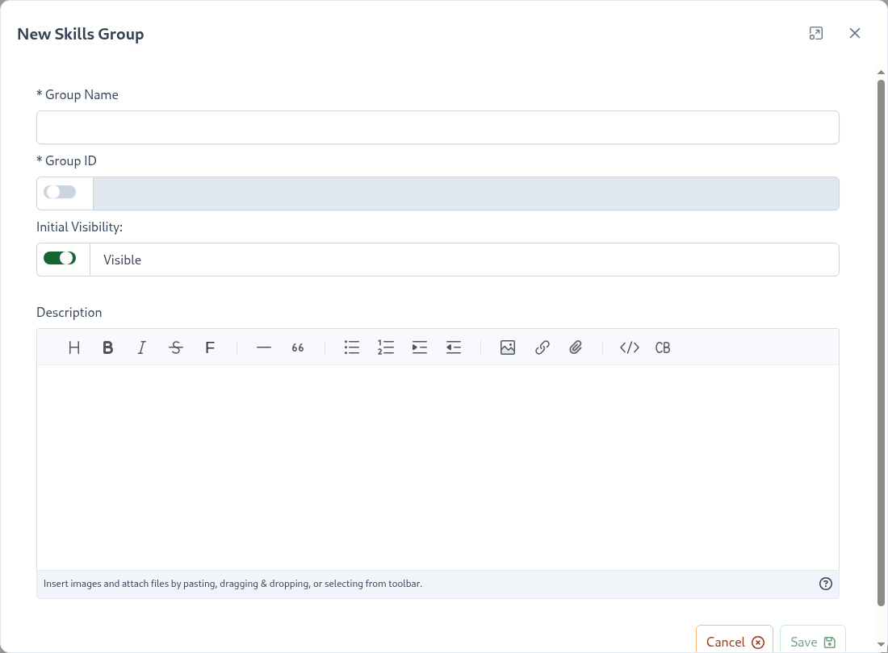

# Skill Groups <since project="skills-service" version="1.8.0" />

Skill Groups is a way to group/organize skills under a subject. 
Projects are composed of Subjects which are made of either [Skills](/dashboard/user-guide/skills.html) or Skill Groups. 
A group is a collection of 2 or more skills that you want to keep and achieve together.
A group is achieved when all of its skills are fully completed. 
Alternatively, a group can be configured to only require ``N`` number of the group's skills. 

::: tip Partial Requirement Example
If let's say a group has ``5`` skills, you can configure it to only require ``3`` skills.
In this case, when any of the ``3`` skills under that group are completed then the group achievement is awarded!
:::

To create a group, navigate to ``Project -> Subject`` then click on ``Group +``, the following group properties can be specified:

| Property | Explanation | 
|:------- |:----------- | 
| Group Name | Display name of the skill |
| Group ID | Group ID that will be used to identify this group |
| Description | *(Optional)* Description of how to perform this skill. The Description property supports markdown.

After a group is created then skills can be added to the group. To add Skills to the group expand the group and click on the ``Add Skill To Group`` button. 
This will bring up a new skill dialog, to learn more about skills and their attributes please visit the [Skills Section](/dashboard/user-guide/skills.html). 

::: tip 
When first created, a Group is not visible on the Skills Display because it has 0 skills. 
Once at least 1 skill is added the group will be rendered in the Skills Display.
:::

## Partial Skill Requirement

Groups have an option to only require ``N`` skills out of the total available number of skills added to the group.
For example, if a group has ``5`` skills, you can configure it to only require the completion of ``3`` skills.
In this case, when any ``3`` skills under that group are completed then the group achievement is awarded!
