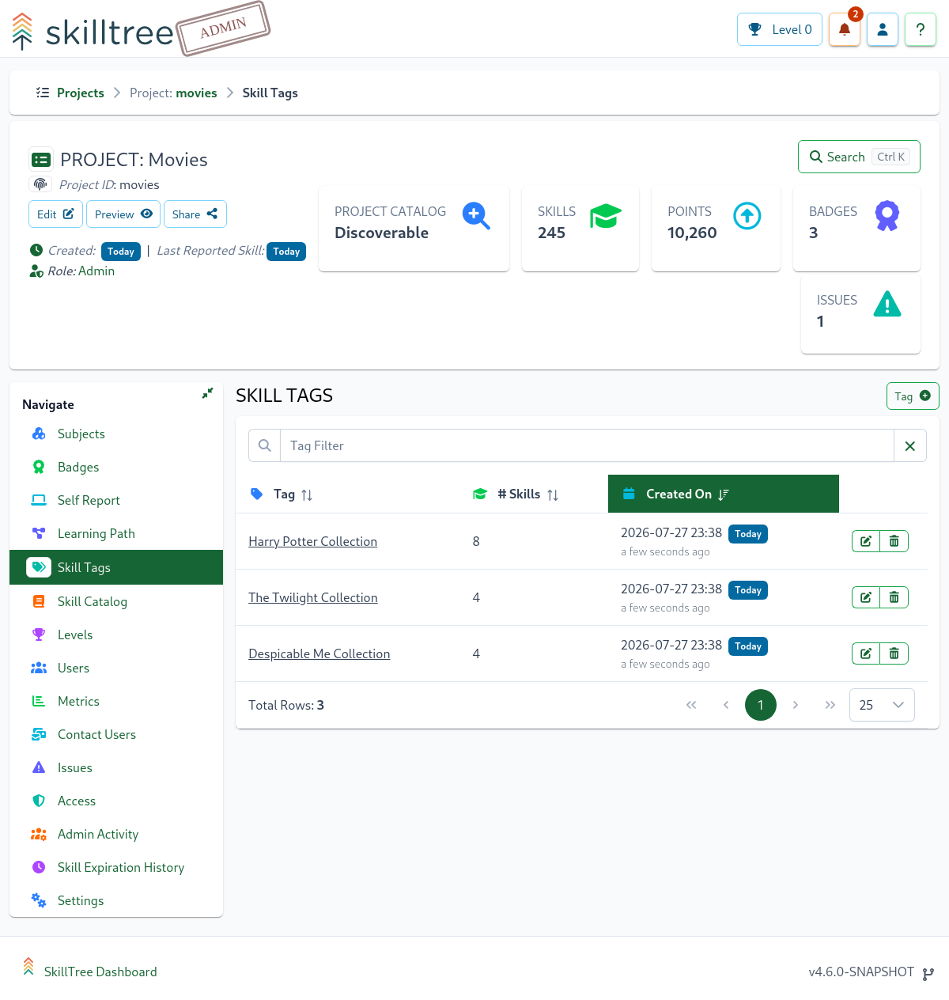
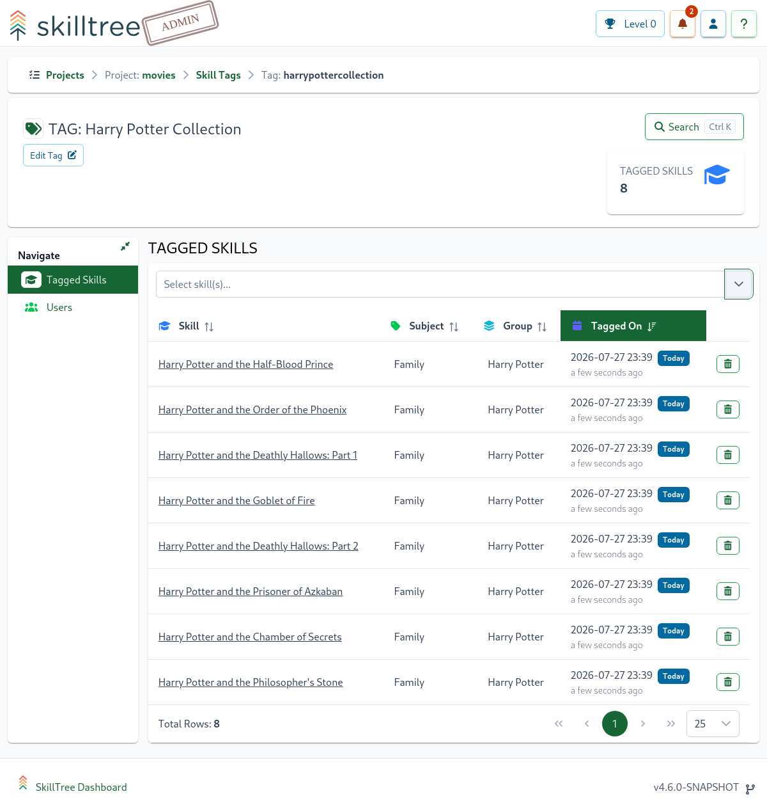
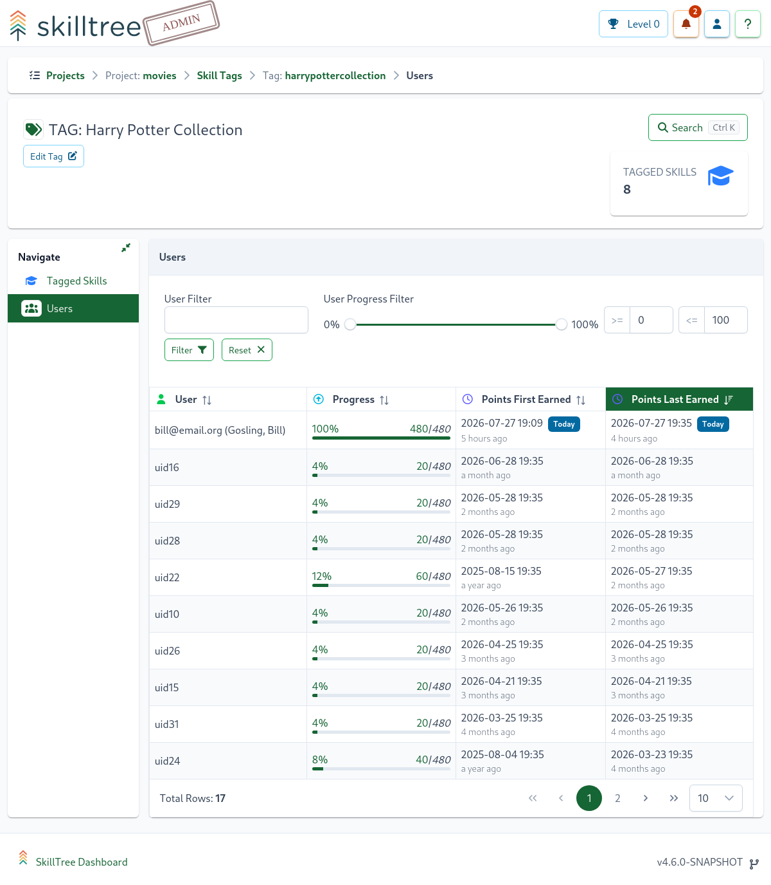

# Skill Tags

Skill Tags allow project administrators to add one or more custom tags to skills. Tags provide an additional way to categorize, group, search, and filter skills across a project.

Skill Tags are also displayed in the Skills Display so trainees can more easily understand how skills relate to one another, discover related training, and filter skills by tag.

::: note Project-Level Skill Tag Management
Skill Tags are now managed at the project level. Administrators can use the dedicated Skill Tags page to view and manage all tags across a project, drill into a single tag to manage its associated skills, and review trainee progress for skills associated with a specific tag.
:::

## Skill Tags Management Page

To manage Skill Tags, open your project and navigate to `Project -> Skill Tags`.

From the Skill Tags page, administrators can:

- View all Skill Tags defined in the project
- Create new Skill Tags
- Delete existing Skill Tags
- Open a dedicated management page for a specific tag
- Review how many skills are associated with each tag

This page provides a centralized place to manage tags across the entire project instead of managing them only from an individual subject or skill context.

## Single Skill Tag Management Page

Click a Skill Tag name from the Skill Tags management page to open the Single Skill Tag management page.

From this page, administrators can:

- Add skills to the selected tag
- Remove skills from the selected tag
- View all skills currently associated with the tag
- Edit the tag value
- Edit the tag ID
- Review user progress for project participants advancing through skills associated with the tag

The Single Skill Tag management page is useful when maintaining a curated group of related skills, such as skills that belong to a specific collection, topic, technology area, curriculum track, or learning objective.

## Editing Tag Values and Tag IDs

Administrators can update both the display value and the ID of a Skill Tag.

- **Tag Value** is the human-readable label displayed to administrators and trainees.
- **Tag ID** is the unique identifier used internally and in URLs.

When editing a tag, choose a clear and stable value that describes the group of skills it represents. If the tag is already in use, consider whether changing the tag value or ID could affect administrator workflows or references to that tag.

## Viewing Trainee Progress by Skill Tag

Skill Tags include project participant progress information for the skills associated with a specific tag. This allows administrators to review how users are advancing within a tagged collection of skills.

This can be helpful for tracking progress across a specific training area, such as:

- A curriculum module
- A certification topic
- A feature-specific training path
- A collection of related skills
- A technology or competency area

## Skill Tags in the Skills Display

Skill Tags are visible to trainees in the Skills Display. This gives trainees another way to understand, categorize, and filter available training.

Tags can help trainees quickly identify related skills and focus on a particular set of training objectives.