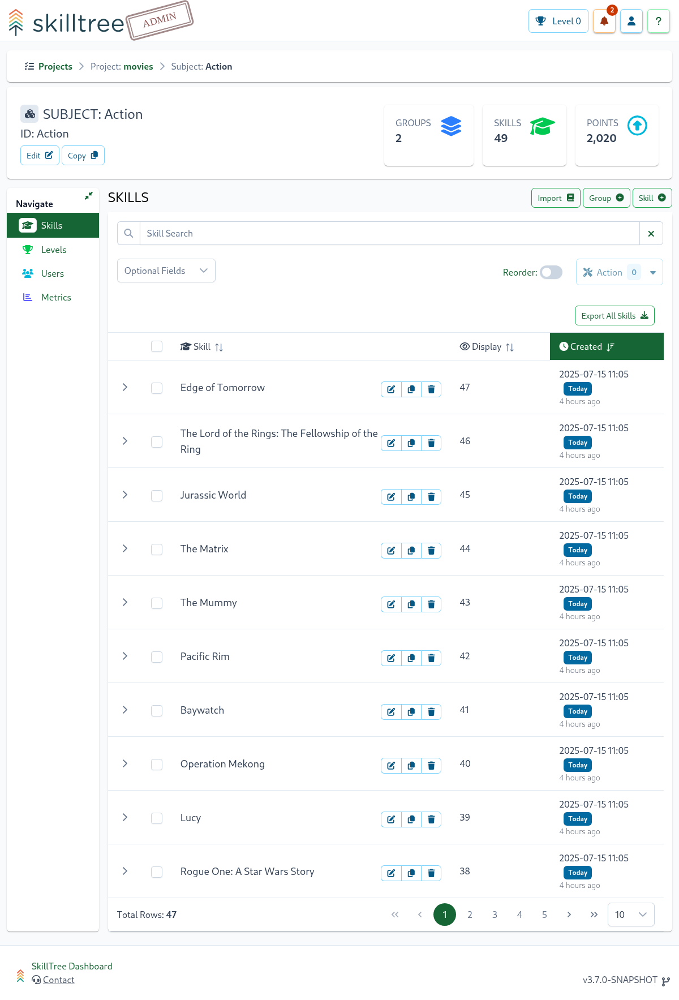
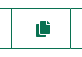
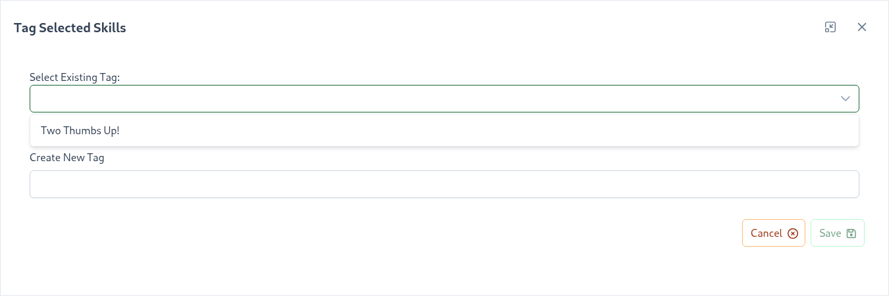
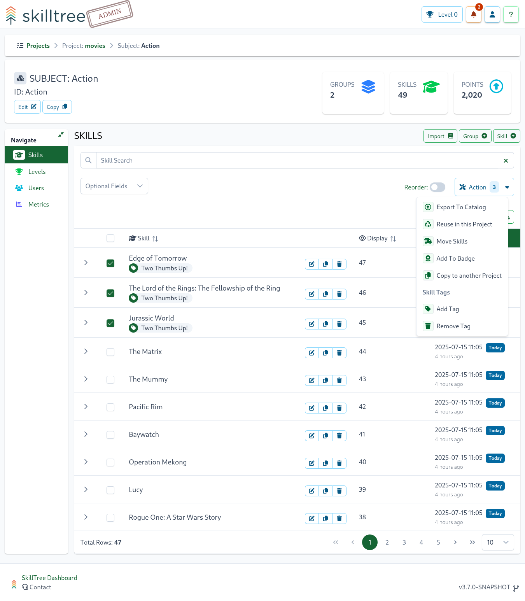

# Skills

Projects are composed of Subjects which are made of Skills (or [Skill Groups](/dashboard/user-guide/skills-groups.html)) and a single skill defines a training unit within the gamification framework. 
To complete a skill, users may need to perform the same action multiple times - repetition is important for retention after all. A Skill definition specifies
how many times a skill has to be performed. Each occurrence is called a Skill Event.   



To create a skill, navigate to ``Project -> Subject`` then click on ``Skill +``, the following skill properties can be specified:


| Property                                                     | Explanation                                                                                                                                                                                                                                                                                                                                                                                                                                                                                                                         | 
|:-------------------------------------------------------------|:------------------------------------------------------------------------------------------------------------------------------------------------------------------------------------------------------------------------------------------------------------------------------------------------------------------------------------------------------------------------------------------------------------------------------------------------------------------------------------------------------------------------------------| 
| Skill Name                                                   | Display name of the skill                                                                                                                                                                                                                                                                                                                                                                                                                                                                                                           |
| Skill ID                                                     | Skill ID that will be used to report skill events                                                                                                                                                                                                                                                                                                                                                                                                                                                                                   |
| Point Increment                                              | Number of points added for each skill event; used in conjunction with the 'Occurrences to Completion' property                                                                                                                                                                                                                                                                                                                                                                                                                      | 
| Occurrences to Completion                                    | Number of successful occurrences to fully accomplish this skill; used in conjunction with the 'Point Increment' property                                                                                                                                                                                                                                                                                                                                                                                                            |
| [Time Window](/dashboard/user-guide/skills.html#time-window) | Used in conjunction with the 'Max Occurrences Within Window' property; once this Max Occurrences is reached, points will not be incremented until outside of the configured [Time Window](/dashboard/user-guide/skills.html#time-window). When 'Time Window' is disabled skill events are applied immediately."                                                                                                                                                                                                                     
| Max Occurrences Within Window                                | Used in conjunction with the [Time Window](/dashboard/user-guide/skills.html#time-window) property; Once this Max Occurrences is reached, points will not be incremented until outside of the configured [Time Window](/dashboard/user-guide/skills.html#time-window).                                                                                                                                                                                                                                                              |
| [Self Reporting](/dashboard/user-guide/self-reporting.html)  | (Optional) When checked Self Reporting is enabled for this skill. The type of ``Approval Queue``, ``Honor System`` or ``Quiz/Survey`` can then be selected. When choosing Approval Queue, you may also choose to require users to submit a justification when self-reporting this skill by selecting the 'Justification Required' check box. When selecting ``Quiz/Survey`` you will also be prompted to pick an existing Quiz or a Survey. Please visit [Self Reporting](/dashboard/user-guide/self-reporting.html) to learn more. | 
| Version                                                      | *(Optional)* Utilize [Skills Versioning](/dashboard/user-guide/skills.html#skills-versioning) to support running multiple versions of client software                                                                                                                                                                                                                                                                                                                                                                               |
| [Description](/dashboard/user-guide/rich-text-editor.html)   | *(Optional)* Description of how to perform this skill.                                                                                                                                                                                                                                                                                                                                                                                                                                                                              |                                                                                                                                                                                                                                                                                                           
| Help URL/Path                                                | *(Optional)* URL pointing to a help article providing further information about this skill or capability. Please note that this property works in conjunction with the [Root Help Url](/dashboard/user-guide/projects.html#setting-root-help-url) project setting. You can also author external links into the description itself if more than one external resource needs to be linked to.                                                                                                                                         |  

::: tip
To calculate the total points that completion of a particular skill will give a user:

Total Points = Point Increment * Occurrences to Completion
:::

## Time Window

Time Window is a powerful feature that limits awarding of points to a maximum number of occurrences within the configured time span. 
This feature provides a balance between requiring repetition of an action and spacing out that repetition. 

> “Repetition is the mother of learning, the father of action, which makes it the architect of accomplishment.” - Zig Ziglar  


When designing a gamification profile, the Time Window must be considered in conjunction with the ``Occurrences to Completion`` property. 
For example, you may want to require 30 occurrences to complete a skill but only up to 5 occurrences within a 24 hour window. 
This means that it will take a user at a minimum, 6 days to complete this skill. Here are the properties for this hypothetical example:
-  *Occurrences to Completion*: 30
-  *Time Window*: 24 hours 0 minutes
-  *Max Occurrences Within Window*: 5

This is just a fictitious example and values will depend on your gamification needs.  

You can also disable the Time Window property of a Skill, which will force each event to be applied immediately (up to ``Occurrences to Completion``). To disable, uncheck the checkbox next to the Time Window property.   

## Best Practices

- "Repetition is the mother of learning" - use the ``Occurrences to Completion`` property in conjunction with the [Time Window](/dashboard/user-guide/skills.html#time-window) property to balance between requiring repetition of an action and spacing out that repetition (for example, prevent users from spamming an action in one sitting to max out a Skill by setting a Time Window of 1-8 hours)
- Help Url - configure the [Root Help Url](/dashboard/user-guide/projects.html#setting-root-help-url) for the project and then enter a path relative to that root. It will then be an easy change if the location of help articles changes. You can also author external links into the description itself if more than one external resource needs to be linked to.

## Videos <since project="skills-service" version="2.8" />

SkillTree supports embedding videos into the skill description and optionally configured to achieve that skill once the
video is fully watched. You can either embed externally hosted videos OR upload a video directly into SkillTree.  

- **SkillTree Hosted** <since project="skills-service" version="2.9" />: upload a video using file-upload form (Browse button) or by drag-n-dropping video files 
  - SkillTree supported video formats are:
    - [Webm](https://www.webmproject.org/about/) - free video format specifically created for the web 
    - [MP4](https://en.wikipedia.org/wiki/MP4_file_format) - common video format often used in web applications
- **Externally Hosted**: enter URL that points to a video hosted on another web server (ex. `https://someloca/.../../video.mp4`)


To configure a video, please navigate to `Project -> Subject -> Skill -> Video`   


The only required field is `Video` and once the video is configured it will be presented on the training above the skill's description. 

To upload a video from you computer you can click on the `Browse` button or `drag-n-drop` a video file into the video input box.
To configure externally hosted video click on the `Switch to External Link` button then enter the URL that points to an externally hosted video. 
Please do not forget to click `Save and Preview` button to persist the changes. 


To make the video accessible, the configuration offers the ability to specify `Captions` and `Transcript` values.
When captions are configured the video player will present an option to turn captions on or off.  
Captions utilize [Web Video Text Tracks Format (WebVTT)](https://developer.mozilla.org/en-US/docs/Web/API/WebVTT_API) format 
and its input form offers an ability to prefill an example in WebVTT format by clicking `Add Example` button above the `Captions` input field.  

### Achieve Skill By Watching the Video 

Once the video's settings are specified the skill can also be configured to be achieved after the trainee watched the entire video (>96%). 
Video-based achievements are done using [Self Reporting](/dashboard/user-guide/self-reporting.html) mechanism and can be easily 
selected by editing that skill and selecting `Video` Self Reporting type. 

::: tips
Please note that self reporting by watching the video completes the skill, so when the `Video` type is
selected, `Occurrences to Completion` are set to `1` and cannot be changed.
:::

If a video has a transcript configured then users will also be allowed to earn the skill by reading its transcript
and then self-certifying to receive the credit for the skill. 

## Expire Points and Achievements <since project="skills-service" version="2.9" />

Skills can be configured to expire points and achievements on either a scheduled and recurring basis for all users, or based on usage *after* a user achieves the skill.  

To configure a skill for expiration, please navigate to `Project -> Subject -> Skill -> Expiration`


The default option for all skills is set to `Never`, so that the skill will never expire any points or achievements.

The `Yearly` and `Monthly` options allow for the skill to be configured to expire on a recurring basis.  For example, you can configure a skill so that *all* user's points and achievements earned for this skill will be removed annually on December 31st.  

The `Daily with the ability to retain` option allows for the skill to be configured to expire based on usage. This option requires the user to continue to exercise the skill after achieving it in order to avoid losing their points. Once a user achieves the skill, 
the user must perform the skill at least once within the number of days configured.  After performing the skill, the "timer" will be reset and the user will once again be required to perform the skill within the configured number of days to avoid losing the points they have earned since achieving this skill.

Skills that are configured to expire will have warnings visualized in the Skills Display, letting the user know when the skill will is set to expire.

### Expiration History <since project="skills-service" version="2.11" />

A history of skills that have been expired can be viewed from the `Skill Expiration History` table on the `Project` page.
This table will allow you to view the skill, the user associated and the date it expired.

## Skills Definition Export

To export the skills table to Excel, click the `Export All Skills` button located at the top right of the table. This will
generate an Excel file containing all skills for the current subject.

Important Export Details:

- All skills under a subject are included in the export, including those within Skill Groups.
- Skill Groups are not exported as separate rows, but their associated skills will include the group name in each row.
- Descriptions are not included in the export due to their complex formatting, which includes rich text, HTML, and embedded images that are not compatible with Excel cells.

## Copy Skill
To use an existing Skill as a template for a new Skill, you can use the  button available on a Skill row displayed on the Subject page.
This will open a new Skill dialog populated with the details of the selected copy-from Skill. The name and id will be prepended with ``Copy of`` which can be changed
before the new Skill is saved. Saving this dialog will create a new Skill that falls within the same Subject as the copy-from Skill.

::: tip
Follow a 2-step process if you want to "copy" a skill into a different subject or group
1. copy the skill
2. Move the skill into another subject or group.
   :::

## Skills Versioning

Skill versioning is a mechanism that allows the addition of new skills without affecting existing software running with an older skill profile.
Versioning is mostly pertinent to the Display Libraries that visualize the skill profile for the version they were declared with. 

Here are simple steps to enable Skills Versioning in your application:
1. When creating a skill, specify a target version (always last deployed version + 1)
   - Version selection can be found on the top-right in the create/edit skills dialogue
1. When initializing the display component, provide the latest target version for that instance. 
   - [Client Integration](/skills-client/#pure-javascript)


Let's walk through a simple scenario to get a better understanding of how Skill Versioning operates. 

We have developed software and are releasing a ``version 0`` that integrates skills display and event reporting using the Vue.js library. 
In the initial release, all of the skills will be created with ``version 0``. The integrated display component will then be initialized with ``version 0``,
like this:
``` js
<skills-display version="0"/>
```
This software instance will then get deployed and the skill profile for ``version 0`` is displayed. 

Now we are working on the next release which we will label as ``version 1``. 
Any skill created with ``version 1`` will not be visible in the already deployed software, configured to visualize skills with ``version 0``.
The version will need to be updated in the integrated display component to use ``version 1``, like this:
 ``` js
 <skills-display version="1"/>
 ```
The updated software running the ``version 1`` profile will expose skills declared with both ``version 0`` and ``version 1``.
Both versions of software can then run simultaneously and each version will present its own gamification profile. 
::: tip Please Note
The skills from previous versions are automatically included, so version 3 will contain skills declared with versions 3, 2, 1 and 0  
:::   

::: warning Important
Conveniently, the Skills Dashboard provides a way to view the [Client Display](/dashboard/user-guide/users.html#client-display) for a specific version. 
Navigate to ``Project -> User -> Client Display`` and then select a previous version on the drop-down located above the client display.  
:::

Limitations: 
- Deletes are not directly supported. To remove a skill, please perform the following procedure:
  1. update all the client code that is reporting events for the skill that is to be deleted
  1. deploy the version that is not using the skill
  1. delete the skill using the dashboard
- Edits to skills are not versioned and will be immediately visible to any display with this or earlier versions. This is mostly likely the behavior you want as any edit to a skill is a fix or an improvement.
- Versioning is only applicable to new skills and doesn't apply to operations done on subjects, badges or other items within the gamificiation framework.  
  
     
## Manually Add Skill Event
There maybe a special situation when you want to give a user credit explicitly. Project admins can add Skill Events manually through the Dashboard:
1. Locate the Subject that contains the Skill for which you would like to add an event
1. Select ```Manage``` for the located Subject
1. Locate the Skill and select ```Manage```
    * The ```Filter``` box on the top left of the Skills table can be used to quickly locate a particular Skill
1. Select ```Add Event``` from the Navigation menu on the left
1. Enter the ```User Id``` of the user for whom the Skill Event will be added (note that the field supports type-ahead to locate existing users)
1. Enter a date on which the Skill Event occurred (this will default to today's date)
1. Select ```Add```

## Incremental Changes
This section explain how various scenarios are handled when skills are modified/removed/added 
*AFTER* your application users already earned points, completed skills, achieved levels and obtained badges.

::: tip Overall Strategy
1. Never take away achieved levels and/or earned badges. 
1. Re-calculate users' points when skill's points and/or occurrences are mutated. 
:::

*SCENARIO:* **Point Increment is increased** :arrow_up:

Recall that *Point Increment* is the number of points applied for each skill event. 
Delta in *Point Increment* will then be added for any of the already performed skill events. 
For example if a user performed 2 skill events and *Point Increment* changed from 5 points to 8 points (delta = 3) then 
user will be awarded additional 6 (3 * 2) points. 
If these additional points place a user into the next level then that level will be awarded the next time an event is reported for that user. 

*SCENARIO:* **Point Increment is increased** :arrow_down:

Recall that *Point Increment* is the number of points applied for each skill event. 
Delta in *Point Increment* will then be substructed for any of the already performed skill events. 
For example if a user performed 2 skill events and *Point Increment* changed from 10 points to 6 points (delta = 4) then 
8 (4 * 2) points will be substructed from the user's points.

*SCENARIO:* **Occurrences to Completion is increased** :arrow_up:

Recall that *Occurrences to Completion* is the number of successful occurrences to fully accomplish a skill. 
Any users that have already completed the skill based on the lower number of occurrences will now have an opportunity to complete new/additional occurrences and earn those points. 

Additional occurrences will cause a completed skill to be worth additional points which in turn may shift the points profile of a user, technically placing certain users outside of their currently achieved level. 
If so, those users will *NOT* lose their current level (per our overall strategy) but rather it will take them a bit longer to achieve the next level.  

If the increase to occurrences was made for a skill that belongs to a badge, then any user that has already earned that badge will retain the badge achievement. 
     
*SCENARIO:* **Occurrences to Completion is decreased** :arrow_down:

Recall that *Occurrences to Completion* is the number of successful occurrences to fully accomplish a skill. 
Points are subtracted for users that already achieved the removed occurrences. 

If the removal causes a user to qualify for achievement of the edited skill, then that completed skill is awarded to the user. 
Subsequently if the completion of that skill completes a badge then the badge is awarded to that user.   

Any previously achieved levels and badges are retained even if the removed occurrences contributed to the achievement of those levels and/or badges. 

*SCENARIO:* **Skill is removed**

For a given user, if this was the last skill to be completed before a badge is achieved then the badge is awarded to that user.

*SCENARIO:* **Skill is added**

New skill will equate to extra points which in turn may shift points profile which then may technically place certain users outside of their currently earned level. 
If so, those users will *NOT* lose their current level (per our overall strategy) but rather it will take them a bit longer to achieve the next level.  

## Same Project Skill Reuse

In-Project Skill Reuse is a feature that facilitates the reuse of skills within the same project. 
A skill can be easily reused within another Subject or Skill Group. 
Reused skills are read-only copies and cannot be mutated. 
As skill occurrences are reported to the original skill they are also automatically propagated to the reused skills.
Changes to the original skill (ex. description, occurrences) are automatically synchronized to all the reused skills as well.

To reuse a skill navigate to the Skills page (``Project -> Subject``), then select skills to reuse
and click on the ``Action`` button located on the top-right above the skills' table. 
Select the ``Reuse in this Project`` button to initiate the process.


Once the skills are reused you will see a ``REUSED`` tag next to each skill.

::: tip
All the skills under a subject or group can be easily selected for reuse via the ``Select All`` button
:::

### Skill occurrences propagation
Please note that when skill occurrences are reported for an original skill, 
SkillTree checks whether that skill was reused. For every reused instance the occurrence is queued up to be propagated 
to that reused skills. The queue is handled in an asynchronous manner so there is a small delay before the skill occurrence are reflected in the reused skills.

### Modify skill in the original project
Only the original skill can be updated. After the attributes of the original skill are mutated they are queued up to be propagated to all reused versions of the edited skill. 
Please note that skill attribute propagation is performed asynchronously, it may take a few moments for changes to appear in all reused skills.

### Self Reporting and Reused Skills
As skill occurrences are reported to the original skill they are also automatically propagated to all reused copies. 
Generally skill occurrences are not allowed to be reported against a reused skill copy, after all it is meant to be read-only.

The one exception to this restriction is self-reported skills. 
Self-reported skills can be reported to the original skill OR to any of its reused copies. 
Regardless of whether it was reported against a reused copy or the natively declared skill, the points are applied to the original AND all of its copies (assuming points are due based on the current configuration and the reported user's prior contributions). 
When a self-reported skill occurrence is reported to the reused copy then the request is simply routed to the originally-declared skill. 
From there on the flow is identical to any skill occurrence that is being reported to the original skill and for every reused instance the occurrence is queued up to be propagated
to that reused skills. The queue is handled in an asynchronous manner so there is a small delay before the skill occurrence are reflected in the reused skills.

The Self-reporting `request points` button is visualized for each reused skill in the ``Skills Display`` and Progress and Rankings views.
Reused skills support all the self-reporting types (`Honor System`, `Approval Queue`, `Quiz`, and `Survey`),
to learn more please visit the [Self Reporting](/dashboard/user-guide/self-reporting.html) section.

### Other Considerations
- Skills with dependencies can NOT be reused. Reused skills can NOT be added as a dependency.
- Reused skills cannot be added to a badge; use the original skill instead
- Removing the original skill will also delete all of its reused copies

## Move Skills
Move Skills is a feature that allows project administrators to move skills to other subjects or skill groups within the same project.
When skills are moved, users' points are preserved for those skills and level-based achievements are 
properly re-calculted for both origination and destination subject/group.

::: tip
The ability to move skills between subjects gives project administrators gives project administrators the ability to refine their training profile after the initial creation of skills.
:::

To move one or more skills please navigate to the Skills page (``Project -> Subject``), then select the skills to move and click 
on the Action button located on the top-right above the skills' table. Select the ``Move Skills`` button to initiate the process.


::: tip
All the skills under a subject or group can be easily selected via the ``Select All`` button
:::

## Skill Tags

Skill tagging is a feature that allows administrators to add one or more custom "tags" to skills.
Adding tags to skills can help to categorize and group skills, giving users another way to search or filter a particular set of skills.
Skill tags are visualized in the Skills Display to give users consuming the training another way to comprehend, categorize and filter skills.

To tag skills, navigate to the Skills page (``Project -> Subject``), then select skills to tag
and click on the ``Action`` button located on the top-right above the skills' table.
Select the ``Tag Skill`` button to initiate the process.  After a tag has been added, it can be
removed by selecting the skills you would like to remove the tag from, then click on the ``Action`` button, and then ``Remove Tags``.

::: tip
Once a skill tag is created, you can easily reuse it to tag other skills by selecting it from the ``Existing Tag`` drop down menu.

:::


