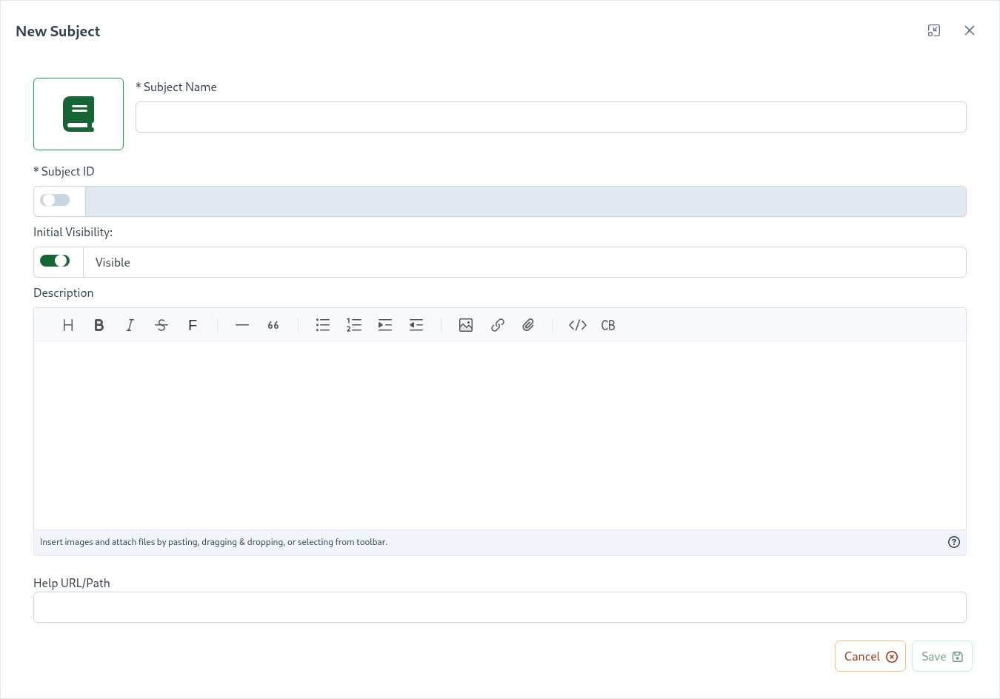

# Subjects

A Project is composed of Subjects which are made of Skills and a single skill defines a training unit within the gamification framework. 
Subjects are a way to group and organize skill definitions within a gameified training profile. 

Subjects offer the following features: 

- [Skills](/dashboard/user-guide/skills.html) - create and manage Skill definitions.
- [Levels Model](/dashboard/user-guide/levels.html) - Subject specific level model definition so users are awarded subject level achievements.
- [Icons](/dashboard/user-guide/icons.html) - assign subject specific icon based on fontawesome or material icon sets or use a custom icon. 
- Stats - Subject specific charts and graph and user stats. 
 
To create a Subject navigate to ``Project -> Subjects`` and then click the ``Subject +`` button.

| Property                                                                              | Explanation                                                                                                                                                                                                                                                                                                                                                                       | 
|:--------------------------------------------------------------------------------------|:----------------------------------------------------------------------------------------------------------------------------------------------------------------------------------------------------------------------------------------------------------------------------------------------------------------------------------------------------------------------------------| 
| Subject Name                                                                          | Display name of the subject                                                                                                                                                                                                                                                                                                                                                       |
| Subject ID                                                                            | The subject ID                                                                                                                                                                                                                                                                                                                                                                    |
| [Initial Visibility](/dashboard/user-guide/subjects.html#subject-creation-lifecycle)  | If the subject is initially visible or hidden. Hidden subjects and all of its skills will not be visible to trainees effectively keeping the subject in a draft mode until it is ready to be exposed.                                                                                                                                                                             |
| [Description](/dashboard/user-guide/rich-text-editor.html)                            | *(Optional)* Description, can be used to describe the topic of the subject. You can also author external links into the description itself if more than one external resource needs to be linked to.                                                                                                                                                                              |
| Help URL/Path                                                                         | *(Optional)* URL pointing to a help article further documenting information about this subject. Please note that this property works in conjunction with the [Root Help Url](/dashboard/user-guide/projects.html#setting-root-help-url) project setting. You can also author external links into the description itself if more than one external resource needs to be linked to. |

::: tip
To navigate to a specific skill you can drill down into a subject card or use the ``Search and Navigate directly to a skill`` component
:::

## Subject Creation Lifecycle <since project="skills-service" version="3.6" />

Subjects can be created with their Initial Visibility set to ``Hidden``. When hidden, both the subject and its skills
remain invisible to trainees until the ``Initial Visibility`` is switched to ``Visible``. This feature allows you to
keep subjects in draft mode until they are ready for trainee access.

::: tip
Once a subject becomes visible, it cannot be hidden again. The `Initial Visibility` control will be removed from the
interface.
:::

Hidden subjects have specific constraints on their skills, skills under a hidden subject **cannot**:
- Be added to the Skills Catalog
- Be added to a badge
- Be added to a Learning Path
- Be reused within the project

Skills under a hidden subject **can be**:

- Moved to another subject or group
- Copied within a project or to another project

::: tip
Visible skills cannot be added or moved to a hidden subject
:::

## Best practices   
- Do your best to create subjects in multiples of 3. On a larger screen, the [Skills Display](/skills-client/#skills-display) renders up-to 3 subjects per row so 3, 6, 9, 12, etc., will look the best.
- Use the same icon style/set for all subjects. We support font awesome, material and custom [icons](/dashboard/user-guide/icons.html) 
- Strive for each subject to have a similar number of points. The ``Project -> Subjects`` page shows subject cards and each card exposes the ``Points %`` which reflects the subject's percentage of the total available Project points. 
