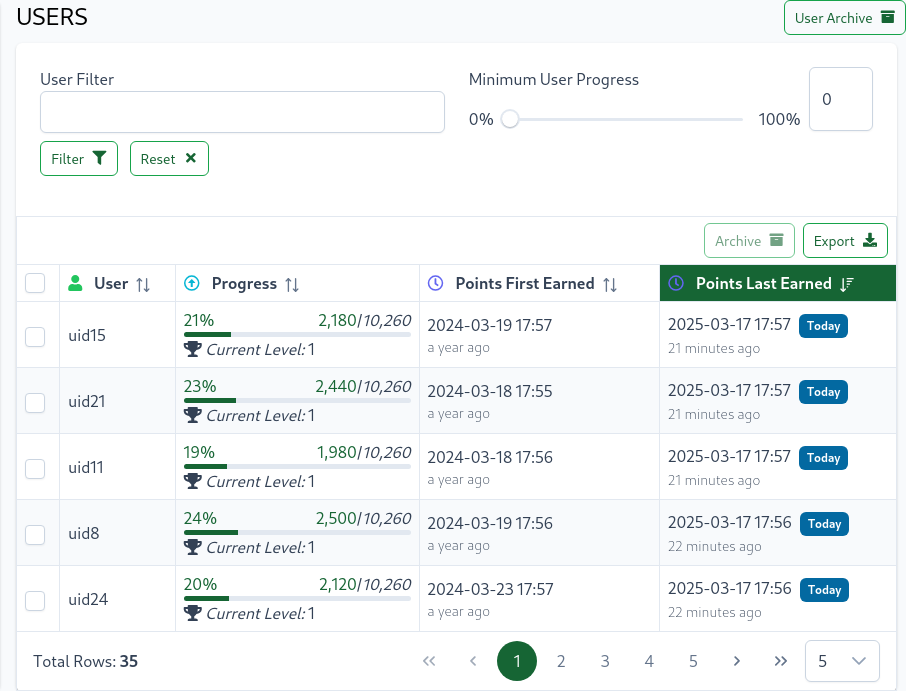
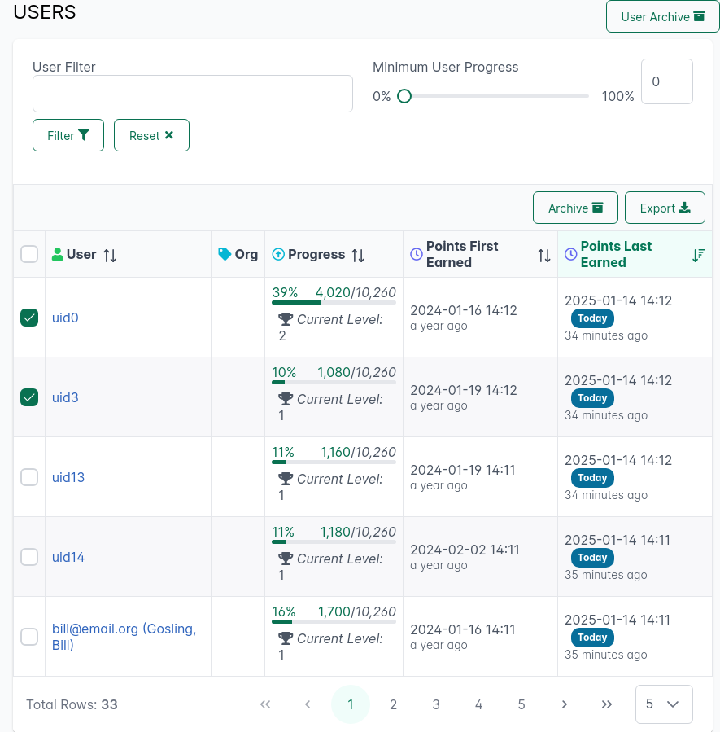
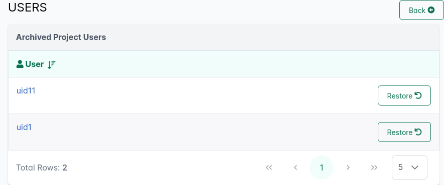
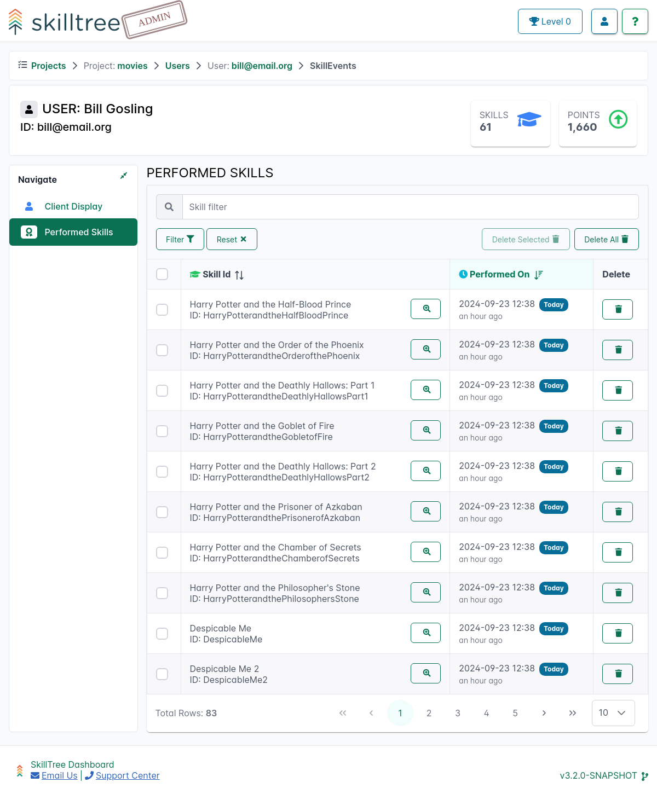
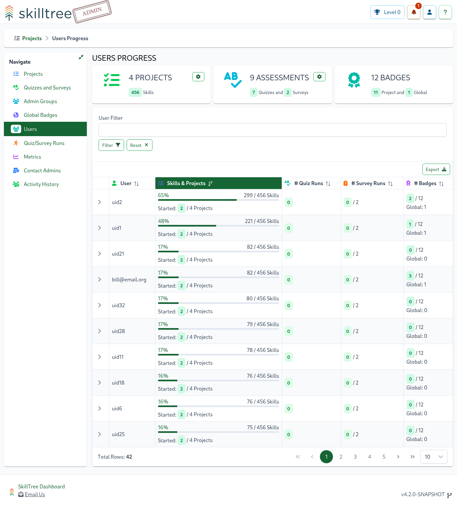
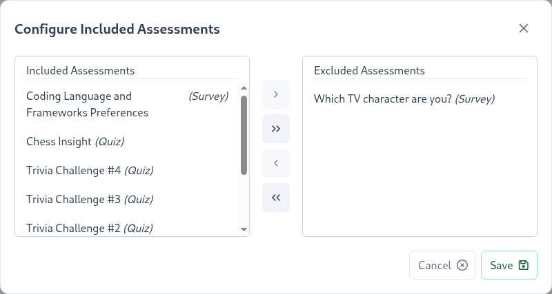

# Users

This section describes different types of dashboard users and their corresponding roles and permissions. 
It will also touch on access management, and a way to view the Skill Display through your users' eyes.  

## Project's Users

### User Progress Table

Easily track user progress in a specific project by visiting the User Progress Table, accessible via the 
`Project -> Users` Page. This table provides a comprehensive overview of user performance, including:

- User: Display user ID, first name, and last name (if available)
- Progress: View total points earned, overall percent complete, and current level achieved
- Recent Activity: See the date and time when points were last earned by each user

::: tip
Please note that a user has to earn at least 1 point in order to show up in on the Users table.
:::

#### Filters, Sorting And Export
The User Progress Table offers filtering, sorting, and export capabilities to help you analyze user performance. You can:

- Filter by user ID, first name, and last name using the User Filter
- Filter by minimum and maximum user progress percentage using the User Progress filter
- Sort any column by clicking its header
- Export table data to Excel by clicking the Export button in the top right

::: tip
Note that the export will respect any currently applied filters.
:::

### Users Archive 

Users can be archived and restored in batches or individually. Archived users are excluded from project visualizations, metrics, and tables.

To archive a user, follow these steps:

- Navigate to the Users page under a project.
- Select one or more users in the users table.
- Click the Archive button.

The archive can be viewed by clicking the `User Archive` button, located on the top-right, above the users table's components.

To restore an archived user, simply click the `Restore` button for that user.

### Performed Skills

To see a history of a user's performed skill events please visit ``Project -> Users -> Select a User -> Performed Skills``.

Project administrators have the ability to remove individual, selected or all skill events.

* *To delete a single skill event:* click the delete button on the specific skill event row
* <em>To delete **ALL** skill events</em>: click the `Delete All` button on the top right of the table.
* To delete multiple skill events, select them and click the `Delete Selected` button

::: tip
If you remove **all** of the skill events then it will practically remove this user from this project
:::

### Individual User Skills Display

You can see what the skills profile and progress display would look like for a particular user by navigating to a specific user page in the dashboard - ``Project -> Users -> Select a User -> User's Display``.
This will allow you to see the project from the trainee's point of view. These displays depict the project skills profile and user's points at that exact moment.

::: tip
We suggest visiting the [Skills Display](/skills-client/#skills-display) view often while building a skill profile to better understand how your users will view the gamification profile and their progress.
Optionally you can also [Add Events Manually](/dashboard/user-guide/skills.html#manually-add-skill-event) to better understand the client display.
:::

If your gamification profile is utilizing [Skills Versioning](/dashboard/user-guide/skills.html#skills-versioning) then you can view
what the [Skills Display](/skills-client/#skills-display) would look like for a specific version by selecting a different version in the drop-down located on the top-right of the page.

::: tip
Project administrators can now easily export transcripts for users who have made progress in the project, providing a convenient way to manage training records. To download a user's transcript, follow these steps:

- Navigate to Project > Users
- Select the desired user (User's Display page)
- Click the `Download Transcript` button at the bottom of the page

This feature offers greater flexibility and convenience for managing training records, making it easier for project
administrators to track user progress and stay organized.
:::

## Overall Progress

The Overall Progress page provides a comprehensive overview of user performance across all projects, quizzes, and surveys that you administer.

To access the Overall Progress page, navigate to ``Projects -> Users``.

At the top of the page, you will find metrics about the Projects, Quizzes, Surveys, and Badges that you are currently an administrator for.

This is followed by a table of users and their overall progress. Each row in the table represents a user and their overall progress across all projects, quizzes, and surveys.

The table can be sorted by all columns. Each row can be expanded to view the details about that user's progress. The expanded row will show each project that the user made progress in, followed by all of the user's quiz and survey runs.

::: tip
You can also export raw table data to an Excel file by clicking the `Export` button at the top of the table.
:::

### Configuring Included Projects and Quizzes

There are times where you may have a number of projects, quizzes, and surveys that you do not want to include in the overall
progress page, metrics, and quizzes pages.

There is a very easy way to include or exclude projects and quizzes from your view. Please note the configuration
buttons within the projects and assessment information cards at the top of the page.

Clicking on the settings button will open a modal where you can select the projects and quizzes that you want to include
in the overall progress page, metrics, and quizzes pages.

For example, for quizzes and surveys:

Select one or more items to exclude or include, then use the controls in the middle to move the items between inclusion and exclusion lists.

::: tip Tips
- Please note that these inclusion/exclusion settings are user-specific and will only apply to you.
- Please note that these settings apply to multiple pages, including the Global Metrics, Overall Users Progress and Global Quiz and Survey Runs.
:::

## User Roles

### Default User

All SkillTree Dashboard users are assigned a default user role, which provides the following permissions:

- Take self-paced training hosted in the SkillTree Dashboard
- Access [Progress & Ranking](/dashboard/user-guide/progress-and-ranking.html) pages, Project Catalog, and personal Preferences pages
- Create new [Projects](/dashboard/user-guide/projects.html) (training profiles)

Furthermore, when a user creates a new project, they are automatically granted the [Project Admin](/dashboard/user-guide/users.html#project-admin) role for that project. This role
allows them to manage project access via the [Access page](/dashboard/user-guide/projects.html#access), providing control over who can view and interact with the
project.

### Project Admin
Project Administrator's can modify all
aspects of a Project, up to and including deleting a Project. The initial creator of a Project will automatically be assigned
as the Project Administrator, however, any number of Project Administrators may be assigned. A Project Administrator role is necessary to approve
self-reported Skill requests. Depending on the installation mode, a user may need to have a dashboard account before
being added as a Project Administrator.

Please visit [Project's Access Page](/dashboard/user-guide/projects.html#access) in order to learn how to add/remove project's roles.

### Project Approver

Project Approvers are assigned to a particular project.
The Project Approver role is allowed to approve and deny [Self Reporting](/dashboard/user-guide/self-reporting.html#approval-queue) approval requests while only getting a read-only view of the project. For example users with an Approval Role can only view but not edit subjects, skills and badges.

Please visit [Project's Access Page](/dashboard/user-guide/projects.html#access) in order to learn how to add/remove project's roles.

<conditional visibilityFlag="showDocsForRootRole">

### Root

The Root role is meant for administering the dashboard itself and not any specific project. Users with the Root role can view the Inception project.
Users with the Root role can also assign Root roles to other dashboard users.

Please visit the [Security Settings Section](/dashboard/user-guide/settings.html#security-settings) to learn how to assign this role.

</conditional>

