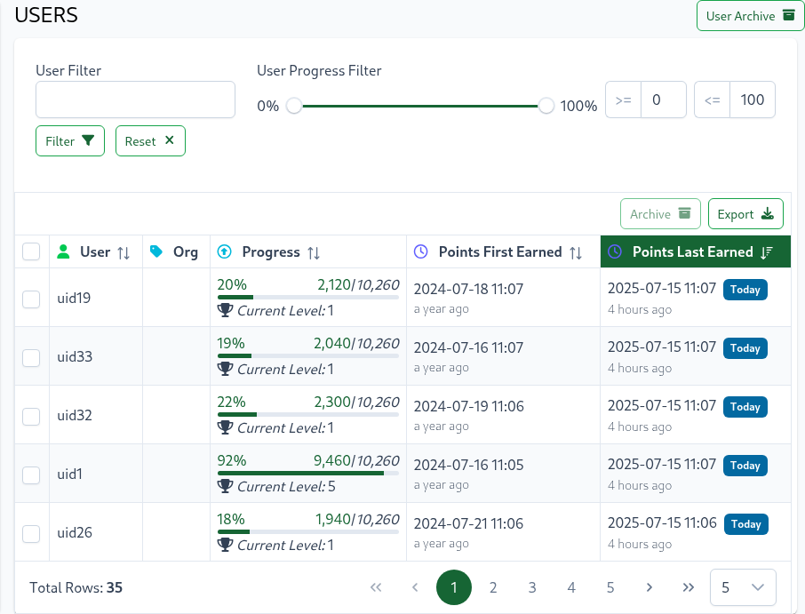
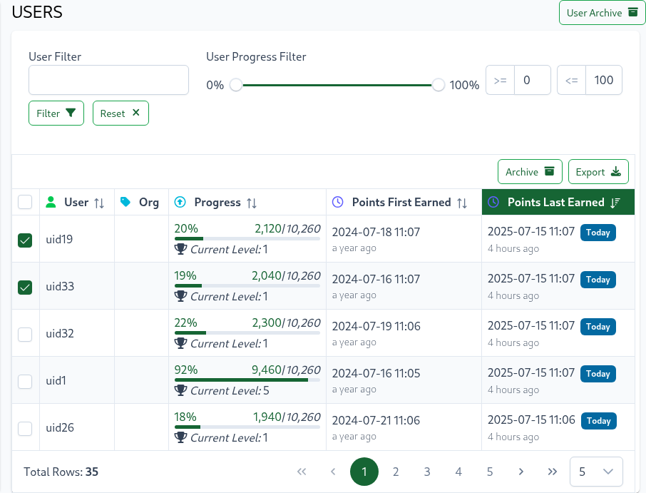
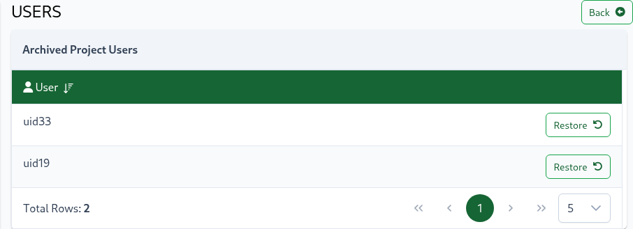
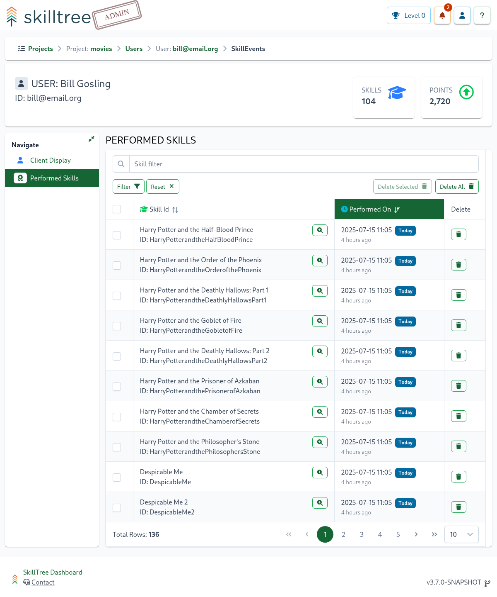

# Users

This section describes different types of dashboard users and their corresponding roles and permissions. 
It will also touch on access management, and a way to view the Skill Display through your users' eyes.  

## User Progress Table

Easily track user progress in a specific project by visiting the User Progress Table, accessible via the 
`Project -> Users` Page. This table provides a comprehensive overview of user performance, including:

- User: Display user ID, first name, and last name (if available)
- Progress: View total points earned, overall percent complete, and current level achieved
- Recent Activity: See the date and time when points were last earned by each user

::: tip
Please note that a user has to earn at least 1 point in order to show up in on the Users table.
:::

### Filters, Sorting And Export
The User Progress Table offers filtering, sorting, and export capabilities to help you analyze user performance. You can:

- Filter by user ID, first name, and last name using the User Filter
- Filter by minimum and maximum user progress percentage using the User Progress filter
- Sort any column by clicking its header
- Export table data to Excel by clicking the Export button in the top right

::: tip
Note that the export will respect any currently applied filters.
:::

## Users Archive 

Users can be archived and restored in batches or individually. Archived users are excluded from project visualizations, metrics, and tables.

To archive a user, follow these steps:

- Navigate to the Users page under a project.
- Select one or more users in the users table.
- Click the Archive button.

The archive can be viewed by clicking the `User Archive` button, located on the top-right, above the users table's components.

To restore an archived user, simply click the `Restore` button for that user.

## User Roles

### Default User

All SkillTree Dashboard users are assigned a default user role, which provides the following permissions:

- Take self-paced training hosted in the SkillTree Dashboard
- Access [Progress & Ranking](/dashboard/user-guide/progress-and-ranking.html) pages, Project Catalog, and personal Preferences pages
- Create new [Projects](/dashboard/user-guide/projects.html) (training profiles)

Furthermore, when a user creates a new project, they are automatically granted the [Project Admin](/dashboard/user-guide/users.html#project-admin) role for that project. This role
allows them to manage project access via the [Access page](/dashboard/user-guide/projects.html#access), providing control over who can view and interact with the
project.

### Project Admin
Project Administrator's can modify all
aspects of a Project, up to and including deleting a Project. The initial creator of a Project will automatically be assigned
as the Project Administrator, however, any number of Project Administrators may be assigned. A Project Administrator role is necessary to approve
self-reported Skill requests. Depending on the installation mode, a user may need to have a dashboard account before
being added as a Project Administrator.

Please visit [Project's Access Page](/dashboard/user-guide/projects.html#access) in order to learn how to add/remove project's roles.

### Project Approver

Project Approvers are assigned to a particular project.
The Project Approver role is allowed to approve and deny [Self Reporting](/dashboard/user-guide/self-reporting.html#approval-queue) approval requests while only getting a read-only view of the project. For example users with an Approval Role can only view but not edit subjects, skills and badges.

Please visit [Project's Access Page](/dashboard/user-guide/projects.html#access) in order to learn how to add/remove project's roles.

### Root
The Root role is meant for administering the dashboard itself and not any specific project. Users with the Root role can view the Inception project. 
Users with the Root role can also assign Supervisor and Root roles to other dashboard users. 

Please visit the [Security Setting Section](/dashboard/user-guide/settings.html#security-settings) to learn how to assign this role.

### Supervisor
The Supervisor role allows users to manage Global Badges. Only users with the Root role can assign the Supervisor role.     

Please visit the [Security Setting Section](/dashboard/user-guide/settings.html#security-settings) to learn how to assign this role.

## Skills Display / Client Display

You can see what the skills profile and progress display would like for a particular user by navigating to a specific user page in the dashboard - ``Project -> Users -> Select a User -> User's Display``. 
This is the same exact pluggable [Skills Display](/skills-client/#skills-display) that you would be embedding into your application so it can provide the ability to view the [Skills Display](/skills-client/#skills-display) through that user's point of view.  
The client display will depict the project skills profile and user's points at that exact moment. 

::: tip 
We suggest visiting the [Skills Display](/skills-client/#skills-display) view often while building a skill profile to better understand how your users will view the gamification profile and their progress. 
Optionally you can also [Add Events Manually](/dashboard/user-guide/skills.html#manually-add-skill-event) to better understand the client display.  
::: 

If your gamification profile is utilizing [Skills Versioning](/dashboard/user-guide/skills.html#skills-versioning) then you can view 
what the [Skills Display](/skills-client/#skills-display) would look like for a specific version by selecting a different version in the drop-down located on the top-right of the page. 

::: tip
Project administrators can now easily export transcripts for users who have made progress in the project, providing a convenient way to manage training records. To download a user's transcript, follow these steps:

- Navigate to Project > Users
- Select the desired user (User's Display page)
- Click the `Download Transcript` button at the bottom of the page

This feature offers greater flexibility and convenience for managing training records, making it easier for project
administrators to track user progress and stay organized.
:::

## Performed Skills

To see a history of a user's performed skill events please visit ``Project -> Users -> Select a User -> Performed Skills``. 

Project administrators have the ability to remove individual, selected or all skill events.

* *To delete a single skill event:* click the delete button on the specific skill event row
* <em>To delete **ALL** skill events</em>: click the `Delete All` button on the top right of the table.
* To delete multiple skill events, select them and click the `Delete Selected` button

::: tip
If you remove **all** of the skill events then it will practically remove this user from this project
:::
