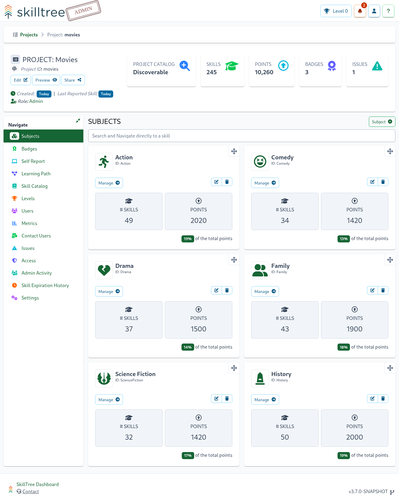
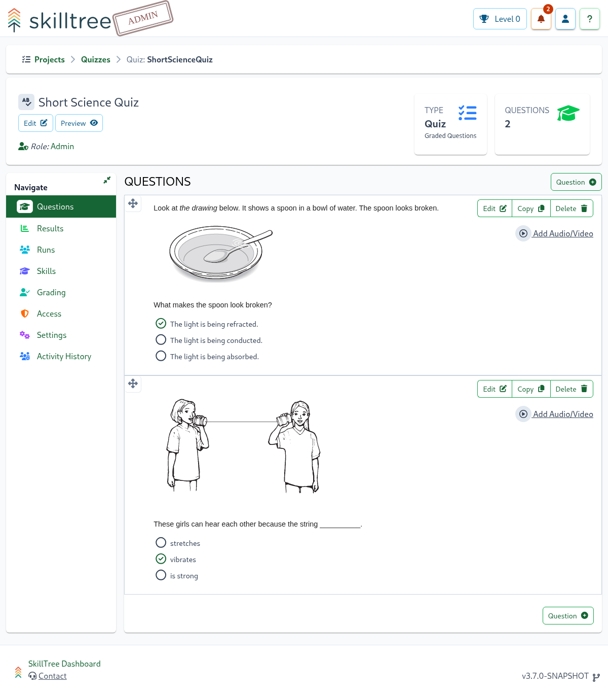
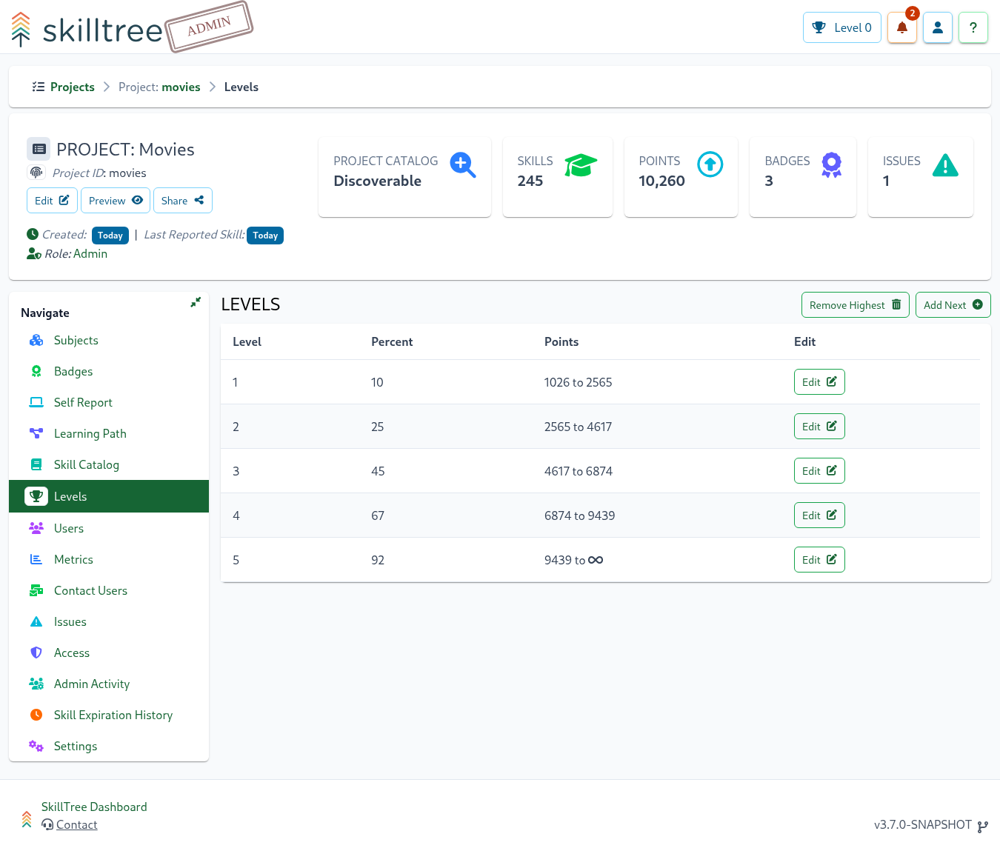
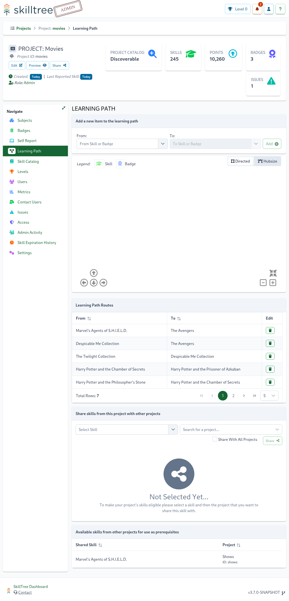
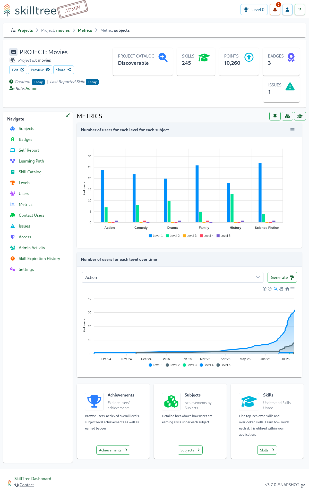
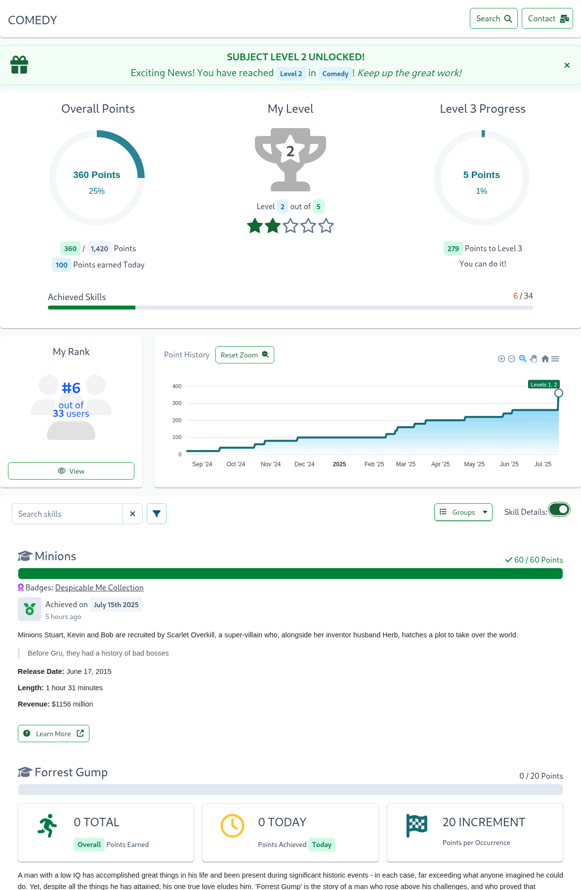
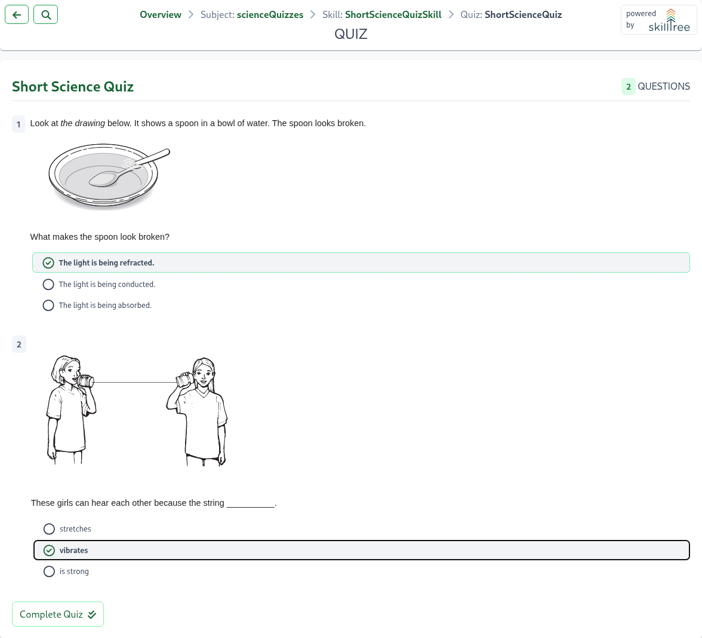

# Overview

SkillTree is a micro-learning gamification platform that supports multiple training and integration options which
enables organizations to use SkillTree as an `All in one training platform.` It is an innovative approach to implementing self-directed gamified training that can be

- all driven from SkillTree's dashboard in a Learning Management System (LMS) fashion, **AND/OR**
- added to an **existing/new web-based application** by directly embedding SkillTree's Skills Display using its client libraries!

::: tip Fun Fact
We here at SkillTree believe that a Gamification based training significantly simplifies the training process while making the process more enjoyable for the user community.
:::

Gamification training empower users to master features in a fun a way.
- A Gamification based strategy sets up friendly competition which provides strong motivation to continue learning; the motivation comes from points being awarded to users for performing desired actions within an application; other examples of motivators are the ability to achieve the next level or earn a badge while competing against your peers.
- Applications that implement Gamificaton for training see their users start using a wider range of available features in a more sophisticated fashion.
- This strategy encourages continued user engagement. Local Experts lead to a reduction in support costs by reducing the need for formal training sessions.

All of that is great, but adding gamification training to an application is extremely expensive and quite time consuming. :drum: roll... here comes the SkillTree Micro-Learning Gamification Platform!!

SkillTree Platform enables trainers, system owners and developers to:
- Implement gamification training with minimal time and effort (we are talking days!)
- It provides consistent and innovative solution and it takes the guesswork and maintenance out of implementing gamified user training.
- SkillTree is Free and Open Source and is released under [Apache 2 License](/overview/#license)

::: tip Check it out!
Want to know what SkillTree Looks like? Take a look at the [Screenshots](/overview/#screenshots) section.
:::

## What is it?

At the heart of the platform is the SkillTree Dashboard that acts as a Learning Management System (LMS) and enables 
to directly embedding SkillTree's Skills Display into one more existing/new web applications.
SkillTree Platform supports both of these use-cases under a single installation of a SkillTree Dashboard - 
an organization can author multiple training profiles where some of these trainings are taken directly in the SkillTree's 
Dashboard and some are embedded into home-grown applications and taken/followed within those applications. 


A *single* installation of the SkillTree Dashboard supports both use-cases where multiple training profiles are created
and updated using a web-based user-friendly interface: 
- Learning Management System (LMS) using SkillTree
  - Create and manage multiple gamified training profile using the SkillTree Dashboard
  - Trainees utilize SkillTree's Progress & Ranking displays to consume the training by completing skills, gaining points, achieving badges, passing quizzes, completing surveys and much, much more...
- Directly embedding SkillTree's Skills Display into one or more existing/new web applications
  - Using the SkillTree Dashboard, integrators create and manage a gamified training profile.
  - Then the JS display libraries are integrated into your existing web-based application which provides your users a fully interactive user ranking and progress display.
  - The last step is to instrument your web-based application to report learning events to the SkillTree centralized service - the provided JS libraries make this process very simple.

::: tip All in one training platform
With SkillTree's centralized platform you don't have to compromise by utilizing just one strategy.
An organization can easily run a single SkillTree platform instance that supports many training profiles where some
will fall under the Learning Management System (LMS) training and others are embededed into home-grown applications and
natively consumed within those applications.  
:::

Want to know what these User Interfaces look like? Take a look at the [Screenshots](/overview/#screenshots) section. 

To learn about the SkillTree Dashboard please visit the [Dashboard User Guide](/dashboard/user-guide/) and to learn about
SkillTree's client libraries that enable rapid training integration into your own web application please visit
the [Integration Guide](/skills-client/) 

## Features

SkillTree Platform enables a number of gamified features when building out a training profile but here is a quick sample
to give you a taste: 

- **Ability to create 100s of training profiles** - a training profile is called a Project
- **Level up!** - users progress and earn levels in a Project
- **Arrange skills under Subjects** - a way to group and organize skill definitions within a gameified training profile.
- **Badges** - further reward your users by providing these prestigious symbols
- **Self Reporting** - users can self report completion with mutliple handling strategies including Approval Queues and an Honor System
- **Skills Catalog** - skills can be exported to the Catalog which makes those skills available for re-use in other projects
- **Knowledge Checks** - requires successful passage of a quiz in order to earn the skill and its points
- **Surveys** - method to get feedback about that skill or collect some pieces of important data related to the skill
- **Learning Path** - lay out a learning path for users to complete skills in a specified order
- **Metrics** - corporate visibility of expertise and knowledge gaps

We hope this sparked your interest so please visit [Dashboard User Guide](/dashboard/user-guide/) to learn more. 

## Native Integration

Although there are a number of other Learning Management Systems, few (if any) offer
the ability to integrate a gamified training into an existing/new web-application.

To facilitate rapid application incorporation, the platform provides the following services, components, and libraries:
- **Display Libraries:** Pluggable and fully interactive user skill and ranking visualization
    - Customize and use the display component in your application within minutes.
    - Out-of-the-box support for Vue.js, React, Angular and pure JavaScript
- **Skill Event Reporting Libraries:** Easily integrate your application by reporting skill events to the centralized service.
    - Out-of-the-box support for Vue.js, React, Angular and pure JavaScript

::: tip Skills Display  
Please note that SkillTree has taken an innovative approach by providing a pluggable and fully interactive user progress and ranking visualization (named Skills Display)
and therefore does **not** support a public API to build your own progress and ranking displays.
:::

This approach delivers a number of benefits to a SkillTree integrator:
- Resources and cost savings because there is no need for you to implement, test and maintain your own gamified progress and ranking views
- Ability to rapidly integrate SkillTree into an existing web application
- SkillTree continuously improves the ranking/progress views and adds new features to these display. Integrators can take advantage of these improvements by simply upgrading.

Please visit the [Integration Guide](/skills-client/) to learn more.

### Integration Benefits

Gamification is a proven training strategy, using the SkillTree platform yields numerous benefits: 

**For Your Application Users:**
1. Fun way to master application features
1. Friendly competition provides motivation to continue learning
1. Clear path to locate new features and explore previously unused features 

**For System Owners:**
1. Implement in existing and new applications with minimal time and effort
1. Greater system engagement and a strategy to grow your user base
1. Significant reduction in training costs
1. Additional facet of application usage visibility (ex. identify expert users)

**For Upper Management:**
1. Corporate visibility of application expertise
1. Greater insight via sophisticated analytics
1. Proven training strategy

## On GitHub

SkillTree Platfrom is Open Source and can be found on <external-url label="GitHub" url="https://github.com/" />: 

- <external-url label="skills-service" url="https://github.com/NationalSecurityAgency/skills-service" />: SkillTree Centralized Service that implements Dashboard UI and SkillTree APIs
- <external-url label="skills-client" url="https://github.com/NationalSecurityAgency/skills-client" />: Client JS libraries which allow rapid SkillTree integration. 
- <external-url label="skills-docs" url="https://github.com/NationalSecurityAgency/skills-docs" />: Documentation, you are reading this now!
- <external-url label="skills-stress-test" url="https://github.com/NationalSecurityAgency/skills-stress-test" />: Web-based application that facilitates stress tests against the SkillTree service.
- <external-url label="call-stack-profiler" url="https://github.com/NationalSecurityAgency/call-stack-profiler" />: Groovy annotation-driven in-code profiling utility used by the services.
- <external-url label="skills-client-examples" url="https://github.com/NationalSecurityAgency/skills-client-examples" />: Simple Integration examples using client libraries. 

Please support SkillTree by adding a :star: to the <external-url label="skills-service" url="https://github.com/NationalSecurityAgency/skills-service"/> and <external-url label="skills-client" url="https://github.com/NationalSecurityAgency/skills-client" /> projects on GitHub. 

<conditional visibilityFlag="showContributionGuide" :visibility-value="true">

Please visit [Contribution Guide](/contribution/#contribution-guidelines) if you are interested to contribute to the SkillTree platform.

</conditional>

## Accessibility
SkillTree is committed to ensuring that Accessibility concerns are addressed. To that end we employ both manual and automated Accessibility testing. 
Automated accessibility testing occurs for every commit, assessing the Dashboard and client-display.

In the event that any of the libraries we depend on for User Interface components fail to meet accessibility standards, we evaluate whether accessibility
fixes are on the near-term development roadmap for those plugins or replace them with equivalents that address accessibility concerns.

## License

SkillTree platform is released under Apache 2 license.  

```
Licensed under the Apache License, Version 2.0 (the "License");
you may not use this file except in compliance with the License.
You may obtain a copy of the License at

    https://www.apache.org/licenses/LICENSE-2.0

Unless required by applicable law or agreed to in writing, software
distributed under the License is distributed on an "AS IS" BASIS,
WITHOUT WARRANTIES OR CONDITIONS OF ANY KIND, either express or implied.
See the License for the specific language governing permissions and
limitations under the License.
``` 

## Screenshots
Below are the screenshots that highlight some of the features of the SkillTree platform. 
These screenshots are broken down into 2 sections:
- [Dashboard](/overview/#screenshots): a web-based user-friendly interface that allows to create and manage gamified training profile.
- [Skills Display](/overview/#ranking-and-progress-display): JS libraries that are integrated into your existing web-based application which provide your users a fully interactive user ranking and progress display.

### Dashboard
The Dashboard provides the capability to create and administer Projects, Subjects, and Skills, as well as the ability to view
a user's progress for any projects. 

A Project is composed of Subjects which are made of Skills and a single skill defines a training unit within the
gamification framework. Subjects are a way to group and organize skill definitions within a gameified training profile.
Screenshots below demonstrates the dashboard's page to create and manage subjects: 


Projects are composed of Subjects which are made of Skills and a single skill defines a training unit within the
gamification framework. To complete a skill, users may need to perform the same action multiple times - repetition is
important for retention after all. A Skill definition specifies how many times a skill has to be performed. Each
occurrence is called a Skill Event.
Screenshots below demonstrates dashboard's management of skill's attribues:


Badges add another facet to the overall gamification profile and allows you to further reward your users by providing
these prestigious symbols. Badges are a collection of skills and when all of the skills are accomplished that badge is
earned.
Screenshots below demonstrates dashboard's page to create and manage badges:


A quiz is a knowledge check composed of multiple questions with a passing requirement. Quizzes can be associated to a
skill or can be executed independently. Associating a Quiz to an existing skill will require successful completion of
that Quiz in order to earn the skill and its points. The screenshot below shows the management of a quiz in the dashboard:


Levels are users' achievement path - the overall goal of the gameified training profile is to encourage users to achieve
the highest level. Levels are tracked for the entire project as well as for each subject which provides users many ways
to progress forward.
Screenshots below demonstrate the management of levels in the dashboard:


Learning Path feature adds another facet to the overall gamification profile, which forces users to complete skills in a
specified order. Project administrators can configure learning path using project's Badges or Skills. For example, if
you set up a simple Learnign Path of Skill A -> Skill B then Skill A will serve as a prerequisite to Skill B and no
points will be awarded toward Skill B until Skill A is fully accomplished.

Screenshot below demonstrates visualization and management of project's learning path:


Almost every page in the SkillTree dashboard exposes metrics and statistics about that particular entity/concept. These
metrics are very much context aware so as an example, graphs and charts you see on a subject page will be for that
specific subject and metrics on the project page will be for the entire project.


----
----



----
----


----
----


### Skills Display

SkillTree JS display libraries are integrated into your existing web-based application which provide your users a fully
interactive user ranking and progress display. The screenshots below highlight some of the features of this display. 

This is a landing page for the display components that shows user's progress and ranking:


------------------------
------------------------

SkillTree integrated displays can be themed. For example, you can easily style it to look something like this:


------------------------
------------------------

User's rank overview: 


------------------------
------------------------
User's progress within a subject, list of all of the skills that fall under that subject where
green indicates completion and blue progress:


------------------------
------------------------
Same display as before but with expanded Skill Details:


------------------------
------------------------
A quiz is a knowledge check composed of multiple questions with a passing requirement. Quizzes can be associated to a
skill. Associating a Quiz to an existing skill will require successful completion of
that Quiz in order to earn the skill and its points. The screenshot below shows user taking a simple 2-question quiz:


------------------------
------------------------
Single skill with prerequisites:


<script>

</script>
