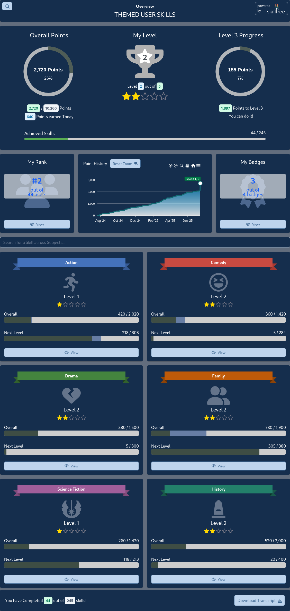
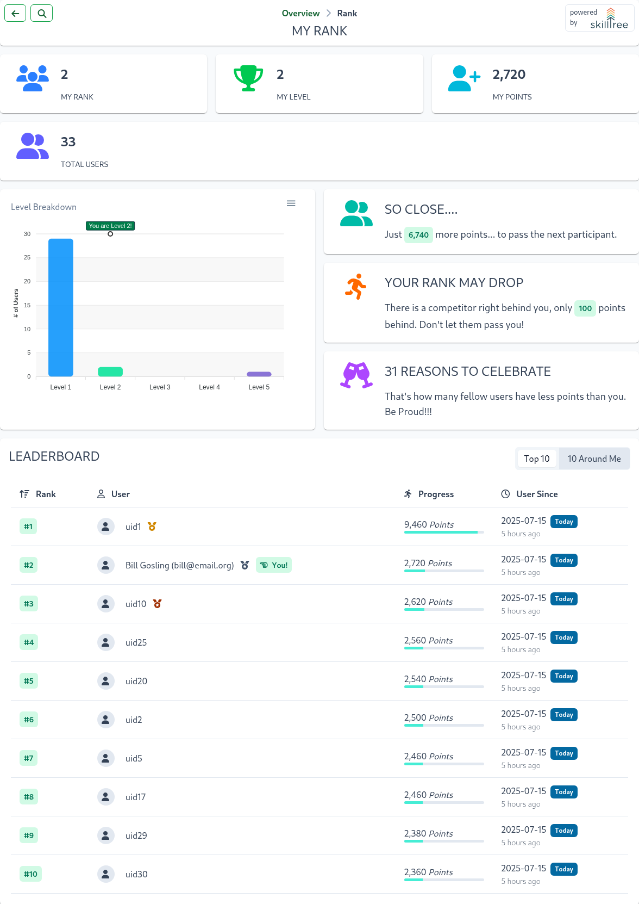
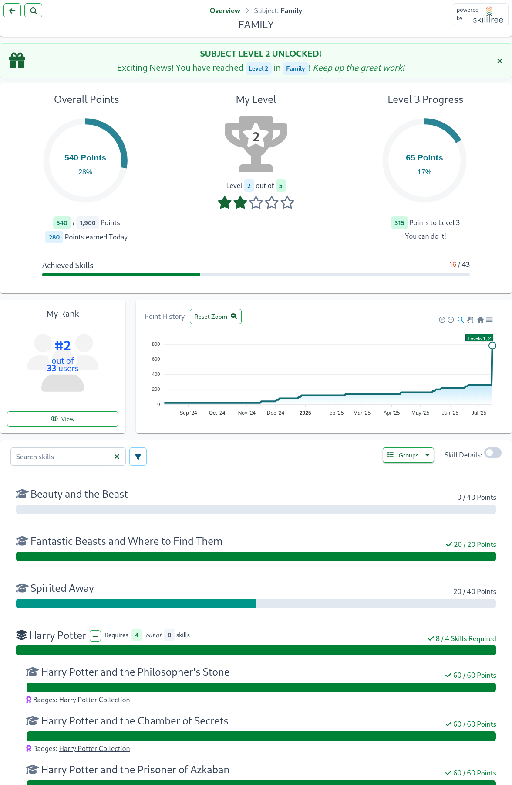
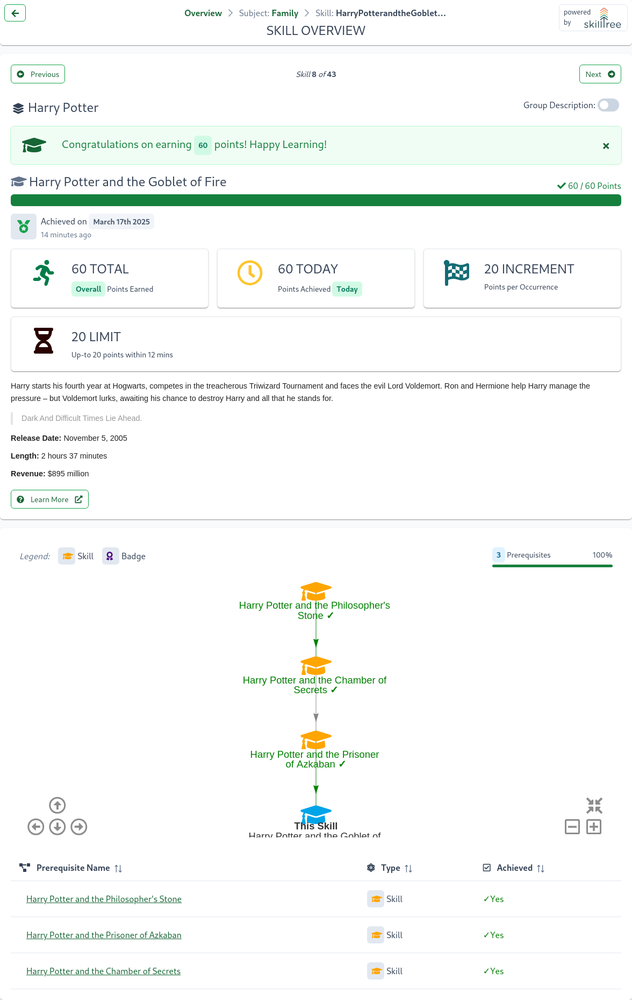

# Overview

SkillTree is a micro-learning gamification platform. 
It is an innovative approach to adding *self-directed* gamified training to **an existing web-based application** (or a new application if you are building one now)!

::: tip Fun Fact
We here at SkillTree believe that a Gamification based training significantly simplifies the training process while making the process more enjoyable for the user community.
:::

Gamification training empower users to master features in a fun a way.
- A Gamification based strategy sets up friendly competition which provides strong motivation to continue learning; the motivation comes from points being awarded to users for performing desired actions within an application; other examples of motivators are the ability to achieve the next level or earn a badge while competing against your peers.
- Applications that implement Gamificaton for training see their users start using a wider range of available features in a more sophisticated fashion.
- This strategy encourages continued user engagement. Local Experts lead to a reduction in support costs by reducing the need for formal training sessions.

All of that is great, but adding gamification training to an application is extremely expensive and quite time consuming. :drum: roll... here comes the SkillTree Micro-Learning Gamification Platform!!

SkillTree Platform enables system owners and developers to:
- Implement gamification training with minimal time and effort (we are talking days!)
- It provides consistent and innovative solution and it takes the guesswork and maintenance out of implementing gamified user training.
- SkillTree is Free and Open Source and is released under [Apache 2 License](/overview/#license)

::: tip Check it out!
Want to know what SkillTree Looks like? Take a look at the [Screenshots](/overview/#screenshots) section.
:::

## What is it?

The SkillTree platform consists of 2 major components: the dashboard and the JS client libraries.
Using the SkillTree Dashboard, a web-based user-friendly interface, integrators create and manage a gamified training profile.
Then the JS display libraries are integrated into your existing web-based application which provides your users a fully interactive user ranking and progress display.
The last step is to instrument your web-based application to report learning events to the SkillTree centralized service - the provided JS libraries make this process very simple.


Want to know what these User Interfaces look like? Take a look at the [Screenshots](/overview/#screenshots) section. 

::: tip
SkillTree offer very low barrier to entry for adding Gamified training to a web-based application
:::

To facilitate rapid application incorporation, the platform provides the following services, components, and libraries: 

- **Dashboard and Service:** Simple management through a centralized Web-Based User Interface and data API service. 
  - *Effective and visual skill definition management* - create and manage things like subjects, skills, levels, badges, and dependencies
  - *Comprehensive Visualization* - through sophisticated analytics, enables unmatched corporate visibility of application expertise; provides an additional facet of application usage visibility (ex. identifying expert users)
- **Display Libraries:** Pluggable and fully interactive user skill and ranking visualization
  - Customize and use the display component in your application within minutes. 
  - Out-of-the-box support for Vue.js, React, Angular and pure JavaScript
- **Skill Event Reporting Libraries:** Easily integrate your application by reporting skill events to the centralized service.
  - Out-of-the-box support for Vue.js, React, Angular and pure JavaScript


::: tip Skills Display  
Please note that SkillTree has taken an innovative approach by providing a pluggable and fully interactive user progress and ranking visualization (named Skills Display)
and therefore does **not** support a public API to build your own progress and ranking displays.
::: 

This approach delivers a number of benefits to a SkillTree integrator:
- Resources and cost savings because there is no need for you to implement, test and maintain your own gamified progress and ranking views
- Ability to rapidly integrate SkillTree into an existing web application
- SkillTree continuously improves the ranking/progress views and adds new features to these display. Integrators can take advantage of these improvements by simply upgrading.

## Who is it for?

Any application with numerous features could benefit from in-context training using this gamfication strategy. 

With that said, the SkillTree platform provides substantial benefits in these scenarios:

1. Application with many complex and sophisticated features. Training is time consuming, complicated and expensive. You can utilize SkillTree to:
   - Enable users to Quickly learn new features and effectively master advanced features. 
   - Improve training recall through continued user engagement and required repetition.  
   - Reduce training sessions - less support costs. Continued user engagement in application training promotes local experts.
1. Workforce utilizes multiple home-grown tools to accomplish their jobs. You can use SkillTree to:
   - Provide cross-application and cross-org training - strongly encourages user engagement to become domain and application experts.
   - [Cross-application dependencies](/dashboard/user-guide/dependencies.html#cross-project-dependencies) teach users cross-domain workflow skills
   - [Global Badges](/dashboard/user-guide/badges.html#global-badges) expand training across project boundaries     

## Benefits

Gamification is a proven training strategy, using the SkillTree platform yields numerous benefits: 

**For Your Application Users:**
1. Fun way to master application features
1. Friendly competition provides motivation to continue learning
1. Clear path to locate new features and explore previously unused features 

**For System Owners:**
1. Implement in existing and new applications with minimal time and effort
1. Greater system engagement and a strategy to grow your user base
1. Significant reduction in training costs
1. Additional facet of application usage visibility (ex. identify expert users)

**For Upper Management:**
1. Corporate visibility of application expertise
1. Greater insight via sophisticated analytics
1. Proven training strategy

## On GitHub

SkillTree Platfrom is Open Source and can be found on [GitHub](https://github.com/): 

- [skills-service](https://github.com/NationalSecurityAgency/skills-service): SkillTree Centralized Service that implements Dashboard UI and SkillTree APIs
- [skills-client](https://github.com/NationalSecurityAgency/skills-client): Client JS libraries which allow rapid SkillTree integration. 
- [skills-docs](https://github.com/NationalSecurityAgency/skills-docs): Documentation, you are reading this now!
- [skills-stress-test](https://github.com/NationalSecurityAgency/skills-stress-test): Web-based application that facilitates stress tests against the SkillTree service.
- [call-stack-profiler](https://github.com/NationalSecurityAgency/call-stack-profiler): Groovy annotation-driven in-code profiling utility used by the services.
- [skills-client-examples](https://github.com/NationalSecurityAgency/skills-client-examples): Simple Integration examples using client libraries. 

Please support SkillTree by adding a :star: [skills-service](https://github.com/NationalSecurityAgency/skills-service) and [skills-client](https://github.com/NationalSecurityAgency/skills-client) projects on GitHub. 

Please visit [Contribution Guide](/contribution/#contribution-guidelines) if you are interested to contribute to the SkillTree platform. 

## Accessibility
<accessibility-score/>
SkillTree is committed to ensuring that Accessibility concerns are addressed. To that end we employ both manual and automated Accessibility testing. Automated accessibility testing occurs for every commit, assessing the Dashboard and client-display, and the resulting [Lighthouse](https://developers.google.com/web/tools/lighthouse) accessibility score is published to the [SkillTree Skills-Service Github page](https://github.com/NationalSecurityAgency/skills-service).

In the event that any of the libraries we depend on for User Interface components fail to meet accessibility standards, we evaluate whether accessibility
fixes are on the near-term development roadmap for those plugins or replace them with equivalents that address accessibility concerns.

## Browser Support

SkillTree is supported on all major browsers since the following versions:

<browser-support />

## License

SkillTree platform is released under Apache 2 license.  

```
Licensed under the Apache License, Version 2.0 (the "License");
you may not use this file except in compliance with the License.
You may obtain a copy of the License at

    https://www.apache.org/licenses/LICENSE-2.0

Unless required by applicable law or agreed to in writing, software
distributed under the License is distributed on an "AS IS" BASIS,
WITHOUT WARRANTIES OR CONDITIONS OF ANY KIND, either express or implied.
See the License for the specific language governing permissions and
limitations under the License.
``` 

## Screenshots
Below are the screenshots that highlight some of the features of the SkillTree platform. 
These screenshots are broken down into 2 sections:
- [Dashboard](/overview/#screenshots): a web-based user-friendly interface that allows to create and manage gamified training profile.
- [Skills Display](/overview/#ranking-and-progress-display): JS libraries that are integrated into your existing web-based application which provide your users a fully interactive user ranking and progress display.

### Dashboard
The Dashboard provides the capability to create and administer Projects, Subjects, and Skills, as well as the ability to view
a user's progress for any projects. 

A Project is composed of Subjects which are made of Skills and a single skill defines a training unit within the
gamification framework. Subjects are a way to group and organize skill definitions within a gameified training profile.
Screenshots below demonstrates the dashboard's page to create and manage subjects: 


Projects are composed of Subjects which are made of Skills and a single skill defines a training unit within the
gamification framework. To complete a skill, users may need to perform the same action multiple times - repetition is
important for retention after all. A Skill definition specifies how many times a skill has to be performed. Each
occurrence is called a Skill Event.
Screenshots below demonstrates dashboard's management of skill's attribues:


Badges add another facet to the overall gamification profile and allows you to further reward your users by providing
these prestigious symbols. Badges are a collection of skills and when all of the skills are accomplished that badge is
earned.
Screenshots below demonstrates dashboard's page to create and manage badges:


Levels are users' achievement path - the overall goal of the gameified training profile is to encourage users to achieve
the highest level. Levels are tracked for the entire project as well as for each subject which provides users many ways
to progress forward.
Screenshots below demonstrate the management of levels in the dashboard:


Dependencies add another facet to the overall gamification profile and force users to complete skills in a specified
order. If you set up Skill A to depend on the completion of Skill B then no points will be awarded toward Skill A until
Skill B is fully accomplished.
The screenshot below demonstrates management of skill dependencies in the dashboard:


Screenshot below demonstrates visualization of all the skill dependencies within a project:


Almost every page in the SkillTree dashboard exposes metrics and statistics about that particular entity/concept. These
metrics are very much context aware so as an example, graphs and charts you see on a subject page will be for that
specific subject and metrics on the project page will be for the entire project.


----
----


----
----


----
----


### Skills Display

SkillTree JS display libraries are integrated into your existing web-based application which provide your users a fully
interactive user ranking and progress display. The screenshots below highlight some of the features of this display. 

This is a landing page for the display components that shows user's progress and ranking:


------------------------
------------------------

SkillTree integrated displays can be themed. For example, you can easily style it to look something like this:


------------------------
------------------------

User's rank overview: 


------------------------
------------------------
User's progress within a subject, list of all of the skills that fall under that subject where
green indicates completion and blue progress:


------------------------
------------------------
Same display as before but with expanded Skill Details:


------------------------
------------------------
Single skill with dependencies:


<script>
  import AccessibilityScore from "../.vuepress/components/AccessibilityScore";
  export default {
    components: { AccessibilityScore }
  }
</script>
