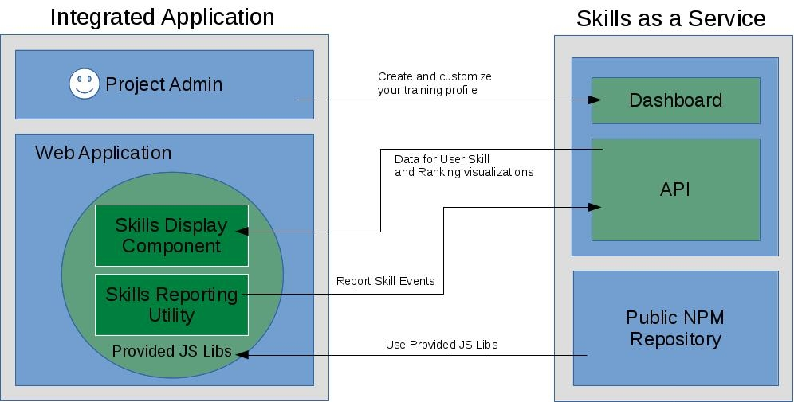

# Overview

Generally integration follows the proceeding steps:

1. Create and customize your training profile in the SkillTree dashboard
1. Integrate client [Skill Display](/skills-client/#client-display-integration) libraries
1. Integrate skill [event reporting](/skills-client/#report-events-integration) either using client libraries and/or REST endpoints

   
Please visit the [Dashboard Guide](/dashboard/user-guide/) to learn about the best practices and options for customizing your gamification training profile.
This Integration Guide focuses on step 2 and 3: integration of the Client Display and the reporting libraries. 

## Skills Display Integration 

We generally recommend the following integration pattern:

1. Put a button in the header that displays the user's level (ex. ``Level 1``)
   - We like placement on the top right but this really depends on your layout
1. Clicking on the button will take you to the page that renders the Skills Display
   - All client JS libraries support the Skills Display
   - Dedicate a full page to the Skills Display    
1. (Optional) Theme Skills Display to match your application   
1. (Optional) Display user progress summary on your home page or splash page
   - Pass ``true`` to skills display ``options.isSummaryOnly``

Skills Display support is provided for the following libraries: 
- [Vue.js](/skills-client/vuejs.html)
- [React](/skills-client/react.html)
- [Angular](/skills-client/angular.html)
- [Pure JS](/skills-client/js.html)

## Report Events Integration

Your can either use one of the supported libraries or utilize the endpoint directly:
- [Vue.js](/skills-client/vuejs.html)
- [React](/skills-client/react.html)
- [Angular](/skills-client/angular.html)
- [Pure JS](/skills-client/js.html)
- [REST Endpoints](/skills-client/endpoints.html#programmatic-endpoints)

## Browser Support

SkillTree is supported on all major browsers since the following versions:

<browser-support />
