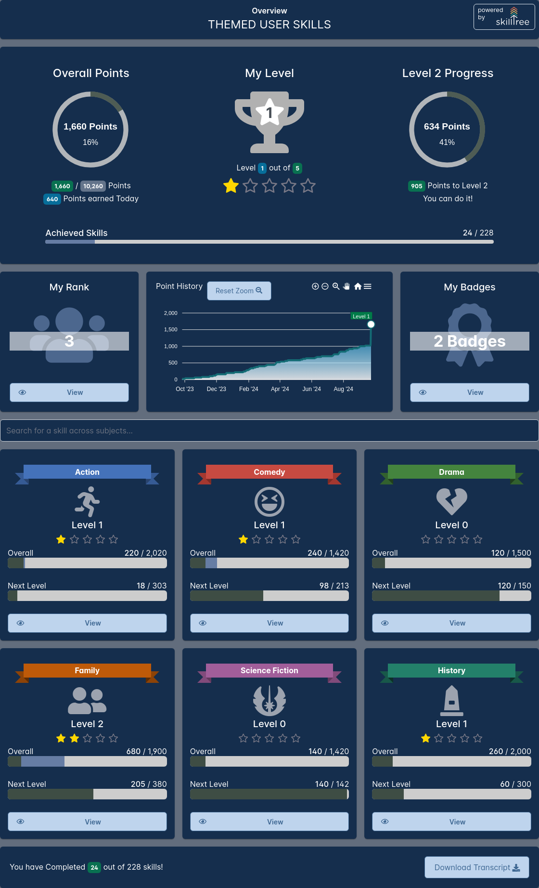

The theme object supports the customization of the color palette of the Skills Display to match your application. 
For example, you can easily style Skills Display to look something like this: 



The theme object supports the following properties:

| Prop          | Explanation  |
| ------------- | -----------  |
| backgroundColor | page background color |
| disableBreadcrumb <since project="skills-service" version="1.5.0" :is-block="true"/> | when set to ``true``, the breadcrumb bar in the title section will not be displayed.  default is ``false`` |
| breadcrumb.linkColor <since project="skills-service" version="1.5.0" :is-block="true"/> | breadcrumbs's parent/ancestor link color  |
| breadcrumb.linkHoverColor <since project="skills-service" version="1.5.0" :is-block="true"/> | breadcrumbs's parent/ancestor link hover color  |
| breadcrumb.currentPageColor <since project="skills-service" version="1.5.0" :is-block="true"/> | breadcrumbs's current page color  |
| breadcrumb.align <since project="skills-service" version="1.6.0" :is-block="true"/> | breadcrumbs's alignment for the title card; valid values are ``start``, ``center``, ``end`` (uses css [justify-content](https://developer.mozilla.org/en-US/docs/Web/CSS/justify-content)) |
| disableSkillTreeBrand <since project="skills-service" version="1.5.0" :is-block="true"/> | when set to ``true``, the SkillTree brand logo in the title section will not be displayed.  default is ``false`` |
| skillTreeBrandColor <since project="skills-service" version="1.6.0" :is-block="true"/> | text color for the SkillTree brand logo; if not supplied the default is ``pageTitle.textColor`` |  
| maxWidth  | maximum width of the component, can use any units supported by [max-width CSS property](https://developer.mozilla.org/en-US/docs/Web/CSS/max-width) such as ``%``, ``em`` and ``px`` (ex. ``100%``); default is ``1140px``  |
| landingPageTitle  | title of the landing page, default is ``User Skills`` |
| pageTitle.fontSize <since project="skills-service" version="1.6.0" :is-block="true"/> | font size for the title, can use any units supported by [font-size CSS property](https://developer.mozilla.org/en-US/docs/Web/CSS/font-size) such as ``%``, ``em`` and ``px`` (ex. ``1.2em``) |
| pageTitle.textColor <since project="skills-service" version="1.6.0" :is-block="true"/> | text color for the title  |
| pageTitle.borderColor <since project="skills-service" version="1.6.0" :is-block="true"/> | border color for the title card |
| pageTitle.borderStyle <since project="skills-service" version="1.6.0" :is-block="true"/> | border style for the title card, for example: ``borderStyle: 'none none solid none'`` |
| pageTitle.backgroundColor <since project="skills-service" version="1.6.0" :is-block="true"/> | background color for the title card |
| pageTitle.textAlign <since project="skills-service" version="1.6.0" :is-block="true"/> | title alignment, supported values are ``left``, ``right`` and ``center`` |
| pageTitle.padding <since project="skills-service" version="1.6.0" :is-block="true"/> | padding for the title card, for example: ``padding: '1.6rem 1rem 1.1rem 1rem'`` |  
| pageTitle.margin <since project="skills-service" version="1.6.0" :is-block="true"/> | margin for the title card, for example: ``margin: '-10px -15px 1.6rem -15px'`` |    
| circleProgressInteriorTextColor | 'x out of yyyy' text color inside circle progress widgets |
| progressIndicators.beforeTodayColor | progress bar color for points earned before today | 
| progressIndicators.earnedTodayColor | progress bar color for points earned today | 
| progressIndicators.completeColor | progress bar color for 100% completion | 
| progressIndicators.incompleteColor | progress bar color for points not yet earned  | 
| textSecondaryColor | secondary text, for example 'Need Help?' and dependent skill text | 
| textPrimaryColor | chart titles, progress titles, tile titles, descriptions, rank tile text | 
| stars.unearnedColor | color of unearned level stars | 
| stars.earnedColor | color of earned level stars | 
| charts.axisLabelColor | color of scales/axis text on charts | 
| tiles.backgroundColor | tile background color, such as subject tiles | 
| tiles.watermarkIconColor | My Rank, Rank overview, My Badges watermark icon color | 
| buttons.backgroundColor  | background for buttons | 
| buttons.foregroundColor  | foreground color for buttons including text and border |
| buttons.disabledColor  | disabled color for buttons including text and border |
| graphLegendBorderColor | border color of dependency graph legend | 
| subjectTileIconColor | color of subject tile icons |
| trophyIconColor | color of the My Level trophy |
| backButton.padding  | optionally customize back button's padding (only applicable if the ``internalBackButton`` is enabled via the ``options`` object) |
| backButton.fontSize  | optionally customize back button's icon size (only applicable if the ``internalBackButton`` is enabled via the ``options`` object) |
| backButton.lineHeight  | optionally customize back button's height (only applicable if the ``internalBackButton`` is enabled via the ``options`` object) | 

Example of a 'Dark Blue' theme object

``` json
    {
      maxWidth: '100%',
      backgroundColor: '#626d7d',
      landingPageTitle: 'Themed User Skills',
      pageTitle: {
        textColor: 'white',
        fontSize: '1.5rem',
      },
      textSecondaryColor: 'white',
      textPrimaryColor: 'white',
      stars: {
        unearnedColor: '#787886',
        earnedColor: 'gold',
      },
      progressIndicators: {
        beforeTodayColor: '#3e4d44',
        earnedTodayColor: '#667da4',
        completeColor: '#59ad52',
        incompleteColor: '#cdcdcd',
      },
      charts: {
        axisLabelColor: 'white',
      },
      tiles: {
        backgroundColor:'#152E4d',
        watermarkIconColor: '#a6c5f7',
      },
      buttons: {
        backgroundColor: '#152E4d',
        foregroundColor: '#59ad52',
      },
      graphLegendBorderColor: '1px solid grey',
    }
``` 
