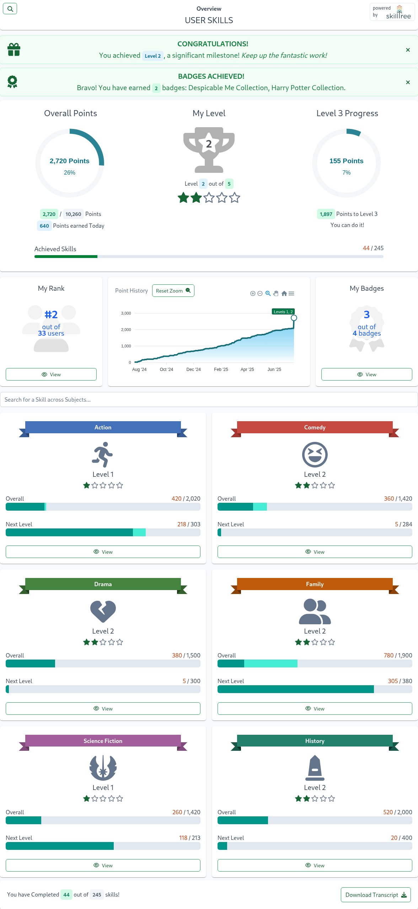

# Take a Training

A single training is also known as a SkillTree Project.

The training entry page provides an overview of your progress and includes the following key metrics:

- **Overall Points**: Displays your total points progress across all skills
- **Overall Level**: Shows your current level and progress toward the next level
- **Level Progress**: Visual indicator showing your progress toward the next level
- **Achieved Skills**: Progress bar showing completed skills versus total available
- **Overall Rank**: Your current standing among all users
- **My Badges**: Number of earned and available badges (only displayed if badges are configured for this training)
- **Subjects**: Displays your progress for each subject, including achieved levels and point progress

From here users can proceed to:
- [My Rank Page](/training-participation/take-training.html#my-rank-page): View your rank on the training leaderboard
- [My Badges Page](/training-participation/take-training.html#my-badges-page): View your earned and available badges
- [Subject Page](/training-participation/take-training.html#subject-page): View progress in a specific subject and all of its available skills

You can also download the training transcript by clicking the **Download Transcript** button on the bottom of the page. 
To learn more about the transcript, see the [Transcript](/training-participation/take-training.html#transcript) section.
## My Rank Page

## My Badges Page

## Subject Page

## Badge Page

## Skill Page

### Prerequisites

### Videos

### Expiration

## Transcript
