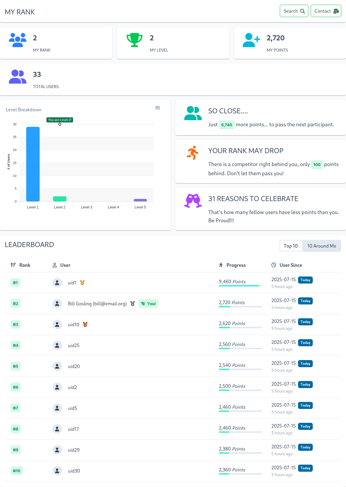
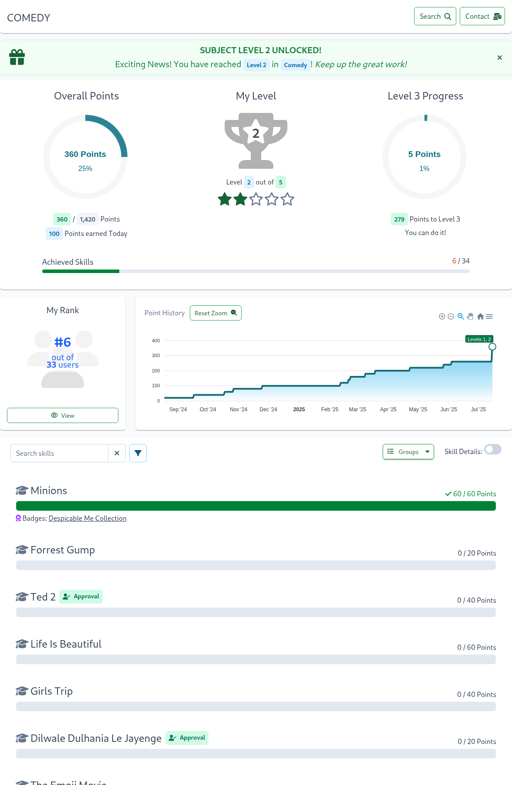
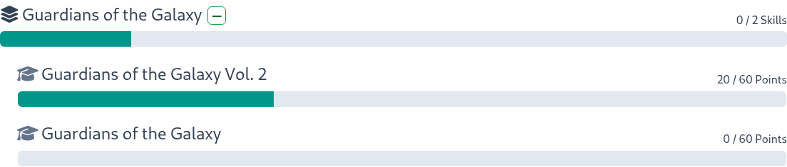
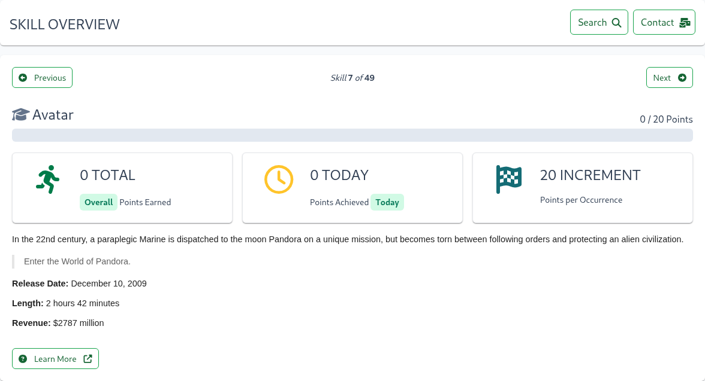

# Take a Training

A single training is also known as a SkillTree Project.

The training entry page provides an overview of your progress and includes the following key items:

- **Overall Points**: Displays your total points progress across all skills
- **Overall Level**: Shows your current level and progress toward the next level
- **Level Progress**: Visual indicator showing your progress toward the next level
- **Achieved Skills**: Progress bar showing completed skills versus total available
- **Point History**: Time chart with historical depiction of your points progress
- **Overall Rank**: Your current standing among all users
- **My Badges**: Number of earned and available badges (only displayed if badges are configured for this training)
- **Subjects**: Displays your progress for each subject, including achieved levels and point progress

From here users can proceed to:
- [My Rank Page](/training-participation/take-training.html#my-rank-page): View your rank on the training leaderboard
- [My Badges Page](/training-participation/take-training.html#my-badges-page): View your earned and available badges
- [Subject Page](/training-participation/take-training.html#subject-page): View progress in a specific subject and all of its available skills
- **Search and Jump to Skill**: Quickly find any skill by name across all subjects and navigate directly to it

At the bottom of the page, you'll find a **Download Transcript** button that allows you to save a detailed record of your training progress. For more information about the transcript and its contents, check out the [Transcript](/training-participation/take-training.html#transcript) section.

## My Rank Page

To access the My Rank page, click the **View** button inside the **My Rank** card. The My Rank page provides a comprehensive overview of your ranking, including:
- **Your Rank**: Your current position among all participants
- **Current Level**: Your current skill level
- **Total Points**: Your cumulative points across all skills
- **Total Participants**: Number of users participating in the training
- **Level Distribution Chart**: Visual breakdown of users across different levels
- **Encouragements**: Number of motivational messages received
- **Leaderboard**: List of users ranked by points

::: tip
Use the **10 Around Me** button to see your position relative to other participants on the leaderboard
:::

## My Badges Page

To access the My Badges page, click the **View** button inside the **My Badges** card. The My Badges page provides a comprehensive overview of your earned and available badges, including:

- **My Earned Badges**: A list of badges you've earned
- **Available Badges**: A list of badges you can still earn

Available badges show your current progress for each badge. You can drill down into [a badge](/training-participation/take-training.html#badge-page) to see your comprehensive progress and the remaining skills and points needed to earn it.

::: tip
- Use the badge filter to show only project badges, gems, or global badges
- Use the badge name search to find a specific badge
:::

You can also drill down into any earned [badge](/training-participation/take-training.html#badge-page) to see the skills and points that contributed to earning it.

## Subject Page

To navigate to a project page, click the **View** button inside the **Subject** card. Subjects offer similar progression features as the entire training, including:
- **Subject Points**: Overall subject points progress
- **Subject Level**: Shows your current level and progress toward the next level for this specific subject (which may differ from the overall training or other subjects)
- **Subject Rank**: Your standing among all users in this subject (which differs from the overall training or other subjects)
- **Point History**: Tracks your progress over time chart with historical depiction of your points progress in this subject

Following overall subject progression displays, you'll find a list of all skills and their progress in this subject.

Each skill displays points and a progress bar showing completed points versus total available. Click on a skill name or progress bar to view its [Skill Page](/training-participation/take-training.html#skill-page).

Several optional items may appear based on the skill type and training configuration:
- **Badges**: Badges that this skill contributes to, with badge names linking to their respective pages
- **Self-Reporting Tag**: A tag indicating how this skill can be self-reported and consecutively achieved. For more details, see [Self Reporting](/training-participation/take-training.html#self-reporting)
- **Skill Tags**: Tags assigned to this skill by the training creator. If skills have tags, a tag filter appears above the skill list
- **Skill Groups**: Training creators can organize skills into groups. For more information, see [Skill Groups](/training-participation/take-training.html#skill-groups)

You can learn more about a skill in two ways:
- Click on skill name or progress bar to visit the [Skill Page](/training-participation/take-training.html#skill-page)
- Enable the `Skill Details` switch in the top-right corner of the skills list. When enabled, additional skill details will appear under each skill, similar to the information on a [single skill](/training-participation/take-training.html#skill-page) page.

::: tip
- Use the skill name search above the skill list to find specific skills
- Use the skill type filter to the right of the search box to filter by specific skill attributes or types. The available filters are:
  - Progress Filter: Filter skills by progress or completion status
  - Attribute Filter: Filter skills by tags, pending approval, or badge membership
  - Self-Reporting Filter: filter by one of the [self-reporting](/training-participation/take-training.html#self-reporting) types
:::

### Skill Groups

Training creators can optionally organize some or all of the subject's skills into groups. When skills are grouped, they
will be organized under a Skill Group that includes a title, progress tracking, and collapse controls.

The expand/collapse controls appear next to each group's title. The expansion state is saved in your browser's local
storage, so your preferences are maintained between sessions.

::: tip
Use the expand/collapse all groups controls at the top of the skill list to manage multiple groups at once.
:::

## Badge Page

To access a Badge page, click the **View** button inside the **My Badges** card and then click on **View** button for a specific badge.

Badge page shows badge's name, description, and overall badge progress followed by a list of skills and points that contribute to earning the badge.
Earn all the skills and you will get the badge! 

Each skill displays points and a progress bar showing completed points versus total available. Click on a skill name or progress bar to view its [Skill Page](/training-participation/take-training.html#skill-page).

Several optional items may appear based on the skill type and training configuration:
- **Self-Reporting Tag**: A tag indicating how this skill can be self-reported and consecutively achieved. For more details, see [Self Reporting](/training-participation/take-training.html#self-reporting)
- **Skill Tags**: Tags assigned to this skill by the training creator. If skills have tags, a tag filter appears above the skill list

You can learn more about a skill in two ways:
- Click on skill name or progress bar to visit the [Skill Page](/training-participation/take-training.html#skill-page)
- Enable the `Skill Details` switch in the top-right corner of the skills list. When enabled, additional skill details will appear under each skill, similar to the information on a [single skill](/training-participation/take-training.html#skill-page) page.

::: tip
- Use the skill name search above the skill list to find specific skills
- Use the skill type filter to the right of the search box to filter by specific skill attributes or types. The available filters are:
  - Progress Filter: Filter skills by progress or completion status
  - Attribute Filter: Filter skills by tags, pending approval, or badge membership
  - Self-Reporting Filter: filter by one of the [self-reporting](/training-participation/take-training.html#self-reporting) types
:::

### Gems

Training creators may sometimes offer exclusive "Gem" badges, rare opportunities available only within a specific time
window. To claim this coveted badge, you must complete all its required skills before the deadline. The expiration date
is prominently displayed on the badge card across all badge
views: [My Badges](/training-participation/take-training.html#my-badges-page), and the Badge details
page. 

### Bonus Award

Certain badges feature a Bonus Award, adding an exciting competitive element by granting a special badge token when
completed by the deadline.

You'll find a clear deadline message for the Bonus Award displayed below the badge's name. If earned, the additional
award icon will appear in the badge card across all views: on
your [My Badges](/training-participation/take-training.html#my-badges-page) page and the Badge
details page.

## Skill Page

To access a Skill page, simply click on the skill's name or progress bar from the Subject Page.
A Skill represents a single, focused step in your learning journey. The skill description will guide you on how to master it.

The Skill Overview page provides a comprehensive view of your progress, including:
- Skill name and description
- Total available and earned points
- Points earned today

Repetition is often essential for effective learning, so some skills may require multiple successful completions. The
training configuration determines whether you can earn multiple completions immediately or if there's a time window
requiring a minimum number of hours between completions. The Skill Overview's progress and information cards clearly
show how many occurrences/points are available and how many have been completed.

Additional optional elements may appear in the skill details, depending on the skill type and configuration:
- **Badges**: Links to badges earned by completing this skill
- **Self-Reporting**: Instructions for self-reporting progress and achieving consecutive completions (see [Self Reporting](/training-participation/take-training.html#self-reporting) for more details)
- **Skill Tags**: Categories assigned by the training creator
- **Prerequisites**: A list of required skills and a visual dependency graph
- **Enhanced Media**: Optional video or audio content to enrich the learning experience
- **Expiration**: A clear deadline indicating when the skill will expire (if applicable)

### Self Reporting

Skills with a self-report tag can be marked as completed directly by the learner. For example, the skill below has an Honor tag and can be earned immediately.

Here multiple self-reporting types that skills can be created with:
- **Honor System**: Points are awarded immediately upon self-reporting completion
- **Approval Queue**: Your request enters an approval queue for review by training administrators
- **Quiz**: Pass a knowledge check with multiple questions
- **Survey**: Complete a feedback survey to earn credit
- **Audio/Video**: Watch or listen to multimedia content to earn credit

#### Honor

After completing the tasks and actions outlined in the skill's description, click the **Claim Points** button to earn points.

#### Approval

After completing the required tasks and actions, click the **Begin Request** button to submit your request for approval.
You'll see a justification input field, which may be optional or required. The skill's description may specify what
information should be included in your justification.

Once you've entered your justification, click the **Submit** button to send your request for approval. If approved,
you'll receive points; if denied, no points will be awarded. However, both your request and the response will remain
visible in the history below the description.

The justification field uses the SkillTree Rich Text Editor, allowing for a wide range of information to be included in
your justification.
<Content path="/dashboard/user-guide/common/rte.md"/>

#### Quiz 

To earn points for this quiz-based skill, you'll need to complete a quiz by answering all questions correctly.
Click the **Take Quiz** button to get started. Be sure to review the skill's description for any important details before you begin.

Please visit [Quizzes and Surveys](#quizzes-and-surveys) section for further details on how to take a quiz.

#### Survey

To earn points for this survey-based skill, you'll need to complete a survey by answering all the questions.
Click the **Complete Survey** button to get started. Be sure to review the skill's description for any important details before you begin.

Please visit [Quizzes and Surveys](#quizzes-and-surveys) section for further details on how to take a survey.

### Audio/Video

To earn points for this audio/video-based skill, you must watch or listen to the entire clip. The video/audio player is located above the skill's description.

::: tip
Resize the video by dragging the bottom right corner. Your preferred size will be saved in your browser's local storage.
:::

### Prerequisites

Skills with prerequisites will display a locked icon on their progress bar.
All the prerequisites must be completed before the skill can be unlocked. Below the skill description, you'll find a
dependency graph showing all required skills and their progress.

::: tip
You can navigate to prerequisite skills by clicking directly on a node in the graph or by selecting a skill name from
the prerequisites table below.
:::

### Expiration

Training creators can configure skill achievements to expire after a set period, allowing users to re-earn them later.
There are two types of expiration:

#### Date-Based Expiration

Skill achievements expire on a specific date and can be re-earned afterward. The expiration date is displayed above the
progress bar, right below the earned points.

#### Time-Based Expiration

Skill achievements expire after a set number of days but can be re-earned at any time. Each time the skill is completed,
the timer resets and the expiration is extended by the configured number of days. The expiration deadline and an option
to re-perform the skill are displayed above the progress bar, right below the earned points.

## Quizzes and Surveys

## Transcript
