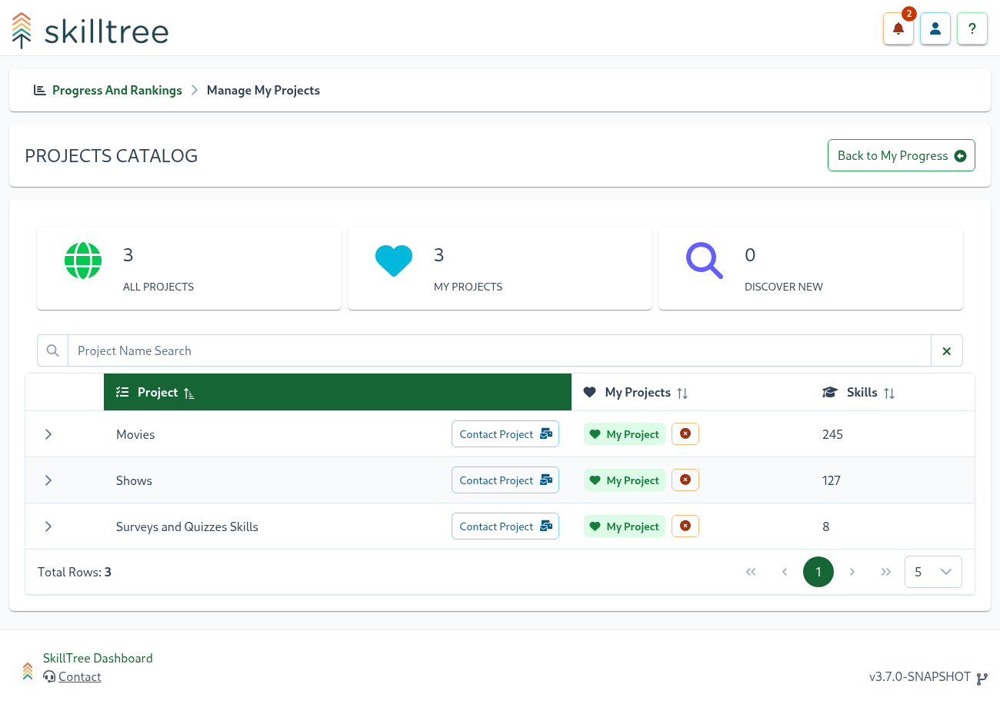
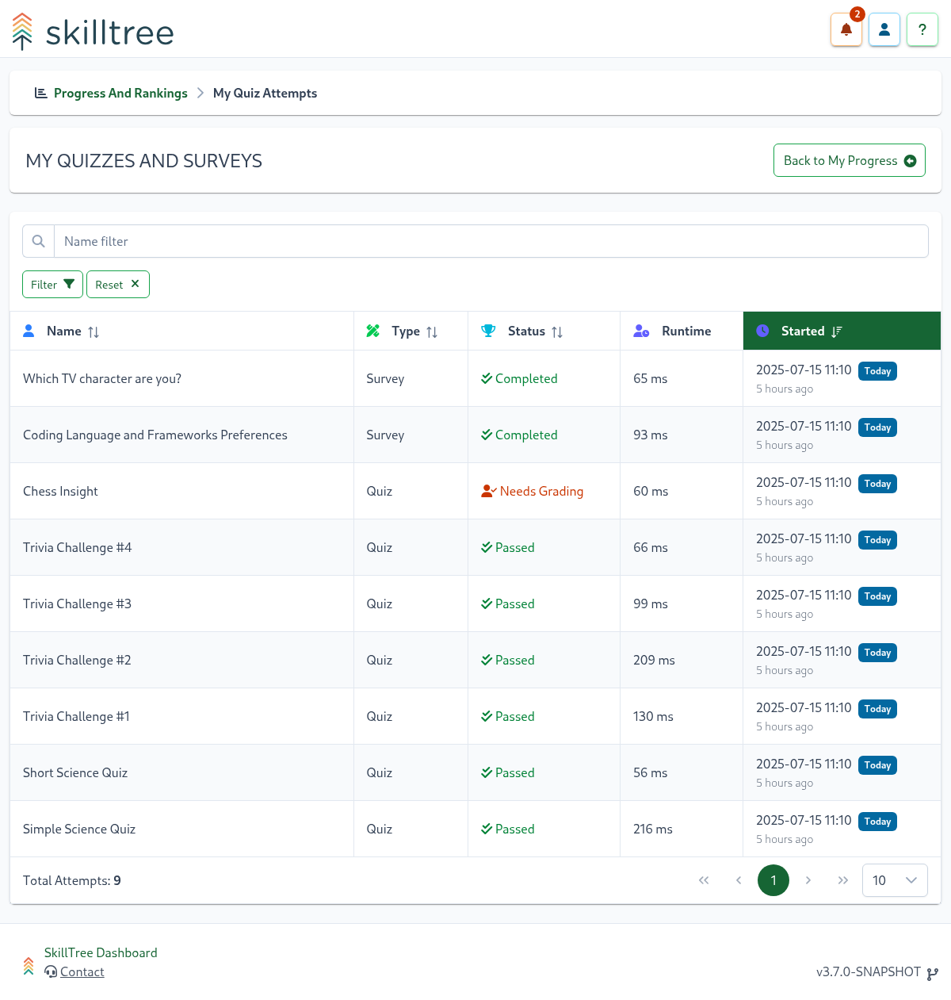
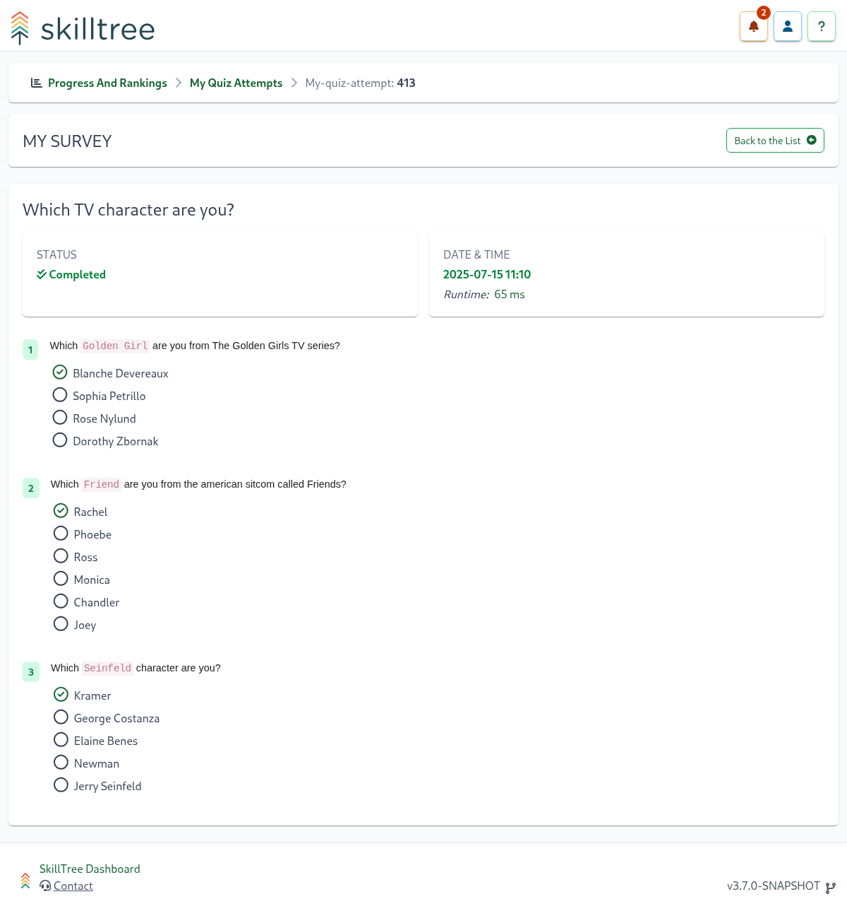
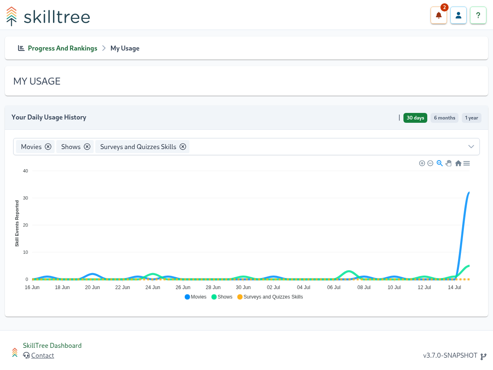

# Training Portfolio

The first visit to the SkillTree's training home page will display an introductory splash page. 
To get started, click the 'Projects Catalog' button to view all available training projects.

## Projects Catalog
The **Projects Catalog** page lists available trainings that can be added to your Progress & Ranking view.

To add a project to your Progress & Ranking view, click the **Add** button next to the project name. 
To remove a project, click the **Remove** button next to the project name.

::: tip
- You can also Preview the project before adding it to your Progress & Ranking view by clicking the ``Preview`` button to the right of the project name. 
- If you have a question about the project, you can send a message to the project's administrators by clicking the **Contact** button next to the project name.
- Each row in the projects table can be expanded to view the project's description and its requirements such as subject and skills counts.
:::
 
Once you've added one or more projects to your Progress & Ranking view, click the **Back to My Progress** button to begin training.

## Home Page

The home page displays your overall progress across all selected trainings. 
You can easily add or remove trainings, which will update what's shown on the home page.

In addition to the overall progress, you can also drill down into a specific training by clicking the training cards at the bottom of the home page.
For more details about making progress in an individual training, see the [Taking a Training](/training-participation/take-training.html) section.

From the home page, you can navigate to:
- [Quizzes and Surveys History](/training-participation/training-portfolio.html#quizzes-and-surveys-history): View your completed quizzes and surveys
- [My Badges](/training-participation/training-portfolio.html#my-badges): View your earned and available badges
- [Usage Page](/training-participation/training-portfolio.html#training-usage): View your daily usage for selected projects
- [Individual Training](/training-participation/take-training.html): Click `View` button on a training card to proceed to that training

::: tip
- You can remove trainings from your home page by clicking the "X" icon in the top-right corner of each training card.
If accidentally removed, you can easily re-add a training by going back to the **Projects Catalog** page and clicking the **Add** button next to the project name.
:::

## Quizzes and Surveys History

View your completed quizzes and surveys by clicking the **History** button on the Quizzes and Surveys card.

The **My Quizzes and Surveys** page features a searchable and sortable history table of all your passed and failed quizzes, as well as completed surveys.
You can drill down into a quiz or survey attempt by clicking on its name.

A single quiz or survey attempt displays the results. For surveys, all questions and their associated selections are shown.

For quizzes, the answers shown depend on the attempt's status:
- `Passed` Quiz: all the questions and answers are shown
- `Failed` Quiz: answers may be shown or not solely depending on how quiz administrator selected to configure the quiz
- `Needs Grading` Quiz: answers are not displayed as they are not yet graded

## My Badges

View your earned and available badges by visiting the **My Badges** page from the **My Projects** page.

The **My Badges** page is divided into **My Earned Badges** and **Available Badges**.
Click an earned badge to see the skills and points that earned it.

Available badges lists all badges that haven't been fully achieved from Trainings added to **My Projects** and currently shown on the home page.

::: tip
You can search badges by name and filter by  to **Project Badges**, **Gems**, or **Global Badges**
:::

## Training Usage

View your daily usage for selected projects by clicking the **Usage** button on a Project card.

## Preferences

To customize your personal preferences:

1. Click the User button in the top right corner of the page
2. Select **Settings**
3. Navigate to the **Preferences** tab

Available customization options:

- **Rank and Leaderboard Opt-Out**: When enabled, you'll be excluded from the Leaderboard and won't receive a rank in any trainings you're taking
- **Dark Mode**: Switch to a light-on-dark color scheme
- **Keyboard Shortcuts**: Customize keyboard shortcuts for training navigation
- **Default Home Page**: Choose your default landing page (only applicable to training creators)